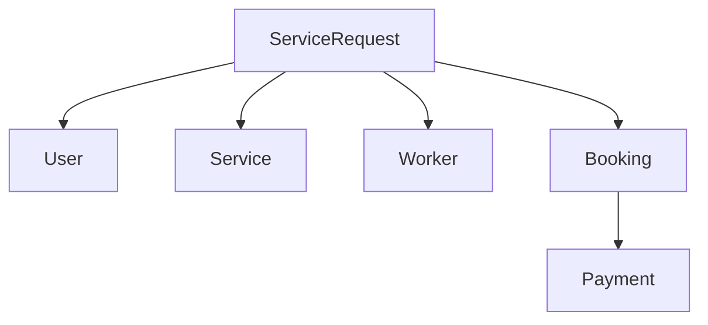

# SEVAQ System Architecture Improvement Plan

## Current Architecture Analysis

Based on the codebase examination, the current SEVAQ system has the following flow:
1. **Booking → Payment → Assignment** (Pay first, then assign worker)
2. Payment entity uses UUIDs, while most other entities use integers
3. ServiceRequest exists but is not the primary assignment anchor
4. Assignment logic is tightly coupled with Booking entity

## Key Issues Identified

1. **Flow Inversion**: Payment before assignment creates poor user experience
2. **ID Inconsistency**: Mix of integer IDs and UUIDs across entities
3. **Entity Design**: ServiceRequest should be the primary assignment anchor
4. **Coupling**: Assignment logic is embedded in Booking entity

## Recommended Architecture Changes

### 1. Flow Restructuring

**Before:** Booking → Payment → Assignment  
**After:** ServiceRequest → Assignment → Booking → Payment

### 2. ID Management

Implement public (UUID) vs internal (integer) ID pattern:
- Internal IDs: Integer primary keys for database operations
- Public IDs: UUIDs for external API exposure
- All entities will have both id (integer) and publicId (UUID) fields

### 3. Entity Design Improvements

#### ServiceRequest (Primary Assignment Anchor)
- Becomes the central entity for service fulfillment
- Manages the entire lifecycle from request to completion
- Links to User, Service, Worker, Booking, and Payment

#### Updated Entity Relationships

## Implementation Plan

### Phase 1: Backend Changes (NestJS)

#### 1.1 Database Schema Migrations
- Add `publicId` column to all existing entities (UUID type)
- Create indexes for publicId fields
- Ensure data integrity with foreign key constraints

#### 1.2 Entity Definition Updates
- Update all entity files to include publicId
- Refactor ServiceRequest to be the primary assignment entity
- Update relationships between entities

#### 1.3 Service Layer Changes
- Create ServiceRequestsService as primary assignment orchestrator
- Refactor AssignmentsService to work with ServiceRequest
- Update BookingsService to be dependent on ServiceRequest
- Modify PaymentsService to link to Booking

#### 1.4 API Contract Changes
- Update all endpoints to use public IDs
- Create new endpoints for ServiceRequest lifecycle
- Modify existing endpoints to support the new flow

### Phase 2: Frontend Changes (Flutter)

#### 2.1 Data Models
- Update all models to include publicId field
- Create ServiceRequest model
- Update relationships between models

#### 2.2 API Service
- Modify API service to use public IDs
- Add endpoints for ServiceRequest operations
- Update existing API calls to follow new flow

#### 2.3 State Management
- Create ServiceRequest provider
- Update Booking and Assignment providers
- Modify payment flow to occur after assignment

#### 2.4 UI Flow
- Restructure screens to follow ServiceRequest → Assignment → Booking → Payment
- Update navigation logic
- Modify booking and payment screens

### Phase 3: Testing & Validation

#### 3.1 Unit Tests
- Update existing unit tests
- Create tests for new ServiceRequest functionality
- Test public/integer ID conversion

#### 3.2 Integration Tests
- Test the entire flow from ServiceRequest to Payment
- Validate assignment logic
- Test error handling scenarios

#### 3.3 User Acceptance Testing
- Test the new user flow
- Validate payment integration
- Ensure worker assignment works correctly

## Migration Strategy

### Data Migration
1. Add publicId column to all tables with default UUID generation
2. Update existing data with generated UUIDs
3. Create migration scripts for each entity

### API Migration
1. Maintain backward compatibility for existing endpoints
2. Add new endpoints with versioning (v2)
3. Deprecate old endpoints with clear documentation

### Rollback Plan
1. Keep backup of existing database
2. Maintain old entity definitions and services
3. Revert API changes if needed

## Expected Benefits

1. **Improved User Experience**: Assign worker first, then collect payment
2. **Cleaner Architecture**: ServiceRequest as primary anchor reduces coupling
3. **Consistent ID Management**: Clear separation between internal and external IDs
4. **Better Scalability**: Decoupled services are easier to maintain and scale
