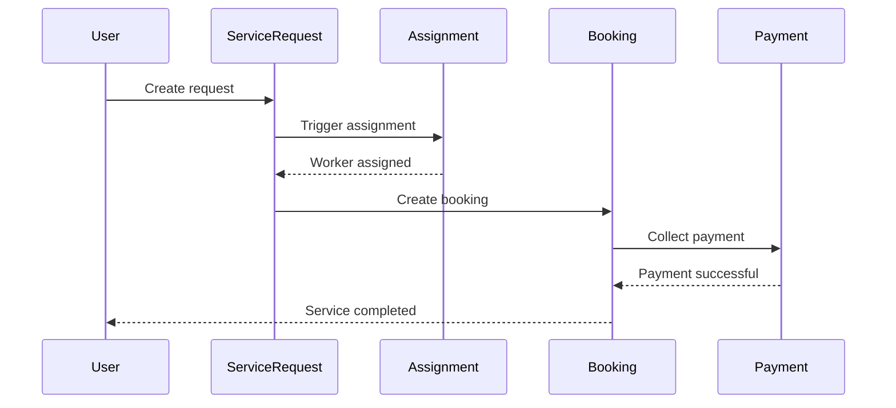

# SEVAQ Entity Design Specification

## Overview

This specification defines the updated entity structure for the SEVAQ system, implementing the recommended architecture changes:
1. ServiceRequest as primary assignment anchor
2. Public (UUID) vs internal (integer) ID pattern
3. New flow: ServiceRequest → Assignment → Booking → Payment

## Core Entities

### 1. ServiceRequest (Primary Assignment Anchor)

```typescript
@Entity('service_requests')
export class ServiceRequest {
  @PrimaryGeneratedColumn()
  id: number; // Internal ID
  
  @Column('uuid', { unique: true, nullable: false })
  publicId: string; // Public API ID
  
  @Column('int')
  userId: number;
  
  @Column('int')
  serviceId: number;
  
  @Column()
  date: Date;
  
  @Column({
    type: 'varchar',
    enum: ['morning', 'afternoon', 'evening'],
  })
  timeWindow: string;
  
  @Column('decimal', { precision: 10, scale: 2 })
  priceSnapshot: number;
  
  @Column({
    type: 'varchar',
    default: 'REQUESTED',
  })
  assignmentStatus: 'REQUESTED' | 'ASSIGNED' | 'FAILED_TO_ASSIGN';
  
  @Column({ nullable: true, type: 'int' })
  assignedWorkerId?: number | null;
  
  @Column({ nullable: true, type: 'int' })
  assignedSlotId?: number | null;
  
  @Column({ nullable: true, type: 'text' })
  failureReason?: string | null;
  
  @Column({ type: 'json', nullable: true })
  metadata?: {
    location?: { lat: number; lng: number };
    retryCount?: number;
    lastRetryAt?: Date;
  };
  
  @CreateDateColumn()
  createdAt: Date;
  
  @UpdateDateColumn()
  updatedAt: Date;
  
  // Relationships
  @OneToMany(() => Booking, (booking) => booking.serviceRequest)
  bookings: Booking[];
  
  @ManyToOne(() => User, (user) => user.serviceRequests)
  user: User;
  
  @ManyToOne(() => Service, (service) => service.serviceRequests)
  service: Service;
  
  @ManyToOne(() => Worker, (worker) => worker.serviceRequests)
  worker: Worker;
}
```

### 2. Booking

```typescript
@Entity('booking')
export class Booking {
  @PrimaryGeneratedColumn()
  id: number; // Internal ID
  
  @Column('uuid', { unique: true, nullable: false })
  publicId: string; // Public API ID
  
  @Column({ name: 'serviceRequestId', type: 'int' })
  serviceRequestId: number;
  
  @ManyToOne(() => ServiceRequest, { nullable: false })
  @JoinColumn({ name: 'serviceRequestId' })
  serviceRequest: ServiceRequest;
  
  @Column({ name: 'userId', type: 'int' })
  userId: number;
  
  @ManyToOne(() => User, { nullable: true })
  @JoinColumn({ name: 'userId' })
  user: User;
  
  @Column({ type: 'int', nullable: true })
  workerId: number;
  
  @ManyToOne(() => Worker, { nullable: true })
  @JoinColumn({ name: 'workerId' })
  worker: Worker;
  
  @Column({ type: 'int', nullable: true })
  serviceId: number;
  
  @ManyToOne(() => Service, { nullable: true })
  @JoinColumn({ name: 'serviceId' })
  service: Service;
  
  @Column({ type: 'int', nullable: true })
  slotId: number;
  
  @ManyToOne(() => Slot, { nullable: true })
  @JoinColumn({ name: 'slotId' })
  slot: Slot;
  
  @Column({ type: 'timestamp' })
  startTime: Date;
  
  @Column({ type: 'timestamp' })
  endTime: Date;
  
  @Column({ type: 'decimal', precision: 10, scale: 2, default: 0 })
  amount: number;
  
  @Column({ type: 'boolean', default: false })
  isPaid: boolean;
  
  @Column({ type: 'text', default: BookingStatus.PENDING })
  status: BookingStatus;
  
  @Column({ type: 'text', default: BookingType.ON_DEMAND })
  type: BookingType;
  
  @Column({ type: 'text', nullable: true })
  notes: string;
  
  // Relationships
  @OneToOne(() => Payment, (payment) => payment.booking)
  payment: Payment;
  
  @CreateDateColumn()
  createdAt: Date;
  
  @UpdateDateColumn()
  updatedAt: Date;
}
```

### 3. Payment

```typescript
@Entity()
export class Payment {
  @PrimaryGeneratedColumn()
  id: number; // Internal ID
  
  @Column('uuid', { unique: true, nullable: false })
  publicId: string; // Public API ID
  
  @Column({ type: 'int' })
  bookingId: number;
  
  @OneToOne(() => Booking)
  @JoinColumn({ name: 'bookingId' })
  booking: Booking;
  
  @Column({ type: 'int', nullable: true })
  workerId: number;
  
  @ManyToOne(() => Worker, { nullable: true })
  @JoinColumn({ name: 'workerId' })
  worker: Worker;
  
  @Column({ nullable: true })
  razorpayOrderId: string;
  
  @Column({ nullable: true })
  razorpayPaymentId: string;
  
  @Column({ type: 'decimal', precision: 10, scale: 2 })
  amount: number;
  
  @Column({ default: 'INR' })
  currency: string;
  
  @Column({
    type: 'text',
    default: PaymentStatus.CREATED,
  })
  status: PaymentStatus;
  
  @CreateDateColumn()
  createdAt: Date;
  
  @UpdateDateColumn()
  updatedAt: Date;
}
```

### 4. User, Worker, Service, and Other Entities

All other entities will follow the same pattern:
- Add `publicId` column of type UUID
- Keep `id` column as integer primary key
- Add relationships to ServiceRequest where appropriate

## Database Schema Changes

### Table Additions
- No new tables required, but existing tables will be modified

### Column Additions
```sql
-- Add publicId to all entities
ALTER TABLE user ADD COLUMN publicId UUID DEFAULT uuid_generate_v4() NOT NULL;
ALTER TABLE worker ADD COLUMN publicId UUID DEFAULT uuid_generate_v4() NOT NULL;
ALTER TABLE service ADD COLUMN publicId UUID DEFAULT uuid_generate_v4() NOT NULL;
ALTER TABLE booking ADD COLUMN publicId UUID DEFAULT uuid_generate_v4() NOT NULL;
ALTER TABLE payment ADD COLUMN publicId UUID DEFAULT uuid_generate_v4() NOT NULL;
ALTER TABLE service_requests ADD COLUMN publicId UUID DEFAULT uuid_generate_v4() NOT NULL;
ALTER TABLE slot ADD COLUMN publicId UUID DEFAULT uuid_generate_v4() NOT NULL;

-- Add unique indexes
CREATE UNIQUE INDEX idx_user_publicId ON user(publicId);
CREATE UNIQUE INDEX idx_worker_publicId ON worker(publicId);
CREATE UNIQUE INDEX idx_service_publicId ON service(publicId);
CREATE UNIQUE INDEX idx_booking_publicId ON booking(publicId);
CREATE UNIQUE INDEX idx_payment_publicId ON payment(publicId);
CREATE UNIQUE INDEX idx_service_requests_publicId ON service_requests(publicId);
CREATE UNIQUE INDEX idx_slot_publicId ON slot(publicId);

-- Add foreign key from booking to service_requests
ALTER TABLE booking ADD COLUMN serviceRequestId INTEGER;
ALTER TABLE booking ADD FOREIGN KEY (serviceRequestId) REFERENCES service_requests(id);

-- Update payment entity to use integer bookingId
ALTER TABLE payment ALTER COLUMN bookingId TYPE INTEGER;
```

## API Contract Changes

### ServiceRequest Endpoints

#### Create Service Request
```
POST /service-requests
Request:
{
  "serviceId": "uuid-123",
  "date": "2026-01-17",
  "timeWindow": "morning",
  "priceSnapshot": 1500
}

Response:
{
  "requestId": "uuid-456",
  "assignmentStatus": "REQUESTED"
}
```

#### Get Service Request Status
```
GET /service-requests/:id

Response:
{
  "id": "uuid-456",
  "assignmentStatus": "ASSIGNED",
  "assignedWorker": {
    "id": "uuid-789",
    "name": "John Doe"
  }
}
```

#### Trigger Assignment
```
POST /service-requests/:id/assign

Response:
{
  "success": true,
  "worker": {
    "id": "uuid-789",
    "name": "John Doe"
  }
}
```

### Booking Endpoints

#### Create Booking
```
POST /bookings
Request:
{
  "serviceRequestId": "uuid-456",
  "startTime": "2026-01-17T09:00:00",
  "endTime": "2026-01-17T12:00:00"
}

Response:
{
  "bookingId": "uuid-012",
  "status": "CONFIRMED"
}
```

### Payment Endpoints

#### Create Payment
```
POST /payments/create-order
Request:
{
  "bookingId": "uuid-012",
  "amount": 1500
}

Response:
{
  "orderId": "rzp_123",
  "amount": 1500
}
```

## Data Flow

### New Service Request Lifecycle

1. **Create ServiceRequest**: User submits service details
2. **Assignment**: System assigns worker to ServiceRequest
3. **Create Booking**: Once worker is assigned, create Booking
4. **Payment**: Collect payment for the Booking
5. **Completion**: Service is delivered and Booking is completed


