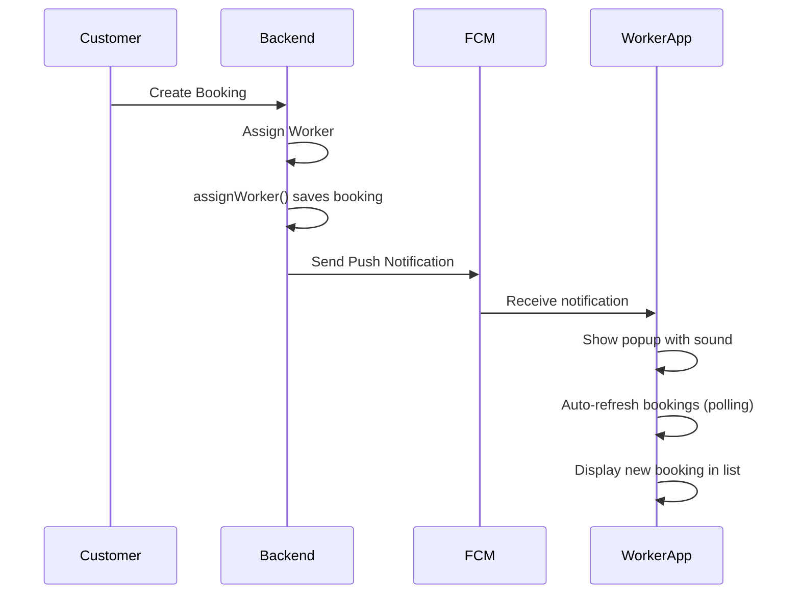

# Worker App Notification & Auto-Refresh Implementation Plan

## Problem Statement
- Workers don't receive notifications when new bookings are assigned
- Worker app requires manual refresh to see new bookings
- No real-time updates - booking delay from creation to appearing in worker app

## Root Cause Analysis
1. **No auto-refresh**: BookingProvider fetches bookings only on pull-to-refresh or app resume
2. **No push notification trigger**: Backend doesn't send FCM notification when worker is assigned to a booking
3. **Firebase config may be missing**: FCM requires proper configuration in backend

## Implementation Plan

---

### Phase 1: Add Auto-Polling to Worker App (Frontend)

**File: `worker_app_flutter/lib/providers/booking_provider.dart`**

Add a Timer-based polling mechanism that automatically fetches bookings every 30 seconds:

```dart
class BookingProvider extends ChangeNotifier {
  Timer? _pollingTimer;
  static const Duration pollingInterval = Duration(seconds: 30);
  
  // Add method to start polling
  void startPolling() {
    _pollingTimer?.cancel();
    _pollingTimer = Timer.periodic(pollingInterval, (_) {
      fetchBookings();
    });
  }
  
  // Add method to stop polling
  void stopPolling() {
    _pollingTimer?.cancel();
    _pollingTimer = null;
  }
  
  // Modify fetchBookings to notify only on new bookings
  Future<void> fetchBookings() async {
    // ... existing fetch logic
    // After fetching, check for new bookings and notify
  }
}
```

**Update Files:**
1. `worker_app_flutter/lib/providers/booking_provider.dart` - Add polling timer
2. `worker_app_flutter/lib/screens/main_screen.dart` - Start polling when authenticated
3. `worker_app_flutter/lib/screens/home_screen.dart` - Stop polling on dispose

---

### Phase 2: Add Push Notification to Backend

**File: `flutter-nest-househelp-master/src/bookings/bookings.service.ts`**

Modify the `assignWorker` method to send push notification after assignment:

```typescript
async assignWorker(id: string, workerId: number) {
  const booking = await this.findOne(id);
  
  // ... existing assignment logic
  
  // After saving, send push notification to worker
  await this.notificationsService.notifyWorkerNewBooking(worker, booking);
  
  return this.bookingsRepository.save(booking);
}
```

**New Method in NotificationsService:**

```typescript
async notifyWorkerNewBooking(worker: Worker, booking: Booking): Promise<void> {
  if (!worker.fcmToken) {
    console.warn(`No FCM token for worker ${worker.id}`);
    return;
  }
  
  const message = {
    token: worker.fcmToken,
    notification: {
      title: 'नया काम मिला!', // New job!
      body: `नया बुकिंग मिली है - ${booking.service?.name || 'सेवा'}`,
    },
    data: {
      type: 'new_booking',
      bookingId: booking.id.toString(),
    },
    android: {
      priority: 'high' as const,
      notification: {
        sound: 'default',
      },
    },
  };
  
  await admin.messaging().send(message);
}
```

---

### Phase 3: Integrate NotificationsService in BookingsModule

**File: `flutter-nest-househelp-master/src/bookings/bookings.module.ts`**

Add NotificationsService to the bookings module imports:

```typescript
import { NotificationsModule } from '../notifications/notifications.module';

@Module({
  imports: [
    // ... other imports
    NotificationsModule,
  ],
  // ...
})
export class BookingsModule {}
```

---

## Files to Modify

| # | File | Change |
|---|------|--------|
| 1 | `worker_app_flutter/lib/providers/booking_provider.dart` | Add Timer-based polling |
| 2 | `worker_app_flutter/lib/screens/main_screen.dart` | Start polling on auth |
| 3 | `worker_app_flutter/lib/screens/home_screen.dart` | Stop polling on dispose |
| 4 | `flutter-nest-househelp-master/src/notifications/notifications.service.ts` | Add notifyWorkerNewBooking method |
| 5 | `flutter-nest-househelp-master/src/bookings/bookings.service.ts` | Call notification after assignWorker |
| 6 | `flutter-nest-househelp-master/src/bookings/bookings.module.ts` | Import NotificationsModule |

---

## Mermaid Flow Diagram



---

## Testing Checklist

- [ ] Worker app fetches bookings every 30 seconds when open
- [ ] Push notification received when booking is assigned
- [ ] Notification shows correct booking details
- [ ] Sound plays on new booking notification
- [ ] Booking appears in worker list without manual refresh
- [ ] App resume triggers booking fetch

---

## Priority

1. **Phase 1 (Immediate)**: Auto-polling - provides instant relief
2. **Phase 2-3 (Short-term)**: Push notifications - proper real-time solution
