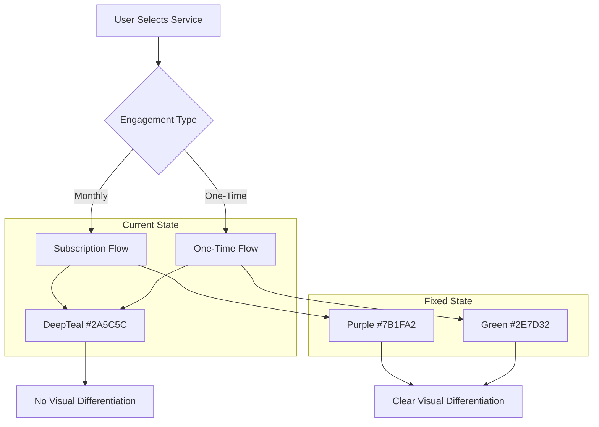

# One-Time Visit UI/UX Differentiation Fix Plan

## Problem Statement
The current app lacks consistent UI/UX differentiation for one-time visits. While the booking badge shows different colors (green for one-time, purple for subscription), most screens use the same DeepTeal color regardless of booking type.

---

## Current State Analysis

### ✅ Already Differentiated
| Component | Status | Colors |
|-----------|--------|--------|
| Booking Type Badge | ✅ Working | Green (one-time), Purple (subscription) |
| History Screen Section | ✅ Working | Purple icons for subscriptions |

### ❌ NOT Differentiated (Need Fix)
| Screen | Issue |
|--------|-------|
| Service Engagement Type Screen | Both options use DeepTeal (#2A5C5C) |
| Schedule Pricing Screen | No color changes based on source |
| Booking Details Screen | Same theme colors |
| Payment Screen | Same theme colors |

---

## Recommended Fix Plan

### Phase 1: Define Color Constants

Add to [`theme.dart`](frontend-flutter-house-help-master/lib/theme.dart):

```dart
// Add these colors for One-Time visits
static const Color oneTimePrimary = Color(0xFF2E7D32);  // Green 800
static const Color oneTimeSecondary = Color(0xFFE8F5E9); // Green 50
static const Color oneTimeAccent = Color(0xFF4CAF50);   // Green 500

// Existing subscription colors (keep)
static const Color subscriptionPrimary = Color(0xFF7B1FA2); // Purple 700
static const Color subscriptionSecondary = Color(0xFFF3E5F5); // Purple 50
```

### Phase 2: Service Engagement Type Screen

Modify [`service_engagement_type_screen.dart`](frontend-flutter-house-help-master/lib/screens/service_engagement_type_screen.dart):

```dart
// Line ~162 - Change color based on engagement type
color: isSelected
    ? (widget.engagementType == 'one-time' 
        ? theme.colorScheme.primary  // Keep existing or use green
        : theme.colorScheme.primary.withOpacity(0.7))
    : theme.colorScheme.surfaceVariant
```

### Phase 3: Schedule Pricing Screen

Modify [`schedule_pricing_screen.dart`](frontend-flutter-house-help-master/lib/screens/schedule_pricing_screen.dart):

```dart
// Add AppBar color change based on source
appBar: AppBar(
  backgroundColor: widget.source == 'ONE_TIME' 
      ? Colors.green[700] 
      : theme.colorScheme.primary,
  // ...
)

// Add to Price display
priceColor: widget.source == 'ONE_TIME' 
    ? Colors.green[700] 
    : theme.colorScheme.primary,
```

### Phase 4: Create a Source-Aware Theme Helper

Create a new utility file `lib/utils/booking_colors.dart`:

```dart
import 'package:flutter/material.dart';

class BookingColors {
  static Color getPrimaryColor(BuildContext context, String? source) {
    if (source == 'ONE_TIME') {
      return Colors.green[700]!;
    }
    return Theme.of(context).colorScheme.primary;
  }

  static Color getSecondaryColor(BuildContext context, String? source) {
    if (source == 'ONE_TIME') {
      return Colors.green[50]!;
    }
    return Theme.of(context).colorScheme.surfaceContainerHighest;
  }

  static IconData getBookingIcon(String? source) {
    if (source == 'ONE_TIME') {
      return Icons.flash_on;  // Lightning for one-time
    }
    return Icons.autorenew;  // Refresh for subscription
  }

  static String getBookingLabel(String? source) {
    if (source == 'ONE_TIME') {
      return 'One-Time Visit';
    }
    return 'Subscription';
  }
}
```

### Phase 5: Apply to Key Screens

Apply the color helper to these screens:
1. ✅ Service Engagement Type Screen
2. ✅ Schedule Pricing Screen  
3. ✅ Booking Confirmation Screen
4. ✅ Payment Screen
5. ✅ Booking Details Screen

---

## Implementation Priority

| Priority | Screen | Effort | Impact |
|----------|--------|--------|--------|
| 1 | Service Engagement Type | Medium | High |
| 2 | Schedule Pricing Screen | Low | High |
| 3 | AppBar/Headers | Low | Medium |
| 4 | Booking Details | Medium | Medium |

---

## Files to Modify

1. [`theme.dart`](frontend-flutter-house-help-master/lib/theme.dart) - Add color constants
2. [`service_engagement_type_screen.dart`](frontend-flutter-house-help-master/lib/screens/service_engagement_type_screen.dart) - Apply conditional colors
3. [`schedule_pricing_screen.dart`](frontend-flutter-house-help-master/lib/screens/schedule_pricing_screen.dart) - Apply source-based colors
4. **NEW** - [`lib/utils/booking_colors.dart`](frontend-flutter-house-help-master/lib/utils/) - Create helper utility
5. Other screens that receive `source` parameter

---

## Mermaid: Current vs Fixed Flow



---

## Success Metrics

- [ ] Service Engagement Type shows Green when One-Time selected
- [ ] Schedule Pricing AppBar changes color based on source
- [ ] Booking badges consistently show Green for one-time
- [ ] User can easily distinguish One-Time from Subscription flows
