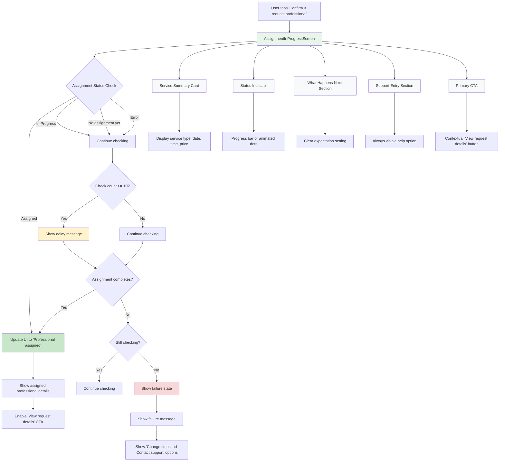
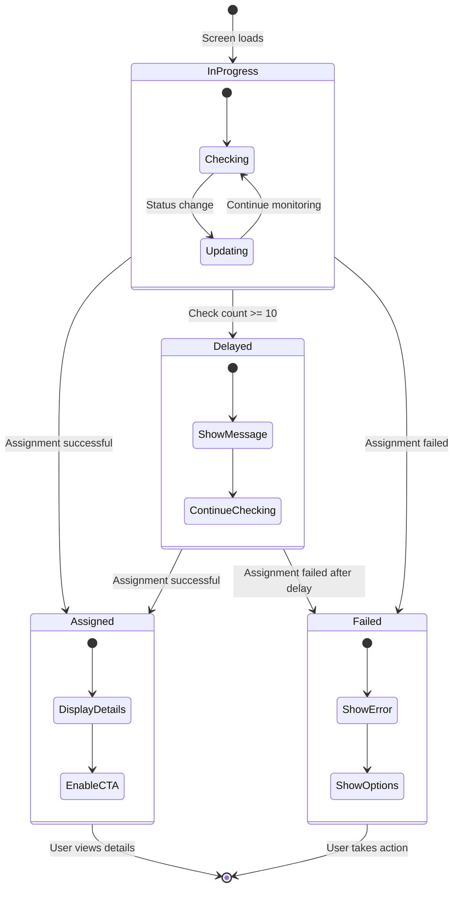
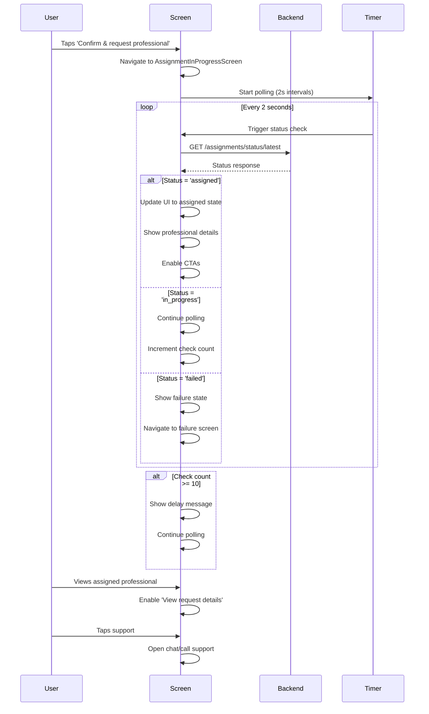
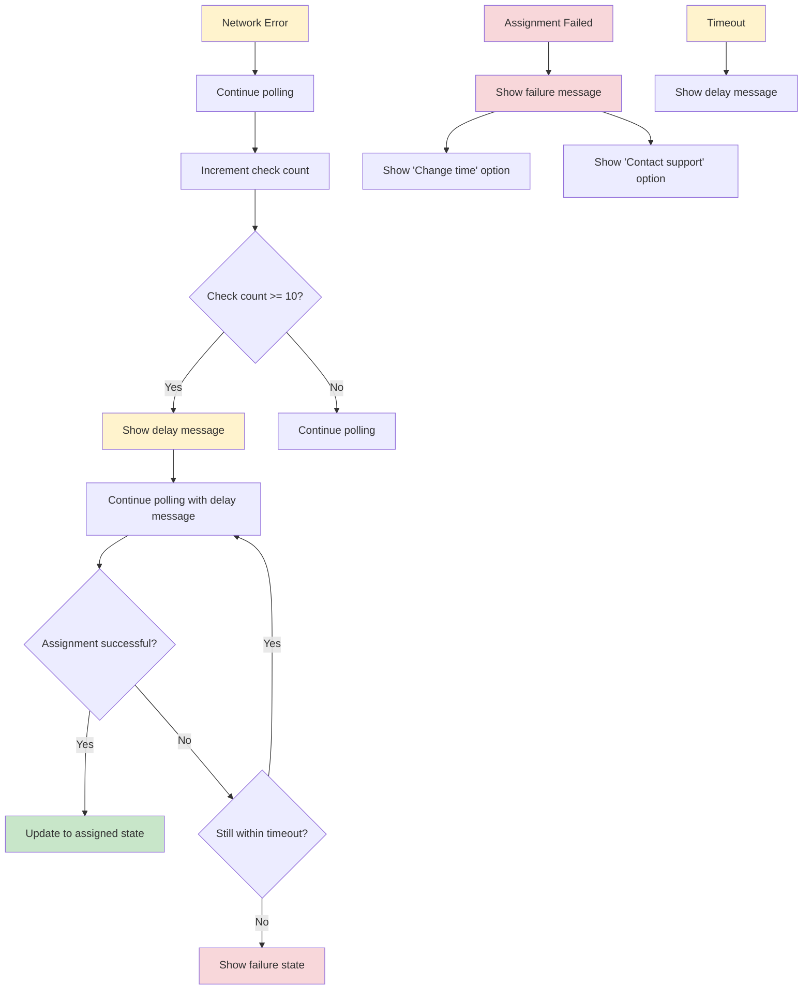

# Sevaq Assignment In Progress Flow Diagram

## Complete User Flow

## State Transitions

## Component Hierarchy

```mermaid
graph TD
    A[AssignmentInProgressScreen] --> B[Header]
    A --> C[StatusIndicator]
    A --> D[ServiceSummaryCard]
    A --> E[WhatHappensNextSection]
    A --> F[SupportSection]
    A --> G[PrimaryCTA]
    
    B --> B1[Title: 'Finding a professional']
    B --> B2[Subtitle: 'We're assigning...']
    
    C --> C1[Progress Bar OR Animated Dots]
    C --> C2[Status Text: 'Assignment in progress']
    C --> C3[Helper Text: 'This usually takes a few minutes']
    
    D --> D1[Service Icon]
    D --> D2[Service Name]
    D --> D3[Date & Time]
    D --> D4[Price]
    
    E --> E1[Step 1: 'We assign a verified professional']
    E --> E2[Step 2: 'You'll be notified once assigned']
    E --> E3[Step 3: 'Payment will be requested after assignment']
    
    F --> F1[Help Icon]
    F --> F2[Text: 'Need help?']
    F --> F3[Action: Open support options]
    
    G --> G1[Button: 'View request details']
    G --> G2[Style: Outlined, contextual]
    
    style A fill:#e3f2fd
    style B fill:#f3e5f5
    style C fill:#e8f5e8
    style D fill:#fff3e0
    style E fill:#e0f2f1
    style F fill:#fce4ec
    style G fill:#f1f8e9
```

## Auto-Update Flow

## Error Handling Flow

This comprehensive flow diagram shows:

1. **Complete User Journey**: From confirmation to assignment completion
2. **State Transitions**: How the screen changes based on assignment status
3. **Component Hierarchy**: How UI components are organized
4. **Auto-Update Flow**: How the screen monitors assignment status
5. **Error Handling**: How different error scenarios are handled

The diagrams ensure that the implementation will be robust, user-friendly, and meet all the specified requirements for building trust and reducing user anxiety during the assignment process.