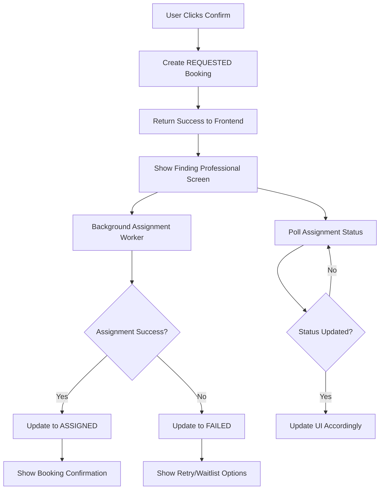

# SEVAQ Managed Service Implementation Plan

## Executive Summary

**Problem:** Current assignment system fails synchronously during user intent, causing premature 400 errors when availability constraints aren't met.

**Solution:** Implement managed service model with three explicit states: REQUESTED → ASSIGNING → ASSIGNED/FAILED.

**Impact:** Eliminates user-facing availability errors during booking, improves conversion rates, and provides graceful degradation.

## Architecture Overview



## Phase 1: Backend Implementation

### 1.1 Enhanced Booking States

**Current States:**
- PENDING → ASSIGNED → CONFIRMED → IN_PROGRESS → COMPLETED

**New States:**
- REQUESTED → ASSIGNING → ASSIGNED → CONFIRMED → IN_PROGRESS → COMPLETED
- REQUESTED → ASSIGNING → FAILED_TO_ASSIGN → RETRYABLE

### 1.2 New Assignment Request Entity

```typescript
@Entity('assignment_requests')
export class AssignmentRequest {
  @PrimaryGeneratedColumn('uuid')
  id: string;

  @Column({ type: 'uuid' })
  bookingId: string;

  @ManyToOne(() => Booking)
  @JoinColumn({ name: 'booking_id' })
  booking: Booking;

  @Column({ type: 'text', default: 'REQUESTED' })
  status: 'REQUESTED' | 'ASSIGNING' | 'ASSIGNED' | 'FAILED_TO_ASSIGN';

  @Column({ type: 'integer', default: 0 })
  retryCount: number;

  @Column({ type: 'text', nullable: true })
  failureReason: string;

  @Column({ type: 'datetime', nullable: true })
  lastAttemptAt: Date;

  @Column({ type: 'datetime', nullable: true })
  assignedAt: Date;

  @Column({ type: 'uuid', nullable: true })
  assignedWorkerId: string;

  @CreateDateColumn()
  createdAt: Date;

  @UpdateDateColumn()
  updatedAt: Date;
}
```

### 1.3 Async Assignment Worker

```typescript
@Injectable()
export class AssignmentWorker {
  constructor(
    private assignmentsService: AssignmentsService,
    private assignmentRequestsService: AssignmentRequestsService,
  ) {}

  @Process('assignment')
  async processAssignment(job: Job<AssignmentJobData>) {
    const { requestId } = job.data;
    
    try {
      const request = await this.assignmentRequestsService.findById(requestId);
      
      // Update status to ASSIGNING
      await this.assignmentRequestsService.updateStatus(requestId, 'ASSIGNING');
      
      // Attempt assignment with retry logic
      const result = await this.assignmentsService.attemptAssignment({
        bookingId: request.bookingId,
        serviceId: request.booking.serviceId,
        userLat: request.booking.user.latitude,
        userLng: request.booking.user.longitude,
        startTime: request.booking.startTime,
        endTime: request.booking.endTime
      });

      if (result.success) {
        await this.assignmentRequestsService.markAsAssigned(requestId, result.worker.id);
      } else {
        await this.assignmentRequestsService.markAsFailed(requestId, result.reason);
      }
    } catch (error) {
      await this.assignmentRequestsService.markAsFailed(requestId, error.message);
    }
  }
}
```

### 1.4 Enhanced API Endpoints

```typescript
// POST /assignments/request - Always succeeds
@Post('request')
async createAssignmentRequest(@Body() request: CreateAssignmentRequestDto) {
  // 1. Create booking with PENDING state
  const booking = await this.bookingsService.create({
    ...request,
    assignmentState: AssignmentState.REQUESTED
  });

  // 2. Create assignment request
  const assignmentRequest = await this.assignmentRequestsService.create({
    bookingId: booking.id,
    status: 'REQUESTED'
  });

  // 3. Queue assignment job
  await this.assignmentWorker.queueAssignment(assignmentRequest.id);

  return {
    success: true,
    bookingId: booking.id,
    requestId: assignmentRequest.id,
    message: 'Assignment request created successfully'
  };
}

// GET /assignments/status/:requestId - Poll status
@Get('status/:requestId')
async getAssignmentStatus(@Param('requestId') requestId: string) {
  return this.assignmentRequestsService.getStatus(requestId);
}
```

## Phase 2: Frontend Implementation

### 2.1 New Screen Flow

1. **Schedule & Price Screen** → **Confirm & Request Screen** → **Finding Professional Screen** → **Booking Confirmation Screen**

### 2.2 Finding Professional Screen

```dart
class FindingProfessionalScreen extends StatefulWidget {
  final String bookingId;
  final String requestId;

  const FindingProfessionalScreen({
    Key? key,
    required this.bookingId,
    required this.requestId,
  }) : super(key: key);
}

class _FindingProfessionalScreenState extends State<FindingProfessionalScreen> {
  late Timer _pollingTimer;
  AssignmentStatus _status = AssignmentStatus.requested;
  Worker? _assignedWorker;

  @override
  void initState() {
    super.initState();
    _startPolling();
  }

  void _startPolling() {
    _pollingTimer = Timer.periodic(const Duration(seconds: 3), (timer) async {
      final status = await _apiService.getAssignmentStatus(widget.requestId);
      
      setState(() {
        _status = status.status;
        _assignedWorker = status.worker;
      });

      if (status.status == 'ASSIGNED' || status.status == 'FAILED_TO_ASSIGN') {
        _pollingTimer.cancel();
      }
    });
  }

  @override
  Widget build(BuildContext context) {
    return Scaffold(
      body: _buildContent(),
    );
  }

  Widget _buildContent() {
    switch (_status) {
      case 'REQUESTED':
        return _buildRequestedState();
      case 'ASSIGNING':
        return _buildAssigningState();
      case 'ASSIGNED':
        return _buildAssignedState();
      case 'FAILED_TO_ASSIGN':
        return _buildFailedState();
      default:
        return _buildRequestedState();
    }
  }
}
```

### 2.3 Enhanced API Service

```dart
extension AssignmentApi on ApiService {
  Future<AssignmentStatus> getAssignmentStatus(String requestId) async {
    final response = await get('assignments/status/$requestId');
    return AssignmentStatus.fromJson(response);
  }

  Future<AssignmentRequestResponse> createAssignmentRequest(
    CreateAssignmentRequest request,
  ) async {
    final response = await post('assignments/request', request.toJson());
    return AssignmentRequestResponse.fromJson(response);
  }
}
```

## Phase 3: Error Handling & User Experience

### 3.1 Business Error vs System Error

**Current Problem:** 400 errors treated as system failures

**Solution:** Distinguish between:
- **Business Errors:** "No professionals available" → handled gracefully
- **System Errors:** Network issues, server errors → show retry

```typescript
// Enhanced error handling
@Catch(BadRequestException)
handleBadRequest(exception: BadRequestException, host: ArgumentsHost) {
  const ctx = host.switchToHttp();
  const response = ctx.getResponse();
  const request = ctx.getRequest();

  // Check if this is an assignment availability error
  if (request.url.includes('/assignments/')) {
    return response.status(200).json({
      success: false,
      error: {
        type: 'business_error',
        message: exception.message,
        code: 'ASSIGNMENT_UNAVAILABLE'
      }
    });
  }

  // Default error handling
  return response.status(exception.getStatus()).json({
    statusCode: exception.getStatus(),
    message: exception.message,
  });
}
```

### 3.2 Retry Logic & Waitlist

```typescript
async handleAssignmentFailure(requestId: string, reason: string) {
  const request = await this.assignmentRequestsService.findById(requestId);
  
  if (request.retryCount < 3) {
    // Retry after delay
    await this.assignmentRequestsService.incrementRetry(requestId);
    await this.assignmentWorker.queueAssignment(requestId, { delay: 30000 });
  } else {
    // Move to waitlist
    await this.waitlistService.addToWaitlist({
      bookingId: request.bookingId,
      reason: reason,
      estimatedWaitTime: this.calculateWaitTime(request.booking.serviceId)
    });
  }
}
```

## Phase 4: Testing & Validation

### 4.1 Test Scenarios

1. **Happy Path:** Request → Assign → Confirm
2. **Race Condition:** Multiple requests for same slot
3. **Worker Unavailable:** No workers in radius
4. **Location Fallback:** Worker GPS unavailable
5. **Retry Logic:** Assignment fails then succeeds
6. **Waitlist:** No immediate availability

### 4.2 Performance Considerations

- **Polling Frequency:** 3-5 seconds (balance between UX and server load)
- **Assignment Timeout:** 30 seconds max per attempt
- **Queue Management:** Process assignments in priority order
- **Database Optimization:** Index on assignment request status

## Implementation Timeline

| Phase | Duration | Tasks |
|-------|----------|-------|
| **Phase 1** | 2-3 days | Backend entities, async worker, API endpoints |
| **Phase 2** | 2-3 days | Frontend screens, polling logic, state management |
| **Phase 3** | 1-2 days | Error handling, retry logic, waitlist integration |
| **Phase 4** | 1-2 days | Testing, validation, performance optimization |

## Success Metrics

- **Conversion Rate:** Measure booking completion rate improvement
- **Error Rate:** Track reduction in 400 errors during booking
- **Assignment Success:** Monitor assignment success rate over time
- **User Satisfaction:** Collect feedback on new flow

## Rollout Strategy

1. **Feature Flag:** Deploy with feature flag disabled
2. **Canary Release:** Enable for 5% of users initially
3. **Gradual Ramp:** Increase to 25%, 50%, 100% based on metrics
4. **Monitoring:** Watch error rates and conversion metrics
5. **Rollback Plan:** Feature flag can disable new flow instantly

This implementation eliminates the core architectural problem while providing a smooth user experience that matches the reality of dynamic service availability.