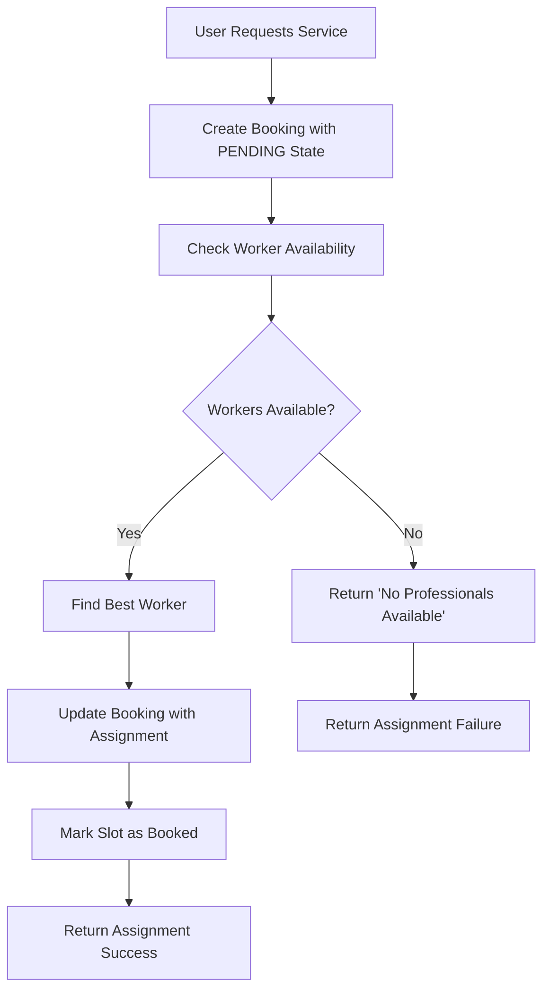
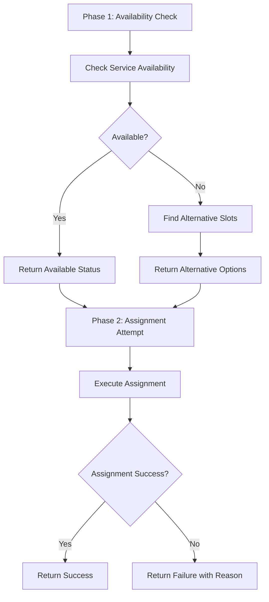

# SEVAQ Professional Assignment System - Technical Specification

**Document Version:** 1.0  
**Created:** January 10, 2026  
**Last Updated:** January 10, 2026  
**Status:** Draft

## Table of Contents

1. [Executive Summary](#executive-summary)
2. [System Architecture](#system-architecture)
3. [Core Components](#core-components)
4. [Assignment Flow and Business Logic](#assignment-flow-and-business-logic)
5. [Database Schema](#database-schema)
6. [API Endpoints](#api-endpoints)
7. [Current Issues and Limitations](#current-issues-and-limitations)
8. [Technical Requirements](#technical-requirements)
9. [Performance and Scalability](#performance-and-scalability)
10. [Implementation Guidelines](#implementation-guidelines)

## 1. Executive Summary

The SEVAQ Professional Assignment System is a sophisticated backend service responsible for matching users with professional service providers (workers) based on location, availability, skills, and service requirements. The system implements a two-phase assignment process with comprehensive worker matching algorithms, availability checking, and fallback mechanisms.

### Key Features
- **Smart Worker Matching**: Multi-criteria algorithm considering distance, rating, experience, and availability
- **Two-Phase Assignment**: Availability checking followed by assignment execution
- **Flexible Time Matching**: Support for time window-based scheduling
- **Location-Based Routing**: Geospatial filtering with fallback mechanisms
- **Assignment State Management**: Complete lifecycle tracking from pending to completion
- **Reassignment Support**: Automatic worker reassignment with tracking

### Current Status
The system is functional but faces challenges with the "No professionals available" error, primarily due to strict matching criteria and insufficient worker data in the test environment.

## 2. System Architecture

### 2.1 High-Level Architecture

```
┌─────────────────┐    ┌──────────────────┐    ┌─────────────────┐
│   Frontend      │    │   API Gateway    │    │  Assignment     │
│   (Flutter)     │────│   (NestJS)       │────│  Service        │
└─────────────────┘    └──────────────────┘    └─────────────────┘
                                │                        │
                                │                        │
                                ▼                        ▼
┌─────────────────┐    ┌──────────────────┐    ┌─────────────────┐
│   Availability  │    │   Worker Service │    │   Slot Service  │
│   Service       │    │                  │    │                 │
└─────────────────┘    └──────────────────┘    └─────────────────┘
                                │
                                │
                                ▼
┌─────────────────┐    ┌──────────────────┐
│   Database      │    │   External APIs  │
│   (PostgreSQL/  │    │   (Razorpay,     │
│   SQLite)       │    │   Geo Services)  │
└─────────────────┘    └──────────────────┘
```

### 2.2 Technology Stack

**Backend:**
- **Framework**: NestJS (Node.js)
- **Database**: PostgreSQL (production), SQLite (development)
- **ORM**: TypeORM
- **Authentication**: JWT with Passport.js
- **Validation**: Class-validator
- **Logging**: Built-in NestJS logging with console output

**Frontend:**
- **Framework**: Flutter
- **State Management**: Provider
- **HTTP Client**: http/dio
- **Location Services**: Google Maps API

**Infrastructure:**
- **Runtime**: Node.js 18+
- **Package Manager**: npm
- **Testing**: Jest
- **Code Quality**: ESLint, Prettier

### 2.3 Module Structure

```
src/
├── assignments/           # Core assignment logic
│   ├── assignments.service.ts
│   ├── assignments.controller.ts
│   ├── assignments.module.ts
│   └── dto/
├── availability/          # Availability checking
├── bookings/             # Booking management
├── workers/              # Worker management
├── slots/                # Time slot management
├── services/             # Service definitions
├── users/                # User management
├── locations/            # Location services
└── payments/             # Payment processing
```

## 3. Core Components

### 3.1 Assignment Service (`AssignmentsService`)

**Primary Responsibilities:**
- Worker matching and assignment
- Assignment state management
- Reassignment logic
- Assignment status tracking

**Key Methods:**
- `assignProfessional()` - Main assignment logic
- `reassignProfessional()` - Worker reassignment
- `getAssignmentStatus()` - Status retrieval
- `checkAvailabilityForAssignment()` - Two-phase availability check
- `attemptAssignment()` - Two-phase assignment execution

**Dependencies:**
- `BookingsRepository` - Booking data access
- `WorkersRepository` - Worker data access
- `ServicesRepository` - Service definitions
- `UsersRepository` - User data access
- `SlotsService` - Time slot management
- `AvailabilityService` - Availability checking

### 3.2 Worker Matching Algorithm

**Scoring Formula:**
```typescript
const distanceScore = distance * 0.3;           // 30% weight
const ratingScore = (5 - worker.rating) * 8 * 0.4; // 40% weight  
const reviewScore = (100 - Math.min(worker.reviewCount, 100)) * 0.3; // 30% weight
const totalScore = distanceScore + ratingScore + reviewScore;
```

**Matching Criteria:**
1. **Service Compatibility**: Worker must offer the requested service
2. **Location Proximity**: Within configurable radius (default: 15km)
3. **Availability**: Must have available time slot
4. **Worker Status**: Must be active and available
5. **Scoring**: Best match based on weighted scoring algorithm

**Location Fallback Logic:**
1. Primary: `worker.currentLat/Lng` (real-time location)
2. Secondary: `worker.latitude/longitude` (primary location)
3. Tertiary: `user.latitude/longitude` (user's location)
4. Final: Skip worker if no location data available

### 3.3 Availability Service (`AvailabilityService`)

**Core Functionality:**
- Real-time availability checking
- Alternative time slot suggestions
- Wait time estimation
- Capacity planning

**Availability Statuses:**
- `AVAILABLE`: 3+ workers available
- `LIMITED`: 1-2 workers available  
- `UNAVAILABLE`: No workers available

**Time Window Mapping:**
- Morning: 8:00 AM - 12:00 PM
- Afternoon: 12:00 PM - 5:00 PM
- Evening: 5:00 PM - 9:00 PM

### 3.4 Slot Management (`SlotsService`)

**Slot States:**
- `isBooked: false` - Available
- `isBooked: true` - Booked/Assigned

**Key Operations:**
- `findAvailableSlot()` - Find available time slot
- `findBookedSlot()` - Find booked time slot
- `markAsBooked()` - Mark slot as booked
- `markAsAvailable()` - Mark slot as available

## 4. Assignment Flow and Business Logic

### 4.1 Standard Assignment Flow



### 4.2 Two-Phase Assignment Flow



### 4.3 Assignment States

```typescript
export enum AssignmentState {
  PENDING = 'pending',           // Booking created, waiting for assignment
  ASSIGNED = 'assigned',         // Worker assigned successfully
  CONFIRMED = 'confirmed',       // Worker confirmed assignment
  REASSIGNING = 'reassigning',   // Currently reassigning worker
  CANCELLED = 'cancelled'        // Assignment cancelled
}
```

### 4.4 Business Rules

**Assignment Rules:**
1. Only bookings in `PENDING` state can be assigned
2. Workers must be active and available
3. Workers must offer the requested service
4. Workers must be within service radius
5. Time slots must not overlap with existing bookings

**Reassignment Rules:**
1. Only bookings with assigned workers can be reassigned
2. Current worker's slot must be marked as available
3. Reassignment count is tracked
4. New assignment follows same matching logic

**Location Rules:**
1. Primary location takes precedence over current location
2. User location is fallback for worker location
3. Distance calculated using Haversine formula
4. Service radius configurable per worker

## 5. Database Schema

### 5.1 Core Entities

#### Booking Entity
```sql
CREATE TABLE booking (
    id UUID PRIMARY KEY,
    user_id UUID REFERENCES user(id),
    worker_id UUID REFERENCES worker(id),
    service_id UUID REFERENCES service(id),
    slot_id UUID REFERENCES slot(id),
    start_time TIMESTAMP NOT NULL,
    end_time TIMESTAMP NOT NULL,
    amount DECIMAL(10,2) DEFAULT 0,
    status VARCHAR(20) DEFAULT 'pending',
    type VARCHAR(20) DEFAULT 'on_demand',
    notes TEXT,
    
    -- Assignment-specific fields
    assignment_state VARCHAR(20) DEFAULT 'pending',
    assigned_worker_id UUID,
    assignment_reason TEXT,
    reassignment_count INTEGER DEFAULT 0,
    assignment_timestamp TIMESTAMP,
    assignment_metadata TEXT,
    
    -- Responsibility transfer fields
    responsibility_transferred BOOLEAN DEFAULT FALSE,
    system_monitoring BOOLEAN DEFAULT FALSE,
    protection_status TEXT,
    
    created_at TIMESTAMP DEFAULT NOW(),
    updated_at TIMESTAMP DEFAULT NOW()
);
```

#### Worker Entity
```sql
CREATE TABLE worker (
    id UUID PRIMARY KEY,
    user_id UUID REFERENCES user(id),
    bio TEXT,
    rating DECIMAL(3,1) DEFAULT 0,
    review_count INTEGER DEFAULT 0,
    
    -- Professional identity
    years_of_experience INTEGER DEFAULT 0,
    homes_served_in_area INTEGER DEFAULT 0,
    reliability_streak INTEGER DEFAULT 0,
    
    -- System backing
    is_verified BOOLEAN DEFAULT FALSE,
    is_trained BOOLEAN DEFAULT FALSE,
    is_monitored BOOLEAN DEFAULT FALSE,
    
    -- Worker status
    is_active BOOLEAN DEFAULT TRUE,
    is_available BOOLEAN DEFAULT TRUE,
    
    -- Location data
    latitude DECIMAL(10,8),
    longitude DECIMAL(11,8),
    micro_zone_id TEXT,
    service_area_id TEXT,
    current_location_data TEXT,
    
    -- Real-time location tracking
    current_lat DECIMAL(10,8),
    current_lng DECIMAL(11,8),
    last_location_update TIMESTAMP,
    
    -- Service configuration
    service_radius_km DECIMAL(4,2) DEFAULT 5.0,
    availability_schedule JSON,
    
    created_at TIMESTAMP DEFAULT NOW(),
    updated_at TIMESTAMP DEFAULT NOW()
);
```

#### Slot Entity
```sql
CREATE TABLE slot (
    id UUID PRIMARY KEY,
    worker_id UUID REFERENCES worker(id),
    start_time TIMESTAMP NOT NULL,
    end_time TIMESTAMP NOT NULL,
    is_booked BOOLEAN DEFAULT FALSE
);
```

#### Service Entity
```sql
CREATE TABLE service (
    id UUID PRIMARY KEY,
    name VARCHAR(100) NOT NULL,
    description TEXT,
    base_price DECIMAL(10,2) DEFAULT 0,
    
    -- Trust and reassurance fields
    reassurance_text TEXT,
    what_will_happen TEXT[],
    what_will_not_happen TEXT[],
    if_something_goes_wrong TEXT,
    
    category VARCHAR(50),
    created_at TIMESTAMP DEFAULT NOW(),
    updated_at TIMESTAMP DEFAULT NOW()
);
```

### 5.2 Entity Relationships

- **Booking → Worker**: Many-to-One (booking belongs to one worker)
- **Booking → User**: Many-to-One (booking belongs to one user)  
- **Booking → Service**: Many-to-One (booking for one service)
- **Booking → Slot**: Many-to-One (booking uses one slot)
- **Worker → User**: Many-to-One (worker has one user)
- **Worker → Service**: Many-to-Many (worker offers multiple services)
- **Worker → Slot**: One-to-Many (worker has multiple slots)

### 5.3 Database Indexes

**Recommended Indexes:**
```sql
-- Assignment optimization
CREATE INDEX idx_booking_assignment_state ON booking(assignment_state);
CREATE INDEX idx_booking_assigned_worker ON booking(assigned_worker_id);

-- Worker matching optimization  
CREATE INDEX idx_worker_service ON worker_services_service(worker_id, service_id);
CREATE INDEX idx_worker_location ON worker(latitude, longitude);
CREATE INDEX idx_worker_availability ON worker(is_active, is_available);

-- Slot optimization
CREATE INDEX idx_slot_worker_time ON slot(worker_id, start_time, end_time);
CREATE INDEX idx_slot_booked ON slot(is_booked);

-- Performance indexes
CREATE INDEX idx_booking_user_created ON booking(user_id, created_at);
CREATE INDEX idx_worker_rating ON worker(rating);
```

## 6. API Endpoints

### 6.1 Assignment Endpoints

#### POST `/assignments/assign`
**Description:** Assign a professional to a booking
**Request Body:**
```json
{
  "bookingId": "uuid",
  "serviceId": "uuid", 
  "userLat": 28.6139,
  "userLng": 77.2090,
  "startTime": "2026-01-10T10:00:00Z",
  "endTime": "2026-01-10T12:00:00Z"
}
```

**Response:**
```json
{
  "success": true,
  "worker": {
    "id": "uuid",
    "rating": 4.5,
    "yearsOfExperience": 5
  }
}
```

#### POST `/assignments/reassign`
**Description:** Reassign a professional for a booking
**Request Body:**
```json
{
  "bookingId": "uuid"
}
```

#### GET `/assignments/:bookingId/status`
**Description:** Get assignment status for a booking

#### POST `/assignments/check-availability`
**Description:** Check availability before assignment (Phase 1)
**Request Body:**
```json
{
  "serviceId": "uuid",
  "userLat": 28.6139,
  "userLng": 77.2090, 
  "startTime": "2026-01-10T10:00:00Z",
  "endTime": "2026-01-10T12:00:00Z"
}
```

**Response:**
```json
{
  "available": true,
  "availableCount": 3,
  "estimatedWaitTime": 0,
  "alternativeSlots": []
}
```

#### POST `/assignments/attempt-assignment`
**Description:** Attempt assignment after availability check (Phase 2)

### 6.2 Availability Endpoints

#### POST `/availability/check`
**Description:** Check service availability for a time slot
**Request Body:**
```json
{
  "serviceId": "uuid",
  "date": "2026-01-10",
  "timeWindow": "morning",
  "userLat": 28.6139,
  "userLng": 77.2090,
  "radius": 5
}
```

**Response:**
```json
{
  "status": "available",
  "availableCount": 3,
  "estimatedWaitTime": 0,
  "alternativeTimeSlots": []
}
```

### 6.3 Worker Endpoints

#### GET `/workers/available`
**Description:** Get available workers for a service and location
**Query Parameters:**
- `serviceId`: Service UUID
- `lat`: User latitude
- `lng`: User longitude
- `radius`: Search radius in km (default: 5)

## 7. Current Issues and Limitations

### 7.1 "No Professionals Available" Error

**Root Causes:**
1. **Insufficient Worker Data**: Test environment has limited worker records
2. **Strict Location Filtering**: 15km radius may be too restrictive for sparse areas
3. **Time Slot Constraints**: Limited slot availability in test data
4. **Service Matching**: Workers may not be associated with requested services
5. **Worker Status**: Many workers marked as inactive or unavailable

**Current Debugging Output:**
```
🔍 Starting worker search for service: [service-id]
📍 User location: { lat: 28.6139, lng: 77.2090 }
⏰ Requested time: { start: 2026-01-10T10:00:00.000Z, end: 2026-01-10T12:00:00.000Z }
👷 Found workers for service: 0
❌ No workers found for service
```

### 7.2 Database Issues

**SQLite Limitations:**
- Limited concurrent connection support
- Performance issues with complex queries
- No native JSON support for some operations

**Entity Relationship Issues:**
- Missing foreign key constraints in some relationships
- Inconsistent naming conventions
- Missing indexes for performance optimization

### 7.3 Worker Matching Algorithm Issues

**Scoring Problems:**
- Distance weight (30%) may be too high for urban areas
- Rating weight (40%) may be too high for new workers
- Review count weight (30%) may disadvantage new workers

**Location Fallback Issues:**
- Primary location may be outdated
- User location fallback may not be accurate
- No geofencing or service area validation

### 7.4 Time Slot Management Issues

**Slot Creation:**
- No automated slot generation for workers
- Manual slot creation required
- No validation for overlapping slots

**Availability Checking:**
- No real-time availability updates
- Static slot data
- No buffer time between appointments

### 7.5 System Integration Issues

**Frontend-Backend Mismatch:**
- Inconsistent error handling
- Missing validation feedback
- Poor user experience for assignment failures

**State Management:**
- Assignment state not properly synchronized
- No real-time updates for assignment status
- Missing audit trail for assignment changes

## 8. Technical Requirements

### 8.1 Functional Requirements

**FR-001: Worker Matching**
- System MUST match workers based on service compatibility
- System MUST filter workers by geographic proximity
- System MUST consider worker availability and ratings
- System MUST return the best available match

**FR-002: Assignment Management**
- System MUST track assignment state throughout lifecycle
- System MUST support worker reassignment
- System MUST prevent double-booking of workers
- System MUST maintain assignment history

**FR-003: Availability Checking**
- System MUST check real-time worker availability
- System MUST suggest alternative time slots when unavailable
- System MUST estimate wait times based on availability
- System MUST validate time slot conflicts

**FR-004: Location Services**
- System MUST calculate distances using Haversine formula
- System MUST support multiple location data sources
- System MUST implement location fallback mechanisms
- System MUST respect worker service radius

### 8.2 Non-Functional Requirements

**Performance Requirements:**
- Assignment matching MUST complete within 2 seconds
- Availability checking MUST complete within 1 second
- System MUST handle 1000 concurrent assignment requests
- Database queries MUST use appropriate indexes

**Reliability Requirements:**
- System MUST maintain 99.5% uptime
- Assignment failures MUST be logged with detailed error information
- System MUST handle worker unavailability gracefully
- Data consistency MUST be maintained during concurrent operations

**Scalability Requirements:**
- System MUST support horizontal scaling of assignment services
- Database MUST support read replicas for availability checking
- Caching layer SHOULD be implemented for frequently accessed data
- Load balancing SHOULD be implemented for high availability

**Security Requirements:**
- All API endpoints MUST require authentication
- Worker location data MUST be protected
- Assignment metadata MUST be encrypted at rest
- System MUST implement rate limiting for assignment requests

### 8.3 Data Requirements

**Worker Data:**
- Minimum 50 workers per service category in each major city
- Worker profiles MUST include verified location data
- Service associations MUST be accurate and up-to-date
- Availability schedules MUST be maintained regularly

**Slot Data:**
- Workers MUST have minimum 4 hours of available slots per day
- Slot creation MUST prevent overlapping bookings
- Buffer time of 15 minutes SHOULD be maintained between appointments
- Weekend and holiday availability MUST be configured

**Service Data:**
- Service definitions MUST include accurate pricing
- Service categories MUST be properly organized
- Worker-service associations MUST be validated
- Service availability MUST be checked in real-time

## 9. Performance and Scalability

### 9.1 Performance Optimization

**Database Optimization:**
```sql
-- Add composite indexes for assignment queries
CREATE INDEX idx_assignment_search ON booking(assignment_state, service_id, start_time);

-- Optimize worker matching queries
CREATE INDEX idx_worker_match ON worker(is_active, is_available, latitude, longitude);

-- Improve slot availability queries
CREATE INDEX idx_slot_availability ON slot(worker_id, start_time, end_time, is_booked);
```

**Query Optimization:**
- Use eager loading for frequently accessed relationships
- Implement pagination for worker lists
- Cache frequently accessed service and worker data
- Use database connection pooling

**Application Optimization:**
- Implement request/response caching
- Use async/await for database operations
- Optimize worker matching algorithm complexity
- Implement circuit breaker pattern for external services

### 9.2 Scalability Architecture

**Horizontal Scaling:**
- Deploy assignment service across multiple instances
- Use load balancer for traffic distribution
- Implement stateless design for easy scaling
- Use distributed caching (Redis) for session data

**Database Scaling:**
- Implement read replicas for availability checking
- Use connection pooling for database connections
- Consider sharding for large-scale deployments
- Implement database monitoring and alerting

**Caching Strategy:**
- Cache worker availability for 5-minute intervals
- Cache service definitions and categories
- Use CDN for static assets
- Implement cache invalidation strategies

### 9.3 Monitoring and Observability

**Key Metrics to Monitor:**
- Assignment success rate
- Average assignment completion time
- Worker availability percentage
- Database query performance
- API response times

**Logging Strategy:**
- Structured logging for all assignment operations
- Error logging with stack traces
- Performance logging for slow queries
- Audit trail for assignment state changes

**Alerting:**
- Assignment failure rate > 5%
- Assignment completion time > 5 seconds
- Database connection failures
- Worker availability drops below threshold

## 10. Implementation Guidelines

### 10.1 Immediate Fixes for "No Professionals Available"

**1. Seed Database with Realistic Data:**
```javascript
// Create workers with proper location and service data
const workers = [
  {
    name: "John Doe",
    latitude: 28.6139,
    longitude: 77.2090,
    services: ["cleaning", "plumbing"],
    isAvailable: true,
    rating: 4.5,
    reviewCount: 25
  }
];
```

**2. Adjust Matching Algorithm:**
```typescript
// Increase radius for sparse areas
const maxRadius = isUrbanArea ? 5 : 15; // 5km urban, 15km rural

// Adjust scoring weights for new workers
const ratingWeight = worker.reviewCount > 10 ? 0.4 : 0.2;
const reviewWeight = worker.reviewCount > 10 ? 0.3 : 0.5;
```

**3. Improve Location Fallback:**
```typescript
// Use geocoding service for address-based location
const getLocation = async (address) => {
  const result = await geocodingService.geocode(address);
  return { lat: result.latitude, lng: result.longitude };
};
```

### 10.2 Long-term Improvements

**1. Implement Real-time Worker Tracking:**
- Use mobile app for worker location updates
- Implement geofencing for service areas
- Add worker availability status updates

**2. Enhance Assignment Algorithm:**
- Machine learning for better matching
- Historical data analysis for demand prediction
- Dynamic pricing based on availability

**3. Improve User Experience:**
- Real-time assignment status updates
- Push notifications for assignment changes
- Estimated arrival time tracking

**4. System Reliability:**
- Implement retry mechanisms for failed assignments
- Add circuit breaker for external service failures
- Implement graceful degradation for high load

### 10.3 Testing Strategy

**Unit Tests:**
- Worker matching algorithm tests
- Assignment state transition tests
- Database query optimization tests

**Integration Tests:**
- End-to-end assignment flow tests
- API endpoint integration tests
- Database transaction tests

**Load Tests:**
- Concurrent assignment request handling
- Database performance under load
- API response time under high traffic

**User Acceptance Tests:**
- Real-world assignment scenarios
- Edge case handling
- Error recovery testing

### 10.4 Deployment Considerations

**Environment Setup:**
- Separate environments for development, staging, production
- Database migration scripts for schema changes
- Environment-specific configuration management

**CI/CD Pipeline:**
- Automated testing before deployment
- Database migration automation
- Rollback mechanisms for failed deployments

**Monitoring Setup:**
- Application performance monitoring
- Database performance monitoring
- User experience monitoring

---

## Conclusion

The SEVAQ Professional Assignment System is a complex, multi-faceted service that requires careful attention to data quality, algorithm optimization, and system reliability. The current "No professionals available" issue is primarily a data and configuration problem that can be resolved through proper worker seeding, algorithm tuning, and system optimization.

The technical specification provides a comprehensive foundation for understanding the system architecture, identifying current limitations, and implementing improvements. Success will depend on addressing both immediate data issues and long-term architectural enhancements to create a robust, scalable assignment system.

**Next Steps:**
1. Implement immediate fixes for worker data and matching algorithm
2. Enhance database performance and indexing
3. Improve error handling and user feedback
4. Implement comprehensive monitoring and alerting
5. Plan for long-term scalability and feature enhancements