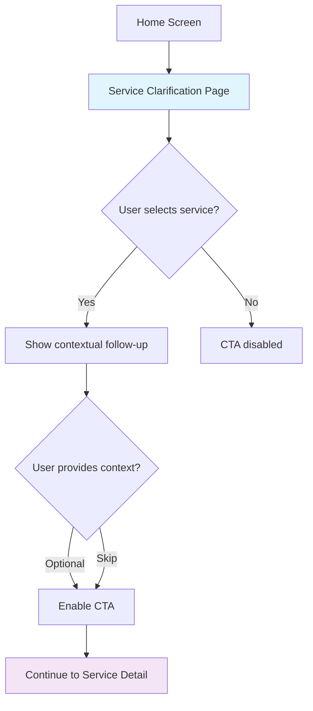
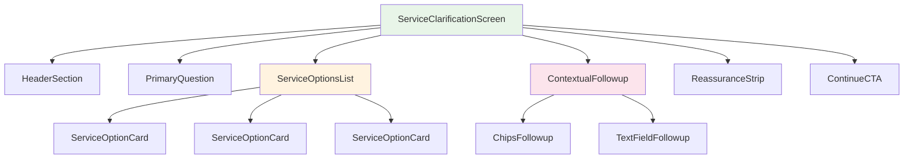

# SEVAQ SERVICE CLARIFICATION PAGE - COMPONENT DESIGN

## 🏗️ COMPONENT ARCHITECTURE

### Main Page Flow


### Component Hierarchy


## 📱 COMPONENT SPECIFICATIONS

### 1. ServiceClarificationScreen
**Purpose:** Main page container and state manager

**State:**
```dart
class ServiceClarificationState {
  ServiceOption? selectedService;
  String? followupResponse;
  bool isCTAEnabled;
}
```

**Key Methods:**
- `handleServiceSelection(service)`
- `handleFollowupResponse(response)`
- `navigateToServiceDetail()`

### 2. HeaderSection
**Purpose:** Simple, non-distracting header

**Props:**
```dart
class HeaderProps {
  final String title = "Confirm what you need";
  final String subtitle = "This helps us assign the right professional";
}
```

**Design:**
- Large, clean typography
- Generous spacing
- No decorative elements

### 3. PrimaryQuestion
**Purpose:** Core question that drives the experience

**Props:**
```dart
class PrimaryQuestionProps {
  final String question = "What kind of help do you need today?";
}
```

**Behavior:**
- Static text (no animation)
- Clear, human language
- Positioned prominently

### 4. ServiceOptionCard
**Purpose:** Individual service selection option

**Props:**
```dart
class ServiceOptionCardProps {
  final ServiceOption service;
  final bool isSelected;
  final VoidCallback onTap;
}
```

**Visual States:**
- Default: Subtle border, normal opacity
- Selected: Soft highlight, checkmark icon
- Hover/Focus: Slight elevation (web)

**Content Structure:**
```
┌─────────────────────────────────┐
│ 🧹 Home Cleaning                │
│                                 │
│ Regular home cleaning, floors,  │
│ kitchen, bathroom               │
└─────────────────────────────────┘
```

### 5. ContextualFollowup
**Purpose:** Smart follow-up question based on selection

**Logic:**
```dart
String getContextualQuestion(ServiceOption service) {
  switch(service.type) {
    case ServiceType.cleaning:
      return "Anything specific we should know? (Optional)";
    case ServiceType.cooking:
      return "Any dietary preferences? (Optional)";
    case ServiceType.maid:
      return "How often do you need help? (Optional)";
    case ServiceType.errands:
      return "What type of tasks? (Optional)";
    default:
      return "Anything else we should know? (Optional)";
  }
}
```

**Components:**
- ChipsFollowup: For predefined options
- TextFieldFollowup: For free text input

### 6. ReassuranceStrip
**Purpose:** Trust reinforcement before CTA

**Props:**
```dart
class ReassuranceStripProps {
  final String text = "We'll assign the right professional and monitor the visit end-to-end.";
  final TextStyle style = TextStyle(
    fontSize: 14,
    color: Colors.grey[600],
    fontStyle: FontStyle.italic
  );
}
```

**Design:**
- Muted background
- Small, italic text
- Positioned above CTA

### 7. ContinueCTA
**Purpose:** Single action to proceed

**Props:**
```dart
class ContinueCTAProps {
  final bool isEnabled;
  final VoidCallback onPressed;
  final String label = "Continue";
  final String subtext = "You can review details before confirming";
}
```

**Behavior:**
- Disabled until service selected
- Sticky positioning at bottom
- Clear, non-salesy language

## 🎨 STYLE SYSTEM

### Typography Scale
```dart
TextStyle headerTitle = TextStyle(
  fontSize: 28,
  fontWeight: FontWeight.w600,
  color: Colors.black87
);

TextStyle primaryQuestion = TextStyle(
  fontSize: 20,
  fontWeight: FontWeight.w500,
  color: Colors.black87
);

TextStyle serviceOptionTitle = TextStyle(
  fontSize: 18,
  fontWeight: FontWeight.w600,
  color: Colors.black87
);

TextStyle serviceOptionSubtitle = TextStyle(
  fontSize: 14,
  fontWeight: FontWeight.w400,
  color: Colors.black54
);
```

### Color Palette
```dart
Color backgroundColor = Colors.white; // Same as Home
Color cardBackground = Colors.white;
Color cardBorder = Colors.grey[200];
Color selectionHighlight = Color(0xFFE3F2FD);
Color checkmarkColor = Color(0xFF1976D2);
Color reassuranceText = Colors.grey[600];
```

### Spacing System
```dart
double pagePadding = 24.0;
double cardSpacing = 16.0;
double contentSpacing = 20.0;
double headerSpacing = 28.0;
double ctaSpacing = 24.0;
```

## 🔄 STATE MANAGEMENT

### Selection Logic
```dart
class ServiceClarificationProvider with ChangeNotifier {
  ServiceOption? _selectedService;
  String? _followupResponse;
  
  bool get isCTAEnabled => _selectedService != null;
  
  void selectService(ServiceOption service) {
    _selectedService = service;
    notifyListeners();
  }
  
  void setFollowupResponse(String? response) {
    _followupResponse = response;
    notifyListeners();
  }
}
```

### Navigation Flow
```dart
void _navigateToServiceDetail() {
  Navigator.push(
    context,
    MaterialPageRoute(
      builder: (context) => ServiceDetailScreen(
        service: _selectedService!,
        followup: _followupResponse
      )
    )
  );
}
```

## 📋 VALIDATION RULES

### CTA Enablement
- ✅ Enabled when service is selected
- ❌ Disabled when no service selected
- ✅ Remains enabled regardless of follow-up response

### Selection Behavior
- ✅ Single selection only
- ✅ Visual feedback on selection
- ✅ Micro-scroll animation
- ❌ No multi-selection

### Follow-up Logic
- ✅ Optional for all services
- ✅ Contextual based on service type
- ✅ Either chips OR text field (not both)
- ❌ No mandatory input

## 🧪 TESTING CRITERIA

### User Experience
- [ ] User understands what to do in < 5 seconds
- [ ] Selection feels natural and intuitive
- [ ] Follow-up question feels relevant
- [ ] CTA feels like the right next step

### Performance
- [ ] Page loads in < 2 seconds
- [ ] Selection animation is smooth
- [ ] No jank on scroll
- [ ] Memory usage is optimized

### Accessibility
- [ ] Screen reader friendly
- [ ] High contrast mode compatible
- [ ] Keyboard navigation supported
- [ ] Touch targets are 44px minimum

---

## 🎯 IMPLEMENTATION PRIORITY

1. **High Priority:**
   - ServiceClarificationScreen (main container)
   - ServiceOptionCard (core interaction)
   - ContinueCTA (primary action)

2. **Medium Priority:**
   - HeaderSection (branding consistency)
   - PrimaryQuestion (user guidance)
   - ReassuranceStrip (trust)

3. **Low Priority:**
   - ContextualFollowup (enhancement)
   - Animation refinements
   - Accessibility improvements

This design ensures the Service Clarification Page serves its critical role as the bridge between trust and execution, maintaining the calm, guided experience that makes SevaQ feel safe and correct.