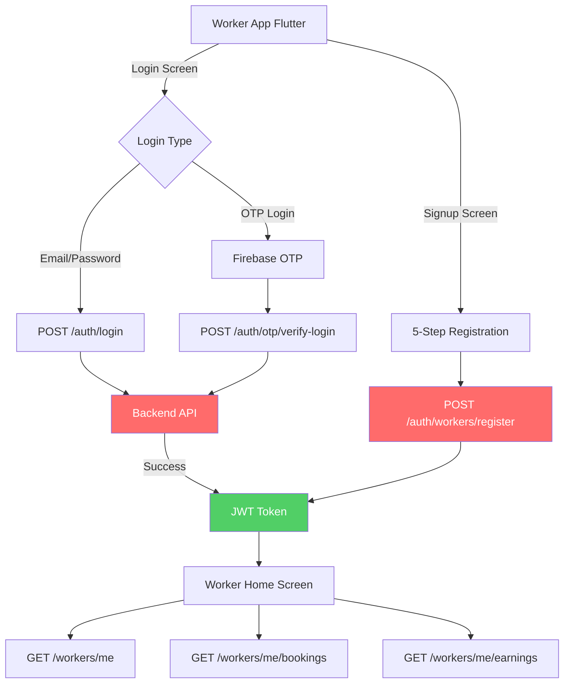
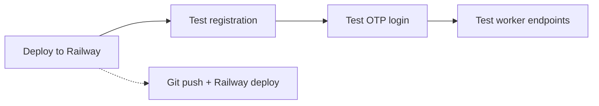

# Worker App Login & Registration - Implementation Plan

## Executive Summary

The worker app Flutter frontend is well-developed with login, signup, and worker registration screens. However, the **backend API endpoints are not functioning correctly on Railway production**. This document outlines the complete flow, issues, and required fixes.

---

## Current Architecture



## Issues Identified

| # | Endpoint | Expected | Actual | Root Cause |
|---|----------|----------|--------|------------|
| 1 | `POST /auth/workers/register` | Create worker + user | 404 Not Found | Route not registered in production |
| 2 | `POST /auth/otp/verify-login` | Return JWT | 400 Bad Request | DTO validation issue |
| 3 | `GET /workers/me/bookings` | Return bookings | 404 | JWT guard blocking |
| 4 | `GET /workers/me/earnings` | Return earnings | 404 | JWT guard blocking |

---

## Backend Fix Requirements

### Fix 1: Enable Worker Registration Route

**File**: `flutter-nest-househelp-master/src/auth/auth.controller.ts`

The route is defined at line 99 but returns 404 on production. This suggests the **Railway deployment is outdated**.

**Required Action**: Redeploy backend to Railway with latest code.

**Expected DTO** (`CreateWorkerRegistrationDto`):
```typescript
{
  phone: string;           // Required, e.g., "+919999999999"
  email: string;           // Required, valid email
  password: string;        // Required, min 8 chars
  firstName: string;      // Required
  lastName: string;       // Required
  address?: string;       // Optional
  serviceCategories?: string[];  // Optional, e.g., ["CLEANING"]
  serviceArea?: {
    latitude: number;
    longitude: number;
    address: string;
    radiusKm?: number;
  };
}
```

**Expected Response**:
```typescript
{
  access_token: string;    // JWT token
  user: {
    id: string;
    email: string;
    phone: string;
    role: string;
  };
  worker: {
    id: number;
    name: string;
    services: Service[];
    isAvailable: boolean;
  };
}
```

---

### Fix 2: Fix OTP Verify Login

**File**: `flutter-nest-househelp-master/src/auth/auth.controller.ts`, line 161

**Current Issue**: Returns 400 Bad Request

**Required DTO** (`VerifyIdTokenDto`):
```typescript
{
  phone: string;    // Required, E.164 format
  idToken: string; // Required, Firebase ID token or "dev_test_token"
}
```

**Validation Required**:
- Phone must be valid format (+91xxxxxxxxxx)
- idToken must not be empty

---

### Fix 3: Fix Worker Endpoints JWT Guard

**File**: `flutter-nest-househelp-master/src/workers/workers.controller.ts`

All worker endpoints require `@UseGuards(JwtAuthGuard)` but are returning 404.

**Expected Endpoints**:
- `GET /workers/me` - Get worker profile
- `GET /workers/me/bookings` - Get assigned bookings  
- `GET /workers/me/earnings` - Get earnings summary
- `PATCH /workers/me/availability` - Toggle availability

**Root Cause**: Routes need to be registered in the module or guards need to be fixed.

---

## Frontend Analysis (worker_app_flutter)

### Login Screen ✅
- **File**: `lib/screens/login_screen.dart`
- **Status**: Well implemented
- **Features**:
  - Email/password login
  - OTP login via Firebase
  - Demo mode with dev_test_token
- **Backend Call**: `authProvider.login()` → `POST /auth/login`

### Signup Screen ✅  
- **File**: `lib/screens/signup_screen.dart`
- **Status**: Well implemented (5-step wizard)
- **Steps**:
  1. Phone → OTP verification
  2. Personal details (name, email, password)
  3. Service selection (CLEANING, COOKING, MAID)
  4. Location/address
  5. Review & submit
- **Backend Call**: `authProvider.registerWorker()` → `POST /auth/workers/register`

### Auth Provider ✅
- **File**: `lib/providers/auth_provider.dart`
- **Status**: All methods implemented correctly
- **Methods**:
  - `login(email, password)` - Line 41
  - `verifyOtpWithToken(phone, idToken)` - Line 74
  - `registerWorker(...)` - Line 316
  - `fetchWorkerProfile()` - Line 201

---

## Implementation Plan

### Phase 1: Backend Fixes (Priority 1)



**Steps**:
1. Deploy latest backend code to Railway
2. Test `POST /auth/workers/register` with sample data
3. Test `POST /auth/otp/verify-login` 
4. Test worker endpoints with JWT token

### Phase 2: Frontend Testing (Priority 2)

**Steps**:
1. Run worker app with fixed backend
2. Test login flow
3. Test signup flow
4. Test home screen (bookings, earnings)

### Phase 3: Polish (Priority 3)

- Add better error messages
- Add loading states
- Add offline support

---

## Test Credentials

Once backend is fixed, test with:

### New Worker Registration
```json
POST /api/auth/workers/register
{
  "phone": "+919999999999",
  "email": "testworker@example.com",
  "password": "password123",
  "firstName": "Test",
  "lastName": "Worker",
  "serviceCategories": ["CLEANING"]
}
```

### OTP Login
```json
POST /api/auth/otp/verify-login
{
  "phone": "+919999999999",
  "idToken": "dev_test_token"
}
```

---

## Conclusion

The worker app frontend is **complete and well-built**. The issues are entirely on the **backend side** - specifically:

1. Worker registration endpoint not responding (404)
2. OTP login endpoint validation issue (400)
3. Worker endpoints require JWT but not accessible

**Recommendation**: Deploy the latest backend code to Railway and retest the worker app flow.

---

## Files Reference

### Frontend (worker_app_flutter)
- `lib/screens/login_screen.dart` - Login UI
- `lib/screens/signup_screen.dart` - Registration UI  
- `lib/providers/auth_provider.dart` - Auth logic
- `lib/services/api_service.dart` - API communication

### Backend (flutter-nest-househelp-master)
- `src/auth/auth.controller.ts` - Auth endpoints
- `src/auth/auth.service.ts` - Auth logic
- `src/workers/workers.controller.ts` - Worker endpoints
- `src/workers/workers.service.ts` - Worker logic