# SEVAQ Admin Dashboard - Phase 2 Design Document

## Executive Summary

Phase 2 transforms the SEVAQ Admin Dashboard from a basic monitoring tool into a comprehensive operations platform. Building on Phase 1's foundation (authentication, dashboard metrics, workers/bookings management, analytics, and user management), Phase 2 adds service management, real-time monitoring, advanced analytics, financial tools, customer support features, role-based admin access, and system configuration capabilities.

**Current System State:**
- Backend: NestJS running at `http://localhost:45357/api`
- Admin Dashboard: React + Vite at `http://localhost:5173`
- Database: PostgreSQL with 19 workers, 11 users, 43,102+ bookings
- All Phase 1 bugs resolved, schedulers running clean

---

## 1. Current Architecture Analysis

### 1.1 Existing Frontend Pages (Phase 1)

| Page | Route | Functionality |
|------|-------|---------------|
| Login | `/login` | Admin authentication with JWT |
| Dashboard | `/dashboard` | Real-time metrics cards |
| Workers | `/workers` | List, view, toggle availability |
| Bookings | `/bookings` | List, view, status update, cancel |
| Users | `/users` | List, search, filter |
| Analytics | `/analytics` | Revenue totals, booking breakdown |

### 1.2 Existing Backend Admin Endpoints

| Endpoint | Method | Purpose |
|----------|--------|---------|
| `/admin/dashboard` | GET | Dashboard statistics |
| `/admin/workers` | GET | List all workers with filters |
| `/admin/workers/:id` | GET | Get worker details |
| `/admin/workers/:id` | PUT | Update worker |
| `/admin/workers/:id/availability` | PATCH | Toggle availability |
| `/admin/workers/by-email` | POST | Create worker profile |
| `/admin/bookings` | GET | List bookings with filters |
| `/admin/bookings/:id` | GET | Get booking details |
| `/admin/bookings/:id/status` | PATCH | Update booking status |
| `/admin/bookings/:id/cancel` | POST | Cancel booking |
| `/admin/analytics/revenue` | GET | Revenue analytics |
| `/admin/analytics/bookings` | GET | Booking analytics |
| `/admin/users` | GET | List all users |
| `/admin/users/:id` | GET | Get user details |

### 1.3 Existing Database Entities

| Entity | Table | Key Fields |
|--------|-------|------------|
| Worker | `worker` | id, publicId, userId, bio, rating, isActive, isAvailable, currentLat, currentLng, lastLocationUpdate, availabilitySchedule, fcmToken |
| User | `user` | id, publicId, email, firstName, lastName, role, phone, latitude, longitude |
| Booking | `booking` | id, userId, workerId, serviceId, slotId, status, type, amount, assignmentState, location |
| Service | `service` | id, publicId, name, description, basePrice, category, subcategory, isAvailable |
| Category | `category` | id, name, reassuranceText, typicalEta, isSecondary |
| Payment | `payment` | id, publicId, bookingId, subscriptionId, amount, status, paymentMethod |
| ServiceRequest | `service_requests` | id, publicId, userId, serviceId, assignmentStatus, assignedWorkerId |
| Subscription | `subscriptions` | id, publicId, userId, status, startDate, endDate |
| Slot | `slot` | id, workerId, startTime, endTime, isBooked |
| Review | `review` | id, workerId, userId, rating, comment |
| ServiceArea | `service_area` | id, name, boundary, isActive |
| MicroZone | `micro_zone` | id, serviceAreaId, name, boundary |
| City | `city` | id, name, isActive |
| SystemHealth | `system_health` | id, component, status, lastCheck, details |
| Metrics | Various | Assignment, worker performance, user behavior, system performance |

---

## 2. Phase 2 Architecture

### 2.1 System Architecture Diagram

```mermaid
graph TB
    subgraph Admin Dashboard Frontend
        A[React + Vite App]
        A1[Dashboard Layout]
        A2[Auth Context]
        A3[API Service Layer]
        A --> A1
        A --> A2
        A --> A3
    end

    subgraph Frontend Pages - Phase 1
        P1[LoginPage]
        P2[DashboardPage]
        P3[WorkersPage]
        P4[BookingsPage]
        P5[UsersPage]
        P6[AnalyticsPage]
    end

    subgraph Frontend Pages - Phase 2 NEW
        P7[ServicesPage]
        P8[LiveMonitorPage]
        P9[AdvancedAnalyticsPage]
        P10[FinancialPage]
        P11[SupportPage]
        P12[AdminUsersPage]
        P13[SystemConfigPage]
    end

    A1 --> P1
    A1 --> P2
    A1 --> P3
    A1 --> P4
    A1 --> P5
    A1 --> P6
    A1 --> P7
    A1 --> P8
    A1 --> P9
    A1 --> P10
    A1 --> P11
    A1 --> P12
    A1 --> P13

    subgraph Backend API - NestJS
        B[Admin Module]
        B1[Admin Controller]
        B2[Admin Service]
        B --> B1
        B --> B2
    end

    subgraph Backend Modules - Existing
        M1[Auth Module]
        M2[Workers Module]
        M3[Bookings Module]
        M4[Users Module]
        M5[Services Module]
        M6[Payments Module]
        M7[Notifications Module]
    end

    subgraph Backend Modules - Phase 2 NEW
        M8[Financial Module]
        M9[Support Module]
        M10[System Config Module]
        M11[Real-time Gateway]
    end

    A3 -.HTTP/REST.-> B1
    A3 -.WebSocket.-> M11
    B1 -.calls.-> M1
    B1 -.calls.-> M2
    B1 -.calls.-> M3
    B1 -.calls.-> M4
    B1 -.calls.-> M5
    B1 -.calls.-> M6
    B1 -.calls.-> M7
    B1 -.calls.-> M8
    B1 -.calls.-> M9
    B1 -.calls.-> M10

    subgraph Database - PostgreSQL
        D1[(worker)]
        D2[(user)]
        D3[(booking)]
        D4[(service)]
        D5[(payment)]
        D6[(NEW TABLES)]
    end

    B2 --> D1
    B2 --> D2
    B2 --> D3
    B2 --> D4
    B2 --> D5
    B2 --> D6
```



### 2.2 Frontend Architecture

```
admin-web/src/
├── pages/
│   ├── LoginPage.tsx                    # Phase 1 - Existing
│   ├── DashboardPage.tsx                # Phase 1 - Existing
│   ├── WorkersPage.tsx                  # Phase 1 - Existing
│   ├── BookingsPage.tsx                 # Phase 1 - Existing
│   ├── UsersPage.tsx                    # Phase 1 - Existing
│   ├── AnalyticsPage.tsx                # Phase 1 - Existing
│   │
│   ├── ServicesPage.tsx                 # Phase 2 - NEW
│   ├── LiveMonitorPage.tsx              # Phase 2 - NEW
│   ├── AdvancedAnalyticsPage.tsx        # Phase 2 - NEW
│   ├── FinancialPage.tsx                # Phase 2 - NEW
│   ├── SupportPage.tsx                  # Phase 2 - NEW
│   ├── AdminUsersPage.tsx               # Phase 2 - NEW
│   └── SystemConfigPage.tsx             # Phase 2 - NEW
│
├── components/
│   ├── charts/                          # Phase 2 - NEW
│   │   ├── LineChart.tsx
│   │   ├── BarChart.tsx
│   │   ├── PieChart.tsx
│   │   └── HeatMap.tsx
│   ├── maps/                            # Phase 2 - NEW
│   │   ├── WorkerMap.tsx
│   │   └── ServiceAreaMap.tsx
│   ├── tables/                          # Phase 2 - NEW
│   │   ├── DataTable.tsx
│   │   └── Pagination.tsx
│   └── realtime/                        # Phase 2 - NEW
│       ├── LiveIndicator.tsx
│       └── NotificationBell.tsx
│
├── services/
│   ├── api.ts                           # Phase 1 - Existing
│   ├── services.api.ts                  # Phase 2 - NEW
│   ├── financial.api.ts                 # Phase 2 - NEW
│   ├── support.api.ts                   # Phase 2 - NEW
│   ├── realtime.service.ts              # Phase 2 - NEW
│   └── config.api.ts                    # Phase 2 - NEW
│
├── contexts/
│   ├── AuthContext.tsx                  # Phase 1 - Existing
│   └── RealtimeContext.tsx              # Phase 2 - NEW
│
└── types/
    ├── index.ts                         # Phase 1 - Existing
    ├── service.types.ts                 # Phase 2 - NEW
    ├── financial.types.ts               # Phase 2 - NEW
    ├── support.types.ts                 # Phase 2 - NEW
    └── config.types.ts                  # Phase 2 - NEW
```

---

## 3. Prioritized Feature List

### Priority P0 - Critical Foundation (Implement First)

| # | Feature | Description | Dependencies |
|---|---------|-------------|--------------|
| 1 | Service Management CRUD | Create, edit, deactivate services; manage categories; pricing config | Backend endpoints |
| 2 | Service-Worker Mapping | Assign workers to services; view service coverage | Service CRUD, Worker API |
| 3 | Role-Based Admin Access | Multiple admin accounts with roles (super_admin, support, finance) | Auth module update |
| 4 | Activity Audit Log | Track all admin actions with timestamps | New entity + endpoints |

### Priority P1 - High Value Operations

| # | Feature | Description | Dependencies |
|---|---------|-------------|--------------|
| 5 | Real-time Worker Map | Live worker locations on interactive map | WebSocket, Worker location API |
| 6 | Active Bookings Tracker | Real-time view of in-progress bookings | WebSocket, Booking API |
| 7 | Advanced Revenue Charts | Line/bar charts with date range picker | Chart library integration |
| 8 | Worker Performance Metrics | Completion rate, ratings, response time | New analytics endpoint |
| 9 | Payout Processing | View, approve, process worker payouts | Payment module extension |

### Priority P2 - Enhanced Operations

| # | Feature | Description | Dependencies |
|---|---------|-------------|--------------|
| 10 | Customer Retention Analysis | Repeat booking rate, churn metrics | New analytics endpoint |
| 11 | Service Popularity Trends | Most/least booked services over time | New analytics endpoint |
| 12 | Refund Management | Process, track, approve refunds | Payment module extension |
| 13 | User Booking History | Complete booking timeline per user | User detail page extension |
| 14 | Manual Booking Creation | Admin creates booking on behalf of user | New booking endpoint |

### Priority P3 - Nice to Have

| # | Feature | Description | Dependencies |
|---|---------|-------------|--------------|
| 15 | Invoice Generation | Auto-generate PDF invoices | PDF library, template system |
| 16 | Geographic Heat Maps | Booking density visualization | Map library, location data |
| 17 | System Health Dashboard | API latency, error rates, DB status | System monitoring module |
| 18 | Real-time Notifications | Toast notifications for events | WebSocket, Notification service |
| 19 | Complaint/Ticket System | Track and resolve user complaints | New entity + endpoints |
| 20 | Communication Log | View all notifications sent to users | Notification API extension |
| 21 | Notification Templates | Manage email/push notification templates | New entity + endpoints |
| 22 | Business Hours Config | Set operating hours per service | New entity + endpoints |
| 23 | Service Area Management | Edit service zones and micro-zones | ServiceArea API extension |
| 24 | Pricing Rules Engine | Dynamic pricing based on demand/time | New entity + endpoints |

---

## 4. New API Endpoints Required

### 4.1 Service Management

| Endpoint | Method | Request Body | Response | Description |
|----------|--------|--------------|----------|-------------|
| `/admin/services` | GET | Query: `?category=&isAvailable=` | `{ services: Service[], total: number }` | List all services |
| `/admin/services` | POST | `{ name, description, basePrice, category, subcategory }` | `Service` | Create new service |
| `/admin/services/:id` | GET | - | `Service` | Get service details |
| `/admin/services/:id` | PUT | `{ name?, description?, basePrice?, isAvailable? }` | `Service` | Update service |
| `/admin/services/:id` | DELETE | - | `{ success: boolean }` | Deactivate service |
| `/admin/services/:id/workers` | GET | - | `{ workers: Worker[] }` | Get workers assigned to service |
| `/admin/services/:id/workers` | POST | `{ workerIds: number[] }` | `{ success: boolean }` | Assign workers to service |
| `/admin/services/:id/workers/:workerId` | DELETE | - | `{ success: boolean }` | Remove worker from service |
| `/admin/categories` | GET | - | `{ categories: Category[] }` | List all categories |
| `/admin/categories` | POST | `{ name, reassuranceText, typicalEta }` | `Category` | Create category |
| `/admin/categories/:id` | PUT | `{ name?, reassuranceText?, isSecondary? }` | `Category` | Update category |

### 4.2 Real-time Monitoring

| Endpoint | Method | Request Body | Response | Description |
|----------|--------|--------------|----------|-------------|
| `/admin/monitor/workers` | GET | - | `{ workers: { id, name, currentLat, currentLng, isAvailable, lastLocationUpdate }[] }` | Get active worker locations |
| `/admin/monitor/bookings/active` | GET | - | `{ bookings: Booking[] }` | Get currently active bookings |
| `/admin/monitor/system-health` | GET | - | `{ components: { name, status, latency, lastCheck }[] }` | System health status |
| `WebSocket: /admin/ws` | WS | - | Real-time events | WebSocket connection for live updates |

**WebSocket Events:**
- `worker_location_update` - Worker position changed
- `booking_status_change` - Booking status updated
- `new_booking_created` - New booking event
- `system_alert` - System health alert
- `notification` - Admin notification

### 4.3 Advanced Analytics

| Endpoint | Method | Request Body | Response | Description |
|----------|--------|--------------|----------|-------------|
| `/admin/analytics/revenue/trends` | GET | Query: `?period=day|week|month&startDate=&endDate=` | `{ data: { date, revenue, bookings }[], totalRevenue, avgPerBooking }` | Revenue trends over time |
| `/admin/analytics/workers/performance` | GET | Query: `?workerId=&period=week|month` | `{ workers: { id, name, completedBookings, avgRating, avgResponseTime, cancellationRate }[] }` | Worker performance metrics |
| `/admin/analytics/customers/retention` | GET | Query: `?period=month|quarter` | `{ repeatRate, churnRate, newCustomers, returningCustomers, avgBookingsPerCustomer }` | Customer retention analysis |
| `/admin/analytics/services/popularity` | GET | Query: `?period=week|month` | `{ services: { id, name, bookingCount, revenue, trend }[] }` | Service popularity trends |
| `/admin/analytics/geographic` | GET | Query: `?granularity=zone|city` | `{ zones: { name, lat, lng, bookingCount, revenue }[] }` | Geographic booking distribution |

### 4.4 Financial Management

| Endpoint | Method | Request Body | Response | Description |
|----------|--------|--------------|----------|-------------|
| `/admin/financial/payouts` | GET | Query: `?status=pending|processed&workerId=` | `{ payouts: { id, workerId, amount, status, createdAt }[], total }` | List payout requests |
| `/admin/financial/payouts` | POST | `{ workerId, amount, periodStart, periodEnd }` | `{ id, workerId, amount, status }` | Create payout |
| `/admin/financial/payouts/:id/process` | POST | `{ paymentMethod, transactionId }` | `{ success, processedAt }` | Process/approve payout |
| `/admin/financial/refunds` | GET | Query: `?status=pending|approved|rejected` | `{ refunds: { id, bookingId, amount, reason, status }[], total }` | List refund requests |
| `/admin/financial/refunds/:id` | POST | `{ action: approve|reject, reason? }` | `{ success, status }` | Process refund |
| `/admin/financial/invoices/:bookingId` | GET | - | `PDF Stream` | Generate invoice for booking |
| `/admin/financial/reports/revenue` | GET | Query: `?period=month|quarter|year` | `{ totalRevenue, platformFee, workerPayouts, netRevenue, growthRate }` | Revenue summary report |

### 4.5 Customer Support

| Endpoint | Method | Request Body | Response | Description |
|----------|--------|--------------|----------|-------------|
| `/admin/support/users/:userId/bookings` | GET | Query: `?status=&limit=&offset=` | `{ bookings: Booking[], total }` | User booking history |
| `/admin/support/bookings` | POST | `{ userId, serviceId, date, startTime, endTime, location, notes? }` | `Booking` | Manual booking creation |
| `/admin/support/tickets` | GET | Query: `?status=open|closed&priority=low|medium|high` | `{ tickets: Ticket[], total }` | List support tickets |
| `/admin/support/tickets` | POST | `{ userId, subject, description, priority }` | `Ticket` | Create support ticket |
| `/admin/support/tickets/:id` | PUT | `{ status?, priority?, adminNotes? }` | `Ticket` | Update ticket |
| `/admin/support/tickets/:id/assign` | POST | `{ adminId }` | `{ success }` | Assign ticket to admin |
| `/admin/support/communications/:userId` | GET | Query: `?type=notification|email|push` | `{ communications: { type, content, sentAt, status }[] }` | User communication log |

### 4.6 Admin User Management

| Endpoint | Method | Request Body | Response | Description |
|----------|--------|--------------|----------|-------------|
| `/admin/admin-users` | GET | - | `{ admins: { id, email, name, role, lastLogin, createdAt }[] }` | List admin users |
| `/admin/admin-users` | POST | `{ email, name, password, role }` | `{ id, email, name, role }` | Create admin user |
| `/admin/admin-users/:id` | PUT | `{ name?, role?, isActive? }` | `AdminUser` | Update admin user |
| `/admin/admin-users/:id` | DELETE | - | `{ success }` | Deactivate admin user |
| `/admin/admin-users/:id/permissions` | GET | - | `{ permissions: string[] }` | Get admin permissions |
| `/admin/admin-users/:id/permissions` | PUT | `{ permissions: string[] }` | `{ success }` | Update admin permissions |
| `/admin/audit-log` | GET | Query: `?adminId=&action=&startDate=&endDate=&limit=` | `{ logs: AuditLog[], total }` | Activity audit log |

### 4.7 System Configuration

| Endpoint | Method | Request Body | Response | Description |
|----------|--------|--------------|----------|-------------|
| `/admin/config/notifications/templates` | GET | - | `{ templates: NotificationTemplate[] }` | List notification templates |
| `/admin/config/notifications/templates` | POST | `{ name, type, subject, body, variables }` | `NotificationTemplate` | Create template |
| `/admin/config/notifications/templates/:id` | PUT | `{ subject?, body? }` | `NotificationTemplate` | Update template |
| `/admin/config/business-hours` | GET | - | `{ hours: { day, openTime, closeTime, isClosed }[] }` | Get business hours |
| `/admin/config/business-hours` | PUT | `{ hours: { day, openTime, closeTime, isClosed }[] }` | `{ success }` | Update business hours |
| `/admin/config/service-areas` | GET | - | `{ areas: ServiceArea[] }` | List service areas |
| `/admin/config/service-areas` | POST | `{ name, boundary, isActive }` | `ServiceArea` | Create service area |
| `/admin/config/service-areas/:id` | PUT | `{ name?, boundary?, isActive? }` | `ServiceArea` | Update service area |
| `/admin/config/pricing-rules` | GET | - | `{ rules: PricingRule[] }` | List pricing rules |
| `/admin/config/pricing-rules` | POST | `{ serviceId, condition, multiplier, description }` | `PricingRule` | Create pricing rule |
| `/admin/config/pricing-rules/:id` | PUT | `{ condition?, multiplier?, description? }` | `PricingRule` | Update pricing rule |

---

## 5. Database Schema Changes

### 5.1 New Entities Required

#### AdminUser Entity
```typescript
@Entity('admin_users')
export class AdminUser {
  @PrimaryGeneratedColumn()
  id: number;

  @Column('uuid', { unique: true })
  publicId: string;

  @Column({ unique: true })
  email: string;

  @Column()
  passwordHash: string;

  @Column()
  name: string;

  @Column({ type: 'varchar', default: 'support' })
  role: AdminRole; // super_admin, support, finance

  @Column({ type: 'json', nullable: true })
  permissions: string[];

  @Column({ default: true })
  isActive: boolean;

  @Column({ type: 'timestamp', nullable: true })
  lastLogin: Date;

  @CreateDateColumn()
  createdAt: Date;

  @UpdateDateColumn()
  updatedAt: Date;
}

export enum AdminRole {
  SUPER_ADMIN = 'super_admin',
  SUPPORT = 'support',
  FINANCE = 'finance',
}
```

#### AuditLog Entity
```typescript
@Entity('audit_logs')
@Index(['adminId', 'createdAt'])
@Index(['action', 'createdAt'])
export class AuditLog {
  @PrimaryGeneratedColumn('uuid')
  id: string;

  @Column('uuid')
  adminId: string;

  @ManyToOne(() => AdminUser)
  @JoinColumn({ name: 'adminId' })
  admin: AdminUser;

  @Column({ type: 'varchar' })
  action: string; // 'worker_updated', 'booking_cancelled', etc.

  @Column({ type: 'varchar', nullable: true })
  entityType: string; // 'worker', 'booking', 'user'

  @Column('uuid', { nullable: true })
  entityId: string;

  @Column({ type: 'json', nullable: true })
  changes: Record<string, any>;

  @Column({ type: 'text', nullable: true })
  ipAddress: string;

  @Column({ type: 'text', nullable: true })
  userAgent: string;

  @CreateDateColumn()
  createdAt: Date;
}
```

#### SupportTicket Entity
```typescript
@Entity('support_tickets')
@Index(['userId', 'createdAt'])
@Index(['status', 'priority'])
export class SupportTicket {
  @PrimaryGeneratedColumn('uuid')
  id: string;

  @Column('uuid')
  userId: string;

  @ManyToOne(() => User)
  @JoinColumn({ name: 'userId' })
  user: User;

  @Column()
  subject: string;

  @Column({ type: 'text' })
  description: string;

  @Column({ type: 'varchar', default: 'open' })
  status: TicketStatus; // open, in_progress, resolved, closed

  @Column({ type: 'varchar', default: 'medium' })
  priority: TicketPriority; // low, medium, high, urgent

  @Column('uuid', { nullable: true })
  assignedAdminId: string;

  @ManyToOne(() => AdminUser, { nullable: true })
  @JoinColumn({ name: 'assignedAdminId' })
  assignedAdmin: AdminUser;

  @Column({ type: 'text', nullable: true })
  adminNotes: string;

  @Column('uuid', { nullable: true })
  relatedBookingId: string;

  @ManyToOne(() => Booking, { nullable: true })
  @JoinColumn({ name: 'relatedBookingId' })
  relatedBooking: Booking;

  @CreateDateColumn()
  createdAt: Date;

  @UpdateDateColumn()
  updatedAt: Date;

  @Column({ type: 'timestamp', nullable: true })
  resolvedAt: Date;
}

export enum TicketStatus {
  OPEN = 'open',
  IN_PROGRESS = 'in_progress',
  RESOLVED = 'resolved',
  CLOSED = 'closed',
}

export enum TicketPriority {
  LOW = 'low',
  MEDIUM = 'medium',
  HIGH = 'high',
  URGENT = 'urgent',
}
```

#### NotificationTemplate Entity
```typescript
@Entity('notification_templates')
export class NotificationTemplate {
  @PrimaryGeneratedColumn()
  id: number;

  @Column()
  name: string;

  @Column({ type: 'varchar' })
  type: NotificationType; // email, push, sms

  @Column({ nullable: true })
  subject: string;

  @Column({ type: 'text' })
  body: string;

  @Column({ type: 'json', nullable: true })
  variables: string[]; // ['userName', 'bookingDate', etc.]

  @Column({ default: true })
  isActive: boolean;

  @CreateDateColumn()
  createdAt: Date;

  @UpdateDateColumn()
  updatedAt: Date;
}

export enum NotificationType {
  EMAIL = 'email',
  PUSH = 'push',
  SMS = 'sms',
}
```

#### BusinessHours Entity
```typescript
@Entity('business_hours')
export class BusinessHours {
  @PrimaryGeneratedColumn()
  id: number;

  @Column()
  day: number; // 0=Sunday, 6=Saturday

  @Column({ type: 'time' })
  openTime: string;

  @Column({ type: 'time' })
  closeTime: string;

  @Column({ default: false })
  isClosed: boolean;

  @Column({ nullable: true })
  serviceId: number;

  @ManyToOne(() => Service, { nullable: true })
  @JoinColumn({ name: 'serviceId' })
  service: Service;
}
```

#### PricingRule Entity
```typescript
@Entity('pricing_rules')
export class PricingRule {
  @PrimaryGeneratedColumn()
  id: number;

  @Column({ nullable: true })
  serviceId: number;

  @ManyToOne(() => Service, { nullable: true })
  @JoinColumn({ name: 'serviceId' })
  service: Service;

  @Column({ type: 'json' })
  condition: {
    type: 'time_of_day' | 'day_of_week' | 'demand' | 'location';
    value: any;
  };

  @Column({ type: 'decimal', precision: 5, scale: 2 })
  multiplier: number; // 1.0 = no change, 1.5 = 50% increase

  @Column({ type: 'text', nullable: true })
  description: string;

  @Column({ default: true })
  isActive: boolean;

  @CreateDateColumn()
  createdAt: Date;

  @UpdateDateColumn()
  updatedAt: Date;
}
```

#### Payout Entity
```typescript
@Entity('payouts')
@Index(['workerId', 'createdAt'])
@Index(['status'])
export class Payout {
  @PrimaryGeneratedColumn()
  id: number;

  @Column()
  workerId: number;

  @ManyToOne(() => Worker)
  @JoinColumn({ name: 'workerId' })
  worker: Worker;

  @Column({ type: 'decimal', precision: 10, scale: 2 })
  amount: number;

  @Column({ type: 'varchar', default: 'pending' })
  status: PayoutStatus; // pending, approved, processed, rejected

  @Column({ type: 'date' })
  periodStart: Date;

  @Column({ type: 'date' })
  periodEnd: Date;

  @Column({ type: 'text', nullable: true })
  paymentMethod: string;

  @Column({ type: 'text', nullable: true })
  transactionId: string;

  @Column('uuid', { nullable: true })
  processedByAdminId: string;

  @Column({ type: 'text', nullable: true })
  notes: string;

  @Column({ type: 'timestamp', nullable: true })
  processedAt: Date;

  @CreateDateColumn()
  createdAt: Date;

  @UpdateDateColumn()
  updatedAt: Date;
}

export enum PayoutStatus {
  PENDING = 'pending',
  APPROVED = 'approved',
  PROCESSED = 'processed',
  REJECTED = 'rejected',
}
```

#### Refund Entity
```typescript
@Entity('refunds')
@Index(['bookingId'])
@Index(['status'])
export class Refund {
  @PrimaryGeneratedColumn('uuid')
  id: string;

  @Column('uuid')
  bookingId: string;

  @ManyToOne(() => Booking)
  @JoinColumn({ name: 'bookingId' })
  booking: Booking;

  @Column({ type: 'decimal', precision: 10, scale: 2 })
  amount: number;

  @Column({ type: 'text' })
  reason: string;

  @Column({ type: 'varchar', default: 'pending' })
  status: RefundStatus; // pending, approved, processed, rejected

  @Column('uuid', { nullable: true })
  processedByAdminId: string;

  @Column({ type: 'text', nullable: true })
  adminNotes: string;

  @Column({ type: 'timestamp', nullable: true })
  processedAt: Date;

  @CreateDateColumn()
  createdAt: Date;

  @UpdateDateColumn()
  updatedAt: Date;
}

export enum RefundStatus {
  PENDING = 'pending',
  APPROVED = 'approved',
  PROCESSED = 'processed',
  REJECTED = 'rejected',
}
```

### 5.2 Existing Entity Modifications

#### Worker Entity - Additions Needed
```typescript
// Already has most fields needed for real-time tracking
// Consider adding:
@Column({ type: 'json', nullable: true })
performanceMetrics: {
  completedBookings: number;
  avgRating: number;
  avgResponseTime: number;
  cancellationRate: number;
};
```

#### User Entity - Additions Needed
```typescript
// Add for support features:
@Column({ default: 0 })
totalBookings: number;

@Column({ type: 'timestamp', nullable: true })
lastBookingDate: Date;
```

### 5.3 Schema Migration SQL

```sql
-- Admin Users Table
CREATE TABLE admin_users (
  id SERIAL PRIMARY KEY,
  public_id UUID UNIQUE NOT NULL DEFAULT gen_random_uuid(),
  email VARCHAR(255) UNIQUE NOT NULL,
  password_hash VARCHAR(255) NOT NULL,
  name VARCHAR(255) NOT NULL,
  role VARCHAR(50) DEFAULT 'support',
  permissions JSONB,
  is_active BOOLEAN DEFAULT true,
  last_login TIMESTAMP,
  created_at TIMESTAMP DEFAULT NOW(),
  updated_at TIMESTAMP DEFAULT NOW()
);

-- Audit Logs Table
CREATE TABLE audit_logs (
  id UUID PRIMARY KEY DEFAULT gen_random_uuid(),
  admin_id UUID NOT NULL,
  action VARCHAR(100) NOT NULL,
  entity_type VARCHAR(50),
  entity_id UUID,
  changes JSONB,
  ip_address TEXT,
  user_agent TEXT,
  created_at TIMESTAMP DEFAULT NOW()
);

CREATE INDEX idx_audit_logs_admin ON audit_logs(admin_id, created_at);
CREATE INDEX idx_audit_logs_action ON audit_logs(action, created_at);

-- Support Tickets Table
CREATE TABLE support_tickets (
  id UUID PRIMARY KEY DEFAULT gen_random_uuid(),
  user_id UUID NOT NULL,
  subject VARCHAR(255) NOT NULL,
  description TEXT NOT NULL,
  status VARCHAR(20) DEFAULT 'open',
  priority VARCHAR(20) DEFAULT 'medium',
  assigned_admin_id UUID,
  admin_notes TEXT,
  related_booking_id UUID,
  created_at TIMESTAMP DEFAULT NOW(),
  updated_at TIMESTAMP DEFAULT NOW(),
  resolved_at TIMESTAMP
);

CREATE INDEX idx_tickets_user ON support_tickets(user_id, created_at);
CREATE INDEX idx_tickets_status_priority ON support_tickets(status, priority);

-- Notification Templates Table
CREATE TABLE notification_templates (
  id SERIAL PRIMARY KEY,
  name VARCHAR(100) NOT NULL,
  type VARCHAR(20) NOT NULL,
  subject VARCHAR(255),
  body TEXT NOT NULL,
  variables JSONB,
  is_active BOOLEAN DEFAULT true,
  created_at TIMESTAMP DEFAULT NOW(),
  updated_at TIMESTAMP DEFAULT NOW()
);

-- Business Hours Table
CREATE TABLE business_hours (
  id SERIAL PRIMARY KEY,
  day INTEGER NOT NULL,
  open_time TIME NOT NULL,
  close_time TIME NOT NULL,
  is_closed BOOLEAN DEFAULT false,
  service_id INTEGER REFERENCES service(id)
);

-- Pricing Rules Table
CREATE TABLE pricing_rules (
  id SERIAL PRIMARY KEY,
  service_id INTEGER REFERENCES service(id),
  condition JSONB NOT NULL,
  multiplier DECIMAL(5,2) NOT NULL,
  description TEXT,
  is_active BOOLEAN DEFAULT true,
  created_at TIMESTAMP DEFAULT NOW(),
  updated_at TIMESTAMP DEFAULT NOW()
);

-- Payouts Table
CREATE TABLE payouts (
  id SERIAL PRIMARY KEY,
  worker_id INTEGER NOT NULL REFERENCES worker(id),
  amount DECIMAL(10,2) NOT NULL,
  status VARCHAR(20) DEFAULT 'pending',
  period_start DATE NOT NULL,
  period_end DATE NOT NULL,
  payment_method TEXT,
  transaction_id TEXT,
  processed_by_admin_id UUID,
  notes TEXT,
  processed_at TIMESTAMP,
  created_at TIMESTAMP DEFAULT NOW(),
  updated_at TIMESTAMP DEFAULT NOW()
);

CREATE INDEX idx_payouts_worker ON payouts(worker_id, created_at);
CREATE INDEX idx_payouts_status ON payouts(status);

-- Refunds Table
CREATE TABLE refunds (
  id UUID PRIMARY KEY DEFAULT gen_random_uuid(),
  booking_id UUID NOT NULL REFERENCES booking(id),
  amount DECIMAL(10,2) NOT NULL,
  reason TEXT NOT NULL,
  status VARCHAR(20) DEFAULT 'pending',
  processed_by_admin_id UUID,
  admin_notes TEXT,
  processed_at TIMESTAMP,
  created_at TIMESTAMP DEFAULT NOW(),
  updated_at TIMESTAMP DEFAULT NOW()
);

CREATE INDEX idx_refunds_booking ON refunds(booking_id);
CREATE INDEX idx_refunds_status ON refunds(status);
```

---

## 6. UI/UX Wireframes

### 6.1 Services Management Page

```
+------------------------------------------------------------------+
|  Services Management                          [+ Create Service]  |
+------------------------------------------------------------------+
|  Search: [________________]  Category: [All v]  Status: [All v]  |
+------------------------------------------------------------------+
|  Name              | Category    | Base Price | Workers | Status  |
|--------------------|-------------|------------|---------|---------|
|  Deep Cleaning     | Cleaning    | ₹1,499     | 8       | Active  |
|  Sofa Cleaning     | Cleaning    | ₹999       | 5       | Active  |
|  AC Service        | Maintenance | ₹799       | 3       | Active  |
|  Plumbing          | Maintenance | ₹599       | 4       | Active  |
|  Electrical        | Maintenance | ₹699       | 2       | Inactive|
|  Painting          | Renovation  | ₹2,999     | 3       | Active  |
+------------------------------------------------------------------+
|  Showing 6 of 12 services                    [< 1 2 >]           |
+------------------------------------------------------------------+

[Edit Service Modal]
+--------------------------------------------------+
|  Edit Service                              [X]   |
+--------------------------------------------------+
|  Name:        [Deep Cleaning____________]        |
|  Category:    [Cleaning_____________v]           |
|  Subcategory: [Deep Clean__________v]           |
|  Base Price:  [₹ 1,499______________]           |
|  Description: [________________________________] |
|               [________________________________] |
|  Reassurance: [A safe choice for most homes_]   |
|                                                  |
|  What Will Happen:                               |
|  [+ Add item]                                    |
|  - Helper will arrive with equipment             |
|  - Work completed within estimated time          |
|                                                  |
|  What Will NOT Happen:                           |
|  [+ Add item]                                    |
|  - No upselling without approval                 |
|                                                  |
|  [ ] Active Service                              |
|                                                  |
|  [Cancel]                        [Save Changes]  |
+--------------------------------------------------+
```

### 6.2 Live Monitoring Page

```
+------------------------------------------------------------------+
|  Live Operations Monitor                        [● Live]  [⚙]    |
+------------------------------------------------------------------+
|  Quick Stats                                                     |
|  +----------------+  +----------------+  +----------------+      |
|  | Active Workers |  | Active Bookings|  | Avg Response   |      |
|  |      12        |  |       8        |  |    4.2 min     |      |
|  +----------------+  +----------------+  +----------------+      |
+------------------------------------------------------------------+
|  Worker Map                          |  Active Bookings          |
|  +-------------------------------+   |  +---------------------+  |
|  |                               |   |  | Time   | Worker     |  |
|  |    [●]      [●]               |   |  | 10:30  | Raj K.     |  |
|  |                               |   |  | 11:00  | Priya S.   |  |
|  |          [●]    [●]           |   |  | 11:15  | Amit P.    |  |
|  |                               |   |  | 11:30  | Sunita D.  |  |
|  |    [●]               [●]      |   |  | 12:00  | Vikram M.  |  |
|  |                               |   |  | 12:30  | Neha R.    |  |
|  |               [●]             |   |  +---------------------+  |
|  +-------------------------------+   |                           |
|  Legend: ● Available  ● Busy  ● Offline |  [View All Bookings]   |
+------------------------------------------------------------------+
|  System Health                                                   |
|  +----------------+  +----------------+  +----------------+      |
|  | API Server     |  | Database       |  | Notification   |      |
|  | ● Healthy 12ms |  | ● Healthy 3ms  |  | ● Healthy      |      |
|  +----------------+  +----------------+  +----------------+      |
+------------------------------------------------------------------+
```

### 6.3 Advanced Analytics Page

```
+------------------------------------------------------------------+
|  Advanced Analytics                          [Date Range: 30d v] |
+------------------------------------------------------------------+
|  Revenue Trends                                                  |
|  +--------------------------------------------------------------+|
|  |  ₹                                                          ||
|  |  |     /\        /\                                          ||
|  |  |    /  \  /\  /  \  /\                                     ||
|  |  |___/____\/__\/____\/__\___                                 ||
|  |      1  5  10  15  20  25  30 (days)                         ||
|  |                                                              ||
|  |  Total: ₹4,52,340  |  Avg/Booking: ₹1,247  |  Growth: +12%  ||
|  +--------------------------------------------------------------+|
+------------------------------------------------------------------+
|  Worker Performance                    Service Popularity         |
|  +----------------------------+        +---------------------+   |
|  | Worker        | Rating | Cmpl|        | Service    | Bookings|  |
|  |---------------|--------|-----|        |------------|---------|  |
|  | Raj K.        | 4.9    | 142 |        | Deep Clean | 1,234 |  |
|  | Priya S.      | 4.8    | 128 |        | Sofa Clean | 892   |  |
|  | Amit P.       | 4.7    | 115 |        | AC Service | 654   |  |
|  | Sunita D.     | 4.6    | 98  |        | Plumbing   | 543   |  |
|  | Vikram M.     | 4.5    | 87  |        | Electrical | 321   |  |
|  +----------------------------+        +---------------------+   |
+------------------------------------------------------------------+
|  Customer Retention                                              |
|  +--------------------------------------------------------------+|
|  |  Repeat Rate: 34%  |  Churn: 8%  |  Avg Bookings/User: 3.2  ||
|  |                                                              ||
|  |  [████████████████████████░░░░░░░░░░]  Returning 62%        ||
|  |  [████████████░░░░░░░░░░░░░░░░░░░░]  One-time 38%           ||
|  +--------------------------------------------------------------+|
+------------------------------------------------------------------+
```

### 6.4 Financial Management Page

```
+------------------------------------------------------------------+
|  Financial Management                         [+ Process Payout]  |
+------------------------------------------------------------------+
|  Tabs: [Payouts] [Refunds] [Reports] [Invoices]                  |
+------------------------------------------------------------------+
|  PENDING PAYOUTS                                                 |
|  +--------------------------------------------------------------+|
|  | Worker        | Period          | Amount    | Actions        ||
|  |---------------|-----------------|-----------|----------------||
|  | Raj K.        | Mar 1-15        | ₹18,450   | [Approve] [View]||
|  | Priya S.      | Mar 1-15        | ₹15,200   | [Approve] [View]||
|  | Amit P.       | Mar 1-15        | ₹12,800   | [Approve] [View]||
|  +--------------------------------------------------------------+|
+------------------------------------------------------------------+
|  RECENT REFUND REQUESTS                                          |
|  +--------------------------------------------------------------+|
|  | Booking ID    | Amount   | Reason              | Status      ||
|  |---------------|----------|---------------------|-------------||
|  | #BK-2847      | ₹1,499   | Worker no-show      | [Approve]   ||
|  | #BK-2831      | ₹799     | Poor quality        | [Review]    ||
|  +--------------------------------------------------------------+|
+------------------------------------------------------------------+
|  Revenue Summary (This Month)                                    |
|  +----------------+  +----------------+  +----------------+      |
|  | Total Revenue  |  | Platform Fee   |  | Net Revenue    |      |
|  |   ₹4,52,340    |  |   ₹90,468      |  |   ₹3,61,872    |      |
|  |   +12% vs last |  |   (20%)        |  |   +8% vs last  |      |
|  +----------------+  +----------------+  +----------------+      |
+------------------------------------------------------------------+
```

### 6.5 Customer Support Page

```
+------------------------------------------------------------------+
|  Customer Support                            [+ New Ticket]       |
+------------------------------------------------------------------+
|  Tabs: [Tickets] [User History] [Manual Booking] [Comm Log]      |
+------------------------------------------------------------------+
|  OPEN TICKETS                                         Filter: [v]|
|  +--------------------------------------------------------------+|
|  | ID     | User        | Subject          | Priority | Status  ||
|  |--------|-------------|------------------|----------|---------||
|  | #T-142 | Arun M.     | Worker late      | High     | Open    ||
|  | #T-141 | Sneha K.    | Billing issue    | Medium   | Open    ||
|  | #T-140 | Rahul P.    | Service quality  | Low      | In Prog ||
|  +--------------------------------------------------------------+|
+------------------------------------------------------------------+
|  Ticket Detail Panel (Slide-in)                                  |
|  +------------------------------------------------------------+  |
|  | #T-142: Worker late                        [Close] [X]     |  |
|  |------------------------------------------------------------|  |
|  | User: Arun M. (arun@email.com)                             |  |
|  | Related Booking: #BK-2847 - Deep Cleaning - Mar 15        |  |
|  |                                                            |  |
|  | Description:                                               |  |
|  | "Worker was 45 minutes late without any communication"     |  |
|  |                                                            |  |
|  | Admin Notes:                                               |  |
|  | [______________________________________________________]   |  |
|  | [______________________________________________________]   |  |
|  |                                                            |  |
|  | Priority: [High v]  Status: [In Progress v]               |  |
|  |                                                            |  |
|  | [Add Note]                    [Resolve Ticket]             |  |
|  +------------------------------------------------------------+  |
+------------------------------------------------------------------+
```

### 6.6 Admin Users Page

```
+------------------------------------------------------------------+
|  Admin User Management                        [+ Add Admin]       |
+------------------------------------------------------------------+
|  +--------------------------------------------------------------+|
|  | Name          | Email            | Role        | Last Login  ||
|  |---------------|------------------|-------------|-------------||
|  | Admin User    | admin@sevaq.com  | Super Admin | 2 min ago   ||
|  | Support Agent | support@sevaq.com| Support     | 1 hour ago  ||
|  | Finance Mgr   | finance@sevaq.com| Finance     | 3 days ago  ||
|  +--------------------------------------------------------------+|
+------------------------------------------------------------------+
|  Role Permissions                                                |
|  +--------------------------------------------------------------+|
|  | Permission              | Super Admin | Support | Finance    ||
|  |-------------------------|-------------|---------|------------||
|  | View Dashboard          |     ✓       |    ✓    |     ✓      ||
|  | Manage Workers          |     ✓       |    ✓    |     -      ||
|  | Manage Bookings         |     ✓       |    ✓    |     -      ||
|  | View Analytics          |     ✓       |    ✓    |     ✓      ||
|  | Process Payouts         |     ✓       |    -    |     ✓      ||
|  | Process Refunds         |     ✓       |    -    |     ✓      ||
|  | Manage Support Tickets  |     ✓       |    ✓    |     -      ||
|  | Manage Admin Users      |     ✓       |    -    |     -      ||
|  | System Configuration    |     ✓       |    -    |     -      ||
|  | View Audit Log          |     ✓       |    -    |     -      ||
|  +--------------------------------------------------------------+|
+------------------------------------------------------------------+
```

### 6.7 System Configuration Page

```
+------------------------------------------------------------------+
|  System Configuration                                            |
+------------------------------------------------------------------+
|  Tabs: [Notifications] [Business Hours] [Service Areas] [Pricing]|
+------------------------------------------------------------------+
|  NOTIFICATION TEMPLATES                                          |
|  +--------------------------------------------------------------+|
|  | Name                    | Type   | Status   | Actions        ||
|  |-------------------------|--------|----------|----------------||
|  | Booking Confirmation    | Push   | Active   | [Edit] [Test]  ||
|  | Booking Confirmation    | Email  | Active   | [Edit] [Test]  ||
|  | Worker Assigned         | Push   | Active   | [Edit] [Test]  ||
|  | Payment Received        | Email  | Active   | [Edit] [Test]  ||
|  | Service Reminder        | Push   | Active   | [Edit] [Test]  ||
|  +--------------------------------------------------------------+|
+------------------------------------------------------------------+
|  BUSINESS HOURS                                                  |
|  +--------------------------------------------------------------+|
|  | Day       | Open     | Close    | Status                      ||
|  |-----------|----------|----------|-----------------------------||
|  | Monday    | 06:00 AM | 10:00 PM | [Edit]                      ||
|  | Tuesday   | 06:00 AM | 10:00 PM | [Edit]                      ||
|  | Wednesday | 06:00 AM | 10:00 PM | [Edit]                      ||
|  | Thursday  | 06:00 AM | 10:00 PM | [Edit]                      ||
|  | Friday    | 06:00 AM | 10:00 PM | [Edit]                      ||
|  | Saturday  | 07:00 AM | 09:00 PM | [Edit]                      ||
|  | Sunday    | 08:00 AM | 06:00 PM | [Edit]                      ||
|  +--------------------------------------------------------------+|
+------------------------------------------------------------------+
```

---

## 7. Implementation Phases

### Phase 2.1 - Service Management & Admin Roles (Weeks 1-2)

**Goal:** Enable full service catalog management and role-based admin access

**Backend Tasks:**
1. Create Service CRUD endpoints in admin controller
2. Create Service-Worker mapping endpoints
3. Create Category management endpoints
4. Create AdminUser entity and authentication updates
5. Create AuditLog entity and middleware
6. Update JWT auth to support role-based permissions

**Frontend Tasks:**
1. Create ServicesPage with list, create, edit, delete
2. Create Service-Worker assignment UI
3. Create AdminUsersPage with role management
4. Update AuthContext to handle admin roles
5. Add permission-based route guards
6. Create AuditLog viewer

**Deliverables:**
- Service management fully functional
- Multiple admin accounts with roles
- Complete audit trail of admin actions

### Phase 2.2 - Real-time Monitoring & Advanced Analytics (Weeks 3-4)

**Goal:** Live operations visibility and deep analytics

**Backend Tasks:**
1. Create WebSocket gateway for real-time events
2. Create worker location tracking endpoints
3. Create active bookings endpoint
4. Create advanced analytics endpoints (revenue trends, worker performance, retention, popularity)
5. Create geographic data endpoint

**Frontend Tasks:**
1. Create RealtimeContext for WebSocket management
2. Create LiveMonitorPage with map integration
3. Install and integrate charting library (recharts recommended)
4. Create AdvancedAnalyticsPage with all chart types
5. Create chart components (LineChart, BarChart, PieChart)
6. Create map components for worker tracking

**Deliverables:**
- Live worker map operational
- Real-time booking tracker
- Revenue trend charts
- Worker performance dashboard
- Customer retention analysis

### Phase 2.3 - Financial Management (Weeks 5-6)

**Goal:** Complete financial operations toolkit

**Backend Tasks:**
1. Create Payout entity and endpoints
2. Create Refund entity and endpoints
3. Create invoice generation endpoint
4. Create revenue report endpoint
5. Add payout calculation logic

**Frontend Tasks:**
1. Create FinancialPage with tabbed interface
2. Create Payout management UI
3. Create Refund processing UI
4. Create invoice viewer
5. Create revenue report dashboard

**Deliverables:**
- Payout processing workflow
- Refund management system
- Invoice generation
- Revenue reports

### Phase 2.4 - Customer Support Tools (Weeks 7-8)

**Goal:** Complete customer support toolkit

**Backend Tasks:**
1. Create SupportTicket entity and endpoints
2. Create manual booking creation endpoint
3. Create user booking history endpoint
4. Create communication log endpoint

**Frontend Tasks:**
1. Create SupportPage with tabbed interface
2. Create ticket management UI
3. Create user booking history view
4. Create manual booking form
5. Create communication log viewer

**Deliverables:**
- Support ticket system
- User booking history view
- Manual booking creation
- Communication log

### Phase 2.5 - System Configuration (Weeks 9-10)

**Goal:** Complete system configuration capabilities

**Backend Tasks:**
1. Create NotificationTemplate entity and endpoints
2. Create BusinessHours entity and endpoints
3. Create PricingRule entity and endpoints
4. Extend ServiceArea endpoints

**Frontend Tasks:**
1. Create SystemConfigPage with tabbed interface
2. Create notification template editor
3. Create business hours configurator
4. Create service area manager
5. Create pricing rules editor

**Deliverables:**
- Notification template management
- Business hours configuration
- Service area management
- Pricing rules engine

---

## 8. Technical Recommendations

### 8.1 Frontend Libraries to Add

| Library | Purpose | Installation |
|---------|---------|--------------|
| `recharts` | Charts and graphs | `npm install recharts` |
| `react-leaflet` + `leaflet` | Interactive maps | `npm install react-leaflet leaflet` |
| `socket.io-client` | WebSocket communication | `npm install socket.io-client` |
| `date-fns` | Date manipulation | `npm install date-fns` |
| `react-hook-form` | Form handling | `npm install react-hook-form` |
| `@tanstack/react-table` | Advanced data tables | `npm install @tanstack/react-table` |

### 8.2 Backend Libraries to Add

| Library | Purpose | Installation |
|---------|---------|--------------|
| `@nestjs/websockets` | WebSocket support | Already included in NestJS |
| `@nestjs/schedule` | Cron jobs for payouts | `npm install @nestjs/schedule` |
| `pdfkit` | PDF invoice generation | `npm install pdfkit` |

### 8.3 WebSocket Event Structure

```typescript
// Server -> Client Events
interface ServerEvents {
  'worker_location_update': {
    workerId: number;
    workerName: string;
    lat: number;
    lng: number;
    isAvailable: boolean;
  };
  'booking_status_change': {
    bookingId: string;
    status: string;
    workerName?: string;
    userName: string;
  };
  'new_booking_created': {
    bookingId: string;
    service: string;
    userName: string;
    scheduledTime: string;
  };
  'system_alert': {
    component: string;
    status: string;
    message: string;
  };
  'notification': {
    id: string;
    type: 'info' | 'warning' | 'error';
    title: string;
    message: string;
    timestamp: Date;
  };
}

// Client -> Server Events
interface ClientEvents {
  'subscribe': {
    channels: string[];
  };
  'unsubscribe': {
    channels: string[];
  };
  'acknowledge': {
    eventId: string;
  };
}
```

---

## 9. Risk Assessment

| Risk | Impact | Likelihood | Mitigation |
|------|--------|------------|------------|
| WebSocket scalability | High | Medium | Use Redis adapter for horizontal scaling |
| Real-time location privacy | Medium | High | Implement location update throttling (30s intervals) |
| Financial data accuracy | Critical | Low | Add transaction support and audit trails |
| Admin permission complexity | Medium | Medium | Start with simple role-based access, expand later |
| Chart performance with large datasets | Medium | Medium | Implement data aggregation and pagination |
| Migration conflicts with existing data | High | Low | Test migrations on staging first, backup before deploy |

---

## 10. Success Metrics

| Metric | Target | Measurement |
|--------|--------|-------------|
| Service management coverage | 100% of services manageable | Admin can CRUD all services |
| Real-time latency | < 2 seconds | Time from event to UI update |
| Admin role separation | 3 distinct roles | Super Admin, Support, Finance |
| Financial accuracy | 100% | All payouts and refunds tracked |
| Support ticket resolution | < 24 hours avg | Time from open to resolve |
| Audit log coverage | 100% of admin actions | Every action logged |

---

## 11. Future Considerations (Post-Phase 2)

- AI-powered worker assignment optimization
- Predictive demand forecasting
- Automated payout scheduling
- Customer satisfaction surveys
- Worker training certification tracking
- Multi-language support for admin panel
- Mobile-responsive admin dashboard
- Export reports to CSV/PDF
- API rate limiting per admin user
- Two-factor authentication for admin accounts
