# Backend System Remediation Plan

Prioritised actionable plan to fix all identified issues in the backend system.

---

## 🎯 PHASE 1: CRITICAL FIXES (0-24 HOURS)
Fix immediately, these are causing production issues.

| Task | Description |
|------|-------------|
| ✅ **Standardise ID Types** | Convert Worker entity to use UUID primary key. Align all foreign keys across the system. Fix all queries that expect numeric IDs. |
| ✅ **Remove Dual Worker References** | Delete `workerId` column from Booking entity. Migrate all existing data to use `assignedWorkerId` exclusively. Remove all references in code. |
| ✅ **Unify Assignment System** | Delete `BookingsService.findBestWorker()` implementation. All assignment logic must go exclusively through ServiceRequests module and Bull queue. |
| ✅ **Fix LocationData Persistence** | Remove the property getter aliases. Standardise all code to use `latitude` / `longitude` only. Migrate existing JSON data. |

> **Note:** These fixes require database migrations and breaking API changes. All client apps must be updated simultaneously.

---

## 🎯 PHASE 2: HIGH SEVERITY (1-3 DAYS)
| Task | Description |
|------|-------------|
| 🔹 **Transaction Isolation** | Implement database transactions for booking creation and worker assignment. Use pessimistic locking on slots during assignment. |
| 🔹 **State Machine Implementation** | Add valid state transition rules for booking status and assignment state. Reject invalid state changes automatically. |
| 🔹 **Scheduler Consolidation** | Disable the two cron job schedulers. Use only the Bull queue for all assignment processing. Add queue monitoring. |
| 🔹 **Remove Unused Modules** | Delete `AssignmentsModule`, `AvailabilityModule` and disable the failing MetricsService system collector. |
| 🔹 **Remove Duplicate Code** | Delete distance calculation from BookingsService. Use only the implementation in LocationsService. |

---

## 🎯 PHASE 3: MEDIUM SEVERITY (3-7 DAYS)
| Task | Description |
|------|-------------|
| 🔸 **Booking Entity Refactoring** | Extract payment, assignment and notification fields into separate tables. Split 47 column booking table into normalised structure. |
| 🔸 **Add Database Indexes** | Create indexes on all foreign keys. Add compound indexes for common query patterns. |
| 🔸 **Endpoint Security** | Implement ownership checks on all user endpoints. Users may only access their own bookings. Add proper RBAC. |
| 🔸 **Rate Limiting** | Apply throttling limits per user, per worker and per IP address. |
| 🔸 **JWT Security Hardening** | Add proper token expiry validation, issuer validation and audience checks. Implement token revocation. |

---

## 🎯 PHASE 4: CLEANUP & IMPROVEMENTS (7-14 DAYS)
| Task | Description |
|------|-------------|
| ⚪ **Dead Code Removal** | Delete all unused endpoints, unused service methods and unused DTO classes. |
| ⚪ **Logging Standardisation** | Implement consistent structured logging. Set appropriate log levels. Ensure errors are not swallowed. |
| ⚪ **Remove Duplicate Entities** | Delete the Config ServiceArea entity. Use only the Locations module ServiceArea entity. |
| ⚪ **Database Connection Pool** | Reduce max pool size from 10 to 3 connections. Tune pool timeout settings. |

---

## 🎯 PHASE 5: MISSING COMPONENTS (ONGOING)
Implement these required capabilities:
1.  Idempotency keys for all write operations
2.  Circuit breakers for external API calls
3.  Dead letter queue for failed assignments
4.  Booking cancellation policy enforcement
5.  Worker capacity limits
6.  Data validation at database level
7.  Audit logging for all state changes

---

## Implementation Order

```mermaid
gantt
    title Backend Remediation Timeline
    dateFormat  X
    axisFormat %s

    section Critical
    ID Standardisation          :crit, a1, 0, 6h
    Remove Dual Worker Column   :crit, after a1, 4h
    Unify Assignment System     :crit, after a1, 8h
    Fix Location Persistence    :crit, after a1, 3h

    section High Severity
    Transaction Isolation       :b1, after a1, 12h
    State Machine               :after b1, 8h
    Consolidate Schedulers      :after b1, 4h
    Remove Unused Modules       :after b1, 2h

    section Medium Severity
    Booking Refactoring         :c1, after b1, 1d
    Add Indexes                 :after c1, 4h
    Endpoint Security           :after c1, 1d
    Rate Limiting               :after c1, 6h

    section Cleanup
    Dead Code Removal           :d1, after c1, 1d
    Logging Standardisation     :after d1, 6h
    Connection Pool Tuning      :after d1, 2h
```

---

## Risk Mitigation
1.  **Breaking Changes:** All changes will be implemented behind feature flags first
2.  **Database Migrations:** All migrations will be tested on staging first with dry run mode
3.  **Backwards Compatibility:** Deprecation warnings will be added 2 weeks before removal
4.  **Monitoring:** New metrics will be added to track improvement after each phase

---

## Success Metrics
| Metric | Target |
|--------|--------|
| Database query time | < 100ms average |
| Duplicate worker assignments | 0 per day |
| Booking creation failures | < 0.1% |
| Error log volume | Reduce by 70% |
| Code lines removed | ~4,500 lines |
| Unused modules removed | 3 modules |

---

## Next Action
This plan is complete and ready for review. Switch to Code mode to begin implementation of Phase 1 critical fixes.
