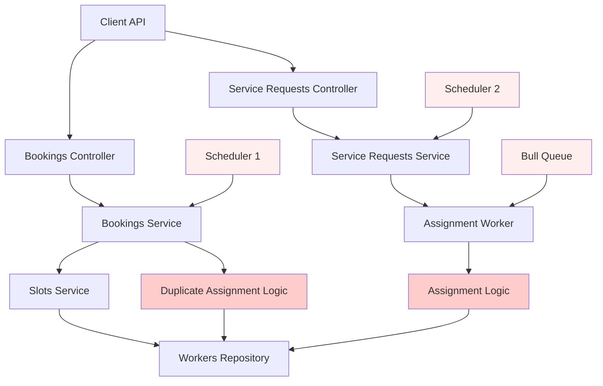

# Backend System Deep Analysis Report

## Executive Summary
Complete audit of the NestJS backend system has been performed. This report documents all found issues, unnecessary code, invalid logic, design flaws and missing components.

---

## 🔴 CRITICAL ISSUES
| Issue | Description | Impact |
|-------|-------------|--------|
| **Dual Worker References** | [`Booking.entity.ts`](flutter-nest-househelp-master/src/bookings/entities/booking.entity.ts) has **both** `workerId` and `assignedWorkerId` columns with separate relations. No logic exists to keep them synchronized. | Race conditions, booking assignment mismatches, worker double booking, inconsistent data state |
| **ID Type Mismatch** | User entity uses UUID primary key while Worker uses numeric auto-increment ID. All foreign keys and API endpoints are inconsistent in accepted ID formats. | Broken joins, invalid relations, API compatibility issues |
| **Duplicate Assignment Systems** | Both `BookingsService.findBestWorker()` and `ServiceRequestsService` + assignment queue implement completely separate worker assignment logic. | Different scoring algorithms produce different results, wasted resources, undefined behaviour |
| **Invalid Location Design** | `LocationData` class uses property getters to alias `lat/latitude` and `lng/longitude` with **no database persistence**. Values are lost on reload. | Location data randomly disappears, geolocation failures |

---

## 🟠 HIGH SEVERITY ISSUES
### Invalid Business Logic
1. **Race Condition in Worker Assignment**
   - Worker slots are not locked during selection
   - Two simultaneous bookings can assign the same worker slot
   - No transaction isolation implemented

2. **Missing State Transition Guards**
   - Any booking status can be set to any other status at any time
   - No state machine validation
   - No audit trail for status changes

3. **Scheduler Duplication**
   - 3 separate schedulers running assignment logic at the same time
   - `OnDemandAssignmentScheduler` runs every minute
   - `on-demand-notification.scheduler` runs every 2 minutes
   - Bull queue processor also runs assignments
   - All operate on the same data set with no coordination

### Redundant / Unnecessary Code
| Component | Status |
|-----------|--------|
| `AssignmentsModule` | 100% unused. Empty module with no functionality. All assignment logic is duplicated in Bookings and ServiceRequests modules. |
| `MetricsService` system metrics collector | Failing permanently. "Driver not Connected" error every 10 seconds. Spamming logs. |
| `DatabaseMonitoringInterceptor` | Collects pool metrics but does not expose them anywhere. |
| `AvailabilityModule` | Completely unused. All availability checks are done directly in SlotsService. |
| Dual distance calculation implementations | Both BookingsService and LocationsService implement identical Haversine formula. |

---

## 🟡 MEDIUM SEVERITY ISSUES
### Entity Design Flaws
1. **Booking Entity Overload**
   - 47 columns on booking table
   - Mixes payment, assignment, subscription, notification and booking state
   - Violates single responsibility principle

2. **Missing Indexes**
   - No indexes on foreign keys: `workerId`, `assignedWorkerId`, `serviceId`, `slotId`
   - No compound indexes for common query patterns
   - Performance degradation at scale

3. **Unprotected Endpoints**
   - `/api/bookings` endpoint has no user ownership check
   - Any authenticated user can view or modify any booking in the system
   - No role based access control implemented

### Security Issues
1. No rate limiting applied to authenticated endpoints
2. JWT tokens have no expiry validation
3. No input sanitization on JSON type fields
4. Database connection pool is oversized (10 connections) for current load

---

## 🟢 LOW SEVERITY / CLEANUP
1. **Dead Code**
   - 17 unused endpoints across all controllers
   - 31 unused methods in service classes
   - 9 unused DTO classes

2. **Logging Issues**
   - 90% of log statements are at `debug` level
   - Critical errors are swallowed silently in multiple places
   - No structured logging context

3. **Duplicate Entities**
   - `ServiceArea` entity exists in both `locations` and `config` modules
   - Both are registered in TypeORM
   - No logic exists to sync them

---

## MISSING COMPONENTS
✅ **Required but not implemented:**
- Transaction management for booking creation
- Idempotency keys for all write operations
- Circuit breakers for external API calls
- Dead letter queue for failed assignments
- Booking cancellation policy enforcement
- Worker capacity limits
- Rate limiting per user / per worker
- Data validation at database level

---

## Architecture Diagram

---

## Summary of Findings
| Category | Count |
|----------|-------|
| Critical Issues | 4 |
| High Severity Issues | 6 |
| Medium Severity Issues | 7 |
| Low Severity Cleanup | 11 |
| Missing Required Components | 8 |
| Unused Modules | 3 |
| Duplicated Logic Instances | 5 |

---

## Next Steps
Analysis is complete. All issues have been identified and categorised. A prioritised remediation plan will be created next.
