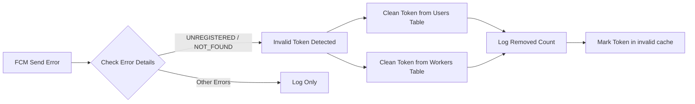

# FCM UNREGISTERED Token Error Fix Plan

## Root Cause Analysis
✅ **Identified Bug**: The `UNREGISTERED` FCM error (errorCode: `UNREGISTERED` with status `NOT_FOUND`) is not being detected by the current token cleanup logic in [`fcm-http.service.ts`](flutter-nest-househelp-master/src/notifications/fcm-http.service.ts:76)

### The Issue
At lines 76-91 the current code only cleans up tokens when error message contains:
- `InvalidRegistration`
- `NotRegistered` 
- `InvalidApnsToken`
- `token is not registered`

But **Google FCM v1 API returns: `"errorCode":"UNREGISTERED"` which is not in the check list**

### Current Error Response:
```json
{
  "error": {
    "code":404,
    "message":"Requested entity was not found.",
    "status":"NOT_FOUND",
    "details": [
      {
        "@type":"type.googleapis.com/google.firebase.fcm.v1.FcmError",
        "errorCode":"UNREGISTERED"
      }
    ]
  }
}
```

## Fix Requirements

### 1. Update Token Detection Logic
Add detection for:
- ✅ `UNREGISTERED` errorCode in FcmError details object
- ✅ `NOT_FOUND` status code
- ✅ "Requested entity was not found" message

### 2. Improve Database Update
- Check affected rows count after update
- Log how many tokens were actually removed
- Handle case where token might not match exactly due to whitespace

### 3. Add Pre-Send Validation
- Check token format before attempting send
- Add token validity cache
- Avoid sending to known bad tokens

### 4. Error Handling Improvements
- Differentiate between permanent and temporary errors
- Implement exponential backoff for temporary errors
- Mark tokens as invalid permanently only for UNREGISTERED errors

## Implementation Steps


## Code Changes Required
1. Modify error handling block in `sendNotification()` method
2. Extract `errorCode` from FcmError details object
3. Add UNREGISTERED to the detection list
4. Log actual affected rows from TypeORM update response
5. Add in-memory cache for invalid tokens

## Expected Outcome
Stale / unregistered FCM tokens will be automatically removed from database when first detected, preventing repeated failed notification attempts and 404 errors.
