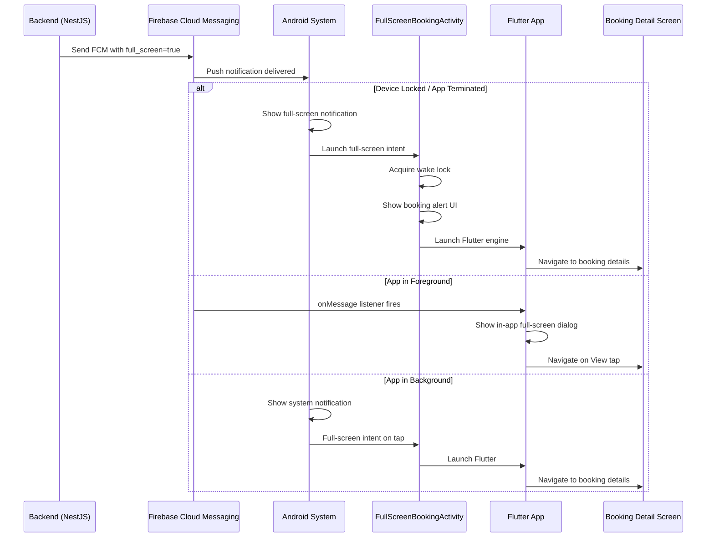

# Full-Screen Intent Notification Implementation Plan

## Executive Summary

This plan details the implementation of a **full-screen intent notification** for the Sevaq Worker app. When a new booking is assigned, the notification will:

- **Take over the entire screen** (even if the phone is locked)
- **Play a sound and vibration** to alert the worker
- **Demand immediate user action** with a "View" CTA button
- **Override normal notification behavior** for critical alerts

This is categorized as an **Interruptive Notification** / **Critical Alert** / **Real-time Alert Screen**.

---

## Current State Analysis

### What Exists

- [`NotificationService`](worker_app_flutter/lib/services/notification_service.dart:10) - FCM messaging with foreground/background handling
- [`SoundService`](worker_app_flutter/lib/services/sound_service.dart:6) - Vibration and sound playback
- [`NotificationListenerWidget`](worker_app_flutter/lib/widgets/notification_listener_widget.dart:6) - Currently a simple pass-through wrapper
- `new_booking_channel` - Existing notification channel with `Importance.max`
- AndroidManifest has basic permissions (INTERNET, POST_NOTIFICATIONS, VIBRATE, RECEIVE_BOOT_COMPLETED)

### What's Missing for Full-Screen

- `USE_FULL_SCREEN_INTENT` permission in AndroidManifest
- `WAKE_LOCK` permission to turn screen on
- Full-screen notification channel with `IMPORTANCE_MAX`
- `setFullScreenIntent()` usage in notification builder
- Full-screen Activity for locked screen display
- Wake lock implementation
- Android 14+ (API 34+) full-screen intent permission handling

---

## Architecture Diagram



---

## Step-by-Step Implementation Plan

### Phase 1: Android Configuration

#### Step 1.1: Add Required Permissions

**File:** `worker_app_flutter/android/app/src/main/AndroidManifest.xml`

Add these permissions at the top of the manifest (before `<application>`):

```xml
<!-- Full-screen intent notification permissions -->
<uses-permission android:name="android.permission.USE_FULL_SCREEN_INTENT" />
<uses-permission android:name="android.permission.WAKE_LOCK" />
<uses-permission android:name="android.permission.DISABLE_KEYGUARD" />
<uses-permission android:name="android.permission.SYSTEM_ALERT_WINDOW" />
<!-- For Android 14+ full-screen intent restrictions -->
<uses-permission android:name="android.permission.POST_NOTIFICATIONS" />
```

#### Step 1.2: Create Full-Screen Notification Channel

**File:** `worker_app_flutter/android/app/src/main/res/values/strings.xml` (create if not exists)

```xml
<?xml version="1.0" encoding="utf-8"?>
<resources>
    <string name="full_screen_channel_id">full_screen_booking_channel</string>
    <string name="full_screen_channel_name">Critical Booking Alerts</string>
    <string name="full_screen_channel_description">Full-screen notifications for new booking assignments that require immediate attention</string>
</resources>
```

#### Step 1.3: Create FullScreenBookingActivity (Android Native)

**New File:** `worker_app_flutter/android/app/src/main/java/com/sevaq/worker/FullScreenBookingActivity.java`

```java
package com.sevaq.worker;

import android.app.KeyguardManager;
import android.content.Intent;
import android.os.Build;
import android.os.Bundle;
import android.view.View;
import android.view.Window;
import android.view.WindowManager;

import io.flutter.embedding.android.FlutterActivity;

public class FullScreenBookingActivity extends FlutterActivity {
    
    @Override
    protected void onCreate(Bundle savedInstanceState) {
        // Show over lock screen
        if (Build.VERSION.SDK_INT >= Build.VERSION_CODES.O_MR1) {
            setShowWhenLocked(true);
            setTurnScreenOn(true);
            
            KeyguardManager keyguardManager = (KeyguardManager) getSystemService(KEYGUARD_SERVICE);
            if (keyguardManager != null) {
                keyguardManager.requestDismissKeyguard(this, null);
            }
        } else {
            // For older Android versions
            getWindow().addFlags(
                WindowManager.LayoutParams.FLAG_SHOW_WHEN_LOCKED |
                WindowManager.LayoutParams.FLAG_TURN_SCREEN_ON |
                WindowManager.LayoutParams.FLAG_KEEP_SCREEN_ON |
                WindowManager.LayoutParams.FLAG_DISMISS_KEYGUARD
            );
        }
        
        super.onCreate(savedInstanceState);
        
        // Handle the intent data and pass to Flutter
        handleIntent(getIntent());
    }
    
    @Override
    protected void onNewIntent(Intent intent) {
        super.onNewIntent(intent);
        handleIntent(intent);
    }
    
    private void handleIntent(Intent intent) {
        // Extract booking data from intent extras
        String bookingId = intent.getStringExtra("bookingId");
        String serviceName = intent.getStringExtra("serviceName");
        String serviceDate = intent.getStringExtra("serviceDate");
        String startTime = intent.getStringExtra("startTime");
        String customerName = intent.getStringExtra("customerName");
        
        // Pass this data to Flutter via method channel or initial route
        // The Flutter side will handle showing the full-screen UI
    }
    
    @Override
    public void onWindowFocusChanged(boolean hasFocus) {
        super.onWindowFocusChanged(hasFocus);
        if (hasFocus) {
            // Ensure full-screen immersive mode
            if (Build.VERSION.SDK_INT >= Build.VERSION_CODES.R) {
                getWindow().setDecorFitsSystemWindows(false);
                getWindow().getInsetsController().hide(
                    android.view.WindowInsets.Type.statusBars() |
                    android.view.WindowInsets.Type.navigationBars()
                );
            } else {
                getWindow().getDecorView().setSystemUiVisibility(
                    View.SYSTEM_UI_FLAG_FULLSCREEN |
                    View.SYSTEM_UI_FLAG_HIDE_NAVIGATION |
                    View.SYSTEM_UI_FLAG_IMMERSIVE_STICKY |
                    View.SYSTEM_UI_FLAG_LAYOUT_FULLSCREEN |
                    View.SYSTEM_UI_FLAG_LAYOUT_HIDE_NAVIGATION |
                    View.SYSTEM_UI_FLAG_LAYOUT_STABLE
                );
            }
        }
    }
}
```

#### Step 1.4: Register FullScreenBookingActivity in AndroidManifest

**File:** `worker_app_flutter/android/app/src/main/AndroidManifest.xml`

Add this activity inside `<application>`:

```xml
<!-- Full-screen booking activity for critical alerts -->
<activity
    android:name=".FullScreenBookingActivity"
    android:exported="true"
    android:showOnLockScreen="true"
    android:turnScreenOn="true"
    android:launchMode="singleTop"
    android:theme="@style/LaunchTheme"
    android:screenOrientation="portrait"
    android:taskAffinity="">
    <intent-filter>
        <action android:name="com.sevaq.worker.FULL_SCREEN_BOOKING" />
        <category android:name="android.intent.category.DEFAULT" />
    </intent-filter>
</activity>
```

---

### Phase 2: Flutter Notification Service Updates

#### Step 2.1: Create Full-Screen Notification Channel

**File:** `worker_app_flutter/lib/services/notification_service.dart`

Add a new channel constant and creation method:

```dart
/// Full-screen notification channel ID for critical booking alerts
static const String fullScreenChannelId = 'full_screen_booking_channel';

/// Create the full-screen notification channel (Android 8.0+)
Future<void> _createFullScreenChannel() async {
  const androidChannel = AndroidNotificationChannel(
    fullScreenChannelId,
    'Critical Booking Alerts',
    description: 'Full-screen notifications for new bookings requiring immediate attention',
    importance: Importance.max,
    playSound: true,
    enableVibration: true,
    enableLights: true,
    showBadge: true,
    // Use high priority sound
    sound: RawResourceAndroidNotificationSound('booking_alert'),
  );

  await _localNotifications
      .resolvePlatformSpecificImplementation<
          AndroidFlutterLocalNotificationsPlugin>()
      ?.createNotificationChannel(androidChannel);

  debugPrint('=== Created full-screen notification channel: $fullScreenChannelId ===');
}
```

Call this in `_initializeLocalNotifications()`:

```dart
await _createFullScreenChannel();
```

#### Step 2.2: Add Full-Screen Notification Method

**File:** `worker_app_flutter/lib/services/notification_service.dart`

Add this method:

```dart
/// Show a full-screen notification that takes over the device
Future<void> showFullScreenNotification({
  required String title,
  required String body,
  required String bookingId,
  required String serviceName,
  required String serviceDate,
  required String startTime,
  required String customerName,
}) async {
  // Create full-screen intent
  const fullScreenIntent = AndroidIntent(
    action: 'com.sevaq.worker.FULL_SCREEN_BOOKING',
    category: 'android.intent.category.DEFAULT',
    extras: {
      'bookingId': 'STRING:bookingId',
      'serviceName': 'STRING:serviceName',
      'serviceDate': 'STRING:serviceDate',
      'startTime': 'STRING:startTime',
      'customerName': 'STRING:customerName',
    },
    flags: [
      AndroidIntent.FLAG_ACTIVITY_NEW_TASK,
      AndroidIntent.FLAG_ACTIVITY_CLEAR_TOP,
      AndroidIntent.FLAG_ACTIVITY_SINGLE_TOP,
    ],
  );

  const androidDetails = AndroidNotificationDetails(
    fullScreenChannelId,
    'Critical Booking Alerts',
    channelDescription: 'Full-screen notifications for new bookings',
    importance: Importance.max,
    priority: Priority.max,
    fullScreenIntent: fullScreenIntent,
    category: AndroidNotificationCategory.alarm,
    visibility: NotificationVisibility.public,
    autoCancel: true,
    ongoing: false,
    playSound: true,
    enableVibration: true,
    enableLights: true,
    ticker: 'New booking assigned!',
    // Use default system alarm sound
    sound: RawResourceAndroidNotificationSound('booking_alert'),
  );

  const notificationDetails = NotificationDetails(
    android: androidDetails,
    iOS: DarwinNotificationDetails(
      presentAlert: true,
      presentBadge: true,
      presentSound: true,
      interruptionLevel: InterruptionLevel.critical,
    ),
  );

  await _localNotifications.show(
    DateTime.now().millisecondsSinceEpoch ~/ 1000,
    title,
    body,
    notificationDetails,
    payload: jsonEncode({
      'type': 'full_screen_booking',
      'bookingId': bookingId,
      'serviceName': serviceName,
      'serviceDate': serviceDate,
      'startTime': startTime,
      'customerName': customerName,
    }),
  );

  debugPrint('=== Full-screen notification shown for booking: $bookingId ===');
}
```

#### Step 2.3: Update Foreground Message Handler

**File:** `worker_app_flutter/lib/services/notification_service.dart`

Update `_handleForegroundMessage()` to detect full-screen booking notifications:

```dart
void _handleForegroundMessage(RemoteMessage message) {
  if (kDebugMode) {
    print('Foreground message received: ${message.notification?.title}');
  }

  final data = Map<String, dynamic>.from(message.data);
  
  // Check if this is a full-screen booking notification
  if (data['fullScreen'] == 'true' || data['full_screen'] == 'true') {
    // Show full-screen notification
    showFullScreenNotification(
      title: message.notification?.title ?? 'New Booking!',
      body: message.notification?.body ?? 'You have a new booking assignment',
      bookingId: data['bookingId'] ?? '',
      serviceName: data['serviceName'] ?? 'Service',
      serviceDate: data['serviceDate'] ?? '',
      startTime: data['startTime'] ?? '',
      customerName: data['customerName'] ?? 'Customer',
    );
  }

  _handleMessage(message);
}
```

---

### Phase 3: Full-Screen UI Widget

#### Step 3.1: Create FullScreenBookingScreen

**New File:** `worker_app_flutter/lib/screens/full_screen_booking_screen.dart`

```dart
import 'package:flutter/material.dart';
import 'package:flutter/services.dart';
import 'package:provider/provider.dart';
import '../providers/booking_provider.dart';
import '../services/sound_service.dart';
import 'booking_detail_screen.dart';

class FullScreenBookingScreen extends StatefulWidget {
  final String bookingId;
  final String serviceName;
  final String serviceDate;
  final String startTime;
  final String customerName;
  final String? customerAddress;
  final String price;

  const FullScreenBookingScreen({
    super.key,
    required this.bookingId,
    required this.serviceName,
    required this.serviceDate,
    required this.startTime,
    required this.customerName,
    this.customerAddress,
    required this.price,
  });

  @override
  State<FullScreenBookingScreen> createState() => _FullScreenBookingScreenState();
}

class _FullScreenBookingScreenState extends State<FullScreenBookingScreen>
    with SingleTickerProviderStateMixin {
  late AnimationController _animationController;
  late Animation<double> _scaleAnimation;
  late Animation<double> _opacityAnimation;
  bool _isPlayingSound = false;

  @override
  void initState() {
    super.initState();
    
    // Set up animations
    _animationController = AnimationController(
      duration: const Duration(milliseconds: 800),
      vsync: this,
    );
    
    _scaleAnimation = Tween<double>(begin: 0.8, end: 1.0).animate(
      CurvedAnimation(parent: _animationController, curve: Curves.elasticOut),
    );
    
    _opacityAnimation = Tween<double>(begin: 0.0, end: 1.0).animate(
      CurvedAnimation(parent: _animationController, curve: Curves.easeIn),
    );
    
    _animationController.forward();
    
    // Play alert sound and vibration
    _playAlert();
    
    // Prevent back button from closing immediately
    SystemChannels.platform.setMethodCallHandler(_handleBackButton);
  }

  Future<dynamic> _handleBackButton(MethodCall methodCall) async {
    if (methodCall.method == 'SystemNavigator.pop') {
      // Show confirmation before allowing exit
      return false;
    }
    return null;
  }

  Future<void> _playAlert() async {
    setState(() => _isPlayingSound = true);
    await SoundService().playNewBookingSound();
    setState(() => _isPlayingSound = false);
  }

  @override
  void dispose() {
    _animationController.dispose();
    SystemChannels.platform.setMethodCallHandler(null);
    super.dispose();
  }

  @override
  Widget build(BuildContext context) {
    // Set immersive full-screen mode
    SystemChrome.setEnabledSystemUIMode(SystemUiMode.immersiveSticky);
    
    return WillPopScope(
      onWillPop: () async {
        // Require explicit action to dismiss
        return false;
      },
      child: Scaffold(
        backgroundColor: Colors.black,
        body: SafeArea(
          child: AnimatedBuilder(
            animation: _animationController,
            builder: (context, child) {
              return Opacity(
                opacity: _opacityAnimation.value,
                child: Transform.scale(
                  scale: _scaleAnimation.value,
                  child: child,
                ),
              );
            },
            child: Column(
              mainAxisAlignment: MainAxisAlignment.center,
              children: [
                // Pulsing bell icon
                _buildPulsingIcon(),
                const SizedBox(height: 32),
                
                // Title in Hindi
                const Text(
                  'नया काम आया है!',
                  style: TextStyle(
                    fontSize: 32,
                    fontWeight: FontWeight.bold,
                    color: Colors.white,
                  ),
                  textAlign: TextAlign.center,
                ),
                const SizedBox(height: 12),
                
                // English subtitle
                Text(
                  'New Booking Assigned',
                  style: TextStyle(
                    fontSize: 18,
                    color: Colors.grey[400],
                  ),
                ),
                const SizedBox(height: 40),
                
                // Booking details card
                _buildBookingCard(),
                const SizedBox(height: 40),
                
                // CTA Button - View Details
                _buildViewButton(),
                const SizedBox(height: 16),
                
                // Dismiss button (smaller, less prominent)
                _buildDismissButton(),
              ],
            ),
          ),
        ),
      ),
    );
  }

  Widget _buildPulsingIcon() {
    return TweenAnimationBuilder<double>(
      duration: const Duration(seconds: 1),
      tween: Tween(begin: 1.0, end: 1.2),
      builder: (context, value, child) {
        return Transform.scale(
          scale: value,
          child: Container(
            padding: const EdgeInsets.all(24),
            decoration: BoxDecoration(
              color: Colors.green.withValues(alpha: 0.2),
              shape: BoxShape.circle,
              boxShadow: [
                BoxShadow(
                  color: Colors.green.withValues(alpha: 0.4),
                  blurRadius: 30,
                  spreadRadius: 10,
                ),
              ],
            ),
            child: const Icon(
              Icons.notifications_active,
              size: 64,
              color: Colors.green,
            ),
          ),
        );
      },
    );
  }

  Widget _buildBookingCard() {
    return Container(
      margin: const EdgeInsets.symmetric(horizontal: 24),
      padding: const EdgeInsets.all(20),
      decoration: BoxDecoration(
        color: Colors.white.withValues(alpha: 0.1),
        borderRadius: BorderRadius.circular(20),
        border: Border.all(color: Colors.white.withValues(alpha: 0.2)),
      ),
      child: Column(
        children: [
          _buildDetailRow(Icons.cleaning_services, widget.serviceName),
          const SizedBox(height: 12),
          _buildDetailRow(
            Icons.calendar_today,
            '${widget.serviceDate} at ${widget.startTime}',
          ),
          const SizedBox(height: 12),
          _buildDetailRow(Icons.person, widget.customerName),
          if (widget.customerAddress != null) ...[
            const SizedBox(height: 12),
            _buildDetailRow(Icons.location_on, widget.customerAddress!),
          ],
          const Divider(color: Colors.white24, height: 24),
          Row(
            mainAxisAlignment: MainAxisAlignment.center,
            children: [
              const Text(
                'Earning: ',
                style: TextStyle(
                  fontSize: 18,
                  color: Colors.white70,
                ),
              ),
              Text(
                '₹${widget.price}',
                style: const TextStyle(
                  fontSize: 28,
                  fontWeight: FontWeight.bold,
                  color: Colors.green,
                ),
              ),
            ],
          ),
        ],
      ),
    );
  }

  Widget _buildDetailRow(IconData icon, String text) {
    return Row(
      children: [
        Icon(icon, size: 20, color: Colors.white70),
        const SizedBox(width: 12),
        Expanded(
          child: Text(
            text,
            style: const TextStyle(
              fontSize: 16,
              color: Colors.white,
            ),
          ),
        ),
      ],
    );
  }

  Widget _buildViewButton() {
    return Padding(
      padding: const EdgeInsets.symmetric(horizontal: 24),
      child: SizedBox(
        width: double.infinity,
        height: 56,
        child: ElevatedButton.icon(
          onPressed: _onViewPressed,
          icon: const Icon(Icons.visibility, size: 24),
          label: const Text(
            'VIEW DETAILS',
            style: TextStyle(
              fontSize: 18,
              fontWeight: FontWeight.bold,
            ),
          ),
          style: ElevatedButton.styleFrom(
            backgroundColor: Colors.green,
            foregroundColor: Colors.white,
            shape: RoundedRectangleBorder(
              borderRadius: BorderRadius.circular(16),
            ),
            elevation: 8,
          ),
        ),
      ),
    );
  }

  Widget _buildDismissButton() {
    return TextButton(
      onPressed: _onDismiss,
      child: Text(
        'Dismiss',
        style: TextStyle(
          fontSize: 14,
          color: Colors.grey[500],
        ),
      ),
    );
  }

  void _onViewPressed() {
    // Stop sound
    SoundService().stop();
    
    // Navigate to booking detail screen
    Navigator.of(context).pushReplacement(
      MaterialPageRoute(
        builder: (context) => BookingDetailScreen(
          bookingId: widget.bookingId,
        ),
      ),
    );
  }

  void _onDismiss() {
    // Stop sound
    SoundService().stop();
    
    // Exit full-screen mode
    SystemChrome.setEnabledSystemUIMode(SystemUiMode.edgeToEdge);
    
    // Go back to main screen
    Navigator.of(context).pop();
  }
}
```

---

### Phase 4: Integration with main.dart

#### Step 4.1: Handle Full-Screen Notification in main.dart

**File:** `worker_app_flutter/lib/main.dart`

Add a global key and overlay entry for full-screen notifications:

```dart
// Global overlay entry for full-screen notifications
OverlayEntry? _fullScreenOverlay;

void _showFullScreenBookingDialog(BuildContext context, Map<String, dynamic> data) {
  if (_fullScreenOverlay != null) return; // Prevent duplicates
  
  _fullScreenOverlay = OverlayEntry(
    builder: (context) => FullScreenBookingScreen(
      bookingId: data['bookingId'] ?? '',
      serviceName: data['serviceName'] ?? 'Service',
      serviceDate: data['serviceDate'] ?? '',
      startTime: data['startTime'] ?? '',
      customerName: data['customerName'] ?? 'Customer',
      customerAddress: data['customerAddress'],
      price: data['price'] ?? '0',
    ),
  );
  
  Overlay.of(context).insert(_fullScreenOverlay!);
}

void _hideFullScreenDialog() {
  _fullScreenOverlay?.remove();
  _fullScreenOverlay = null;
}
```

Update the notification stream listener:

```dart
NotificationService.onNewBooking.listen((data) {
  if (data['fullScreen'] == 'true' || data['full_screen'] == 'true') {
    _showFullScreenBookingDialog(context, data);
  } else {
    // Show regular dialog
    // ... existing code
  }
});
```

---

### Phase 5: Backend Changes

#### Step 5.1: Update Notification Payload

**File:** `flutter-nest-househelp-master/src/notifications/notifications.service.ts`

Update the notification payload to include full-screen metadata:

```typescript
async notifyWorkerNewBooking(worker: Worker, booking: Booking): Promise<void> {
  if (!worker.fcmToken) {
    this.logger.warn(`Worker ${worker.id} has no FCM token, skipping notification`);
    return;
  }

  const serviceName = booking.service?.name || 'Service';
  const bookingDate = booking.date || new Date().toISOString().split('T')[0];

  await this.sendPushNotification(
    worker.fcmToken,
    'नया काम आया है! 🎉',
    `${serviceName} - ${bookingDate} at ${booking.startTime}`,
    {
      type: 'new_booking',
      bookingId: booking.id.toString(),
      bookingPublicId: booking.publicId ?? '',
      serviceName,
      serviceDate: bookingDate,
      startTime: booking.startTime ?? '',
      customerName: booking.user?.firstName ?? 'Customer',
      customerAddress: booking.address ?? '',
      price: booking.price?.toString() ?? '0',
      assignmentType: 'on_demand',
      fullScreen: 'true',  // NEW: Trigger full-screen notification
      timestamp: new Date().toISOString(),
    },
  );
}
```

---

### Phase 6: Android 14+ (API 34+) Compatibility

#### Step 6.1: Handle Full-Screen Intent Permission

Android 14 (API 34) introduced restrictions on full-screen intents. Apps must have the `USE_FULL_SCREEN_INTENT` permission and the user must grant it.

**File:** `worker_app_flutter/lib/services/notification_service.dart`

Add permission check:

```dart
/// Check and request full-screen intent permission (Android 14+)
Future<bool> checkFullScreenIntentPermission() async {
  if (Platform.isAndroid) {
    final androidPlugin = _localNotifications
        .resolvePlatformSpecificImplementation<
            AndroidFlutterLocalNotificationsPlugin>();
    
    if (androidPlugin != null) {
      // Check if permission is granted
      final granted = await androidPlugin.checkFullScreenIntentPermission();
      
      if (!granted) {
        // Request permission
        final requested = await androidPlugin.requestFullScreenIntentPermission();
        return requested ?? false;
      }
      
      return granted;
    }
  }
  return false;
}
```

Call this during app initialization and show a settings prompt if denied.

---

## Files to Create

| File | Purpose |
|------|---------|
| `worker_app_flutter/android/app/src/main/java/com/sevaq/worker/FullScreenBookingActivity.java` | Native Android activity for locked screen |
| `worker_app_flutter/android/app/src/main/res/values/strings.xml` | String resources for notification channel |
| `worker_app_flutter/lib/screens/full_screen_booking_screen.dart` | Full-screen UI widget |

## Files to Modify

| File | Changes |
|------|---------|
| `worker_app_flutter/android/app/src/main/AndroidManifest.xml` | Add permissions and activity registration |
| `worker_app_flutter/lib/services/notification_service.dart` | Add full-screen channel, notification method, permission check |
| `worker_app_flutter/lib/main.dart` | Add full-screen overlay handling |
| `flutter-nest-househelp-master/src/notifications/notifications.service.ts` | Add `fullScreen: 'true'` to payload |

---

## CTA Button Design

The **"View"** button is the primary CTA on the full-screen notification:

```
┌─────────────────────────────────────┐
│                                     │
│         🔔 (pulsing icon)           │
│                                     │
│     नया काम आया है!                  │
│     New Booking Assigned            │
│                                     │
│  ┌───────────────────────────────┐  │
│  │ 🧹 Cleaning Service           │  │
│  │ 📅 2024-04-05 at 10:00 AM     │  │
│  │ 👤 John Doe                   │  │
│  │ 📍 123 Main St, City          │  │
│  │ ───────────────────────────── │  │
│  │     Earning: ₹500             │  │
│  └───────────────────────────────┘  │
│                                     │
│  ┌───────────────────────────────┐  │
│  │   👁 VIEW DETAILS (Primary)   │  │
│  └───────────────────────────────┘  │
│                                     │
│        Dismiss (Secondary)          │
│                                     │
└─────────────────────────────────────┘
```

**Primary CTA: "VIEW DETAILS"**
- Large, prominent green button
- Takes user to booking detail screen
- Stops sound/vibration
- Cannot be easily dismissed (back button blocked)

**Secondary: "Dismiss"**
- Small, grey text button
- Stops sound/vibration
- Returns to previous screen

---

## Risk Assessment

| Risk | Impact | Mitigation |
|------|--------|------------|
| Android 14+ blocks full-screen intent | High | Request permission at runtime, fallback to regular notification |
| Wake lock drains battery | Medium | Release wake lock immediately after user interaction |
| Full-screen activity crashes | Medium | Wrap in try-catch, fallback to regular notification |
| User cannot dismiss notification | High | Always provide dismiss option, handle back button gracefully |
| Sound doesn't play on some devices | Low | Use multiple fallback sound URLs |
| Notification appears on wrong screen | Medium | Use proper intent flags and launch modes |

---

## Implementation Order

1. **Android Configuration** (foundation):
   - Step 1.1: Add permissions to AndroidManifest.xml
   - Step 1.2: Create string resources
   - Step 1.3: Create FullScreenBookingActivity
   - Step 1.4: Register activity in AndroidManifest

2. **Flutter Notification Service** (core logic):
   - Step 2.1: Create full-screen notification channel
   - Step 2.2: Add showFullScreenNotification method
   - Step 2.3: Update foreground message handler

3. **Full-Screen UI** (user experience):
   - Step 3.1: Create FullScreenBookingScreen

4. **Integration** (connect everything):
   - Step 4.1: Update main.dart with overlay handling

5. **Backend** (trigger full-screen):
   - Step 5.1: Update notification payload

6. **Android 14+ Compatibility** (edge cases):
   - Step 6.1: Handle permission checks

7. **Testing**:
   - Test on locked device
   - Test on background state
   - Test on foreground state
   - Test on Android 14+ devices
   - Test sound/vibration
   - Test wake lock behavior

---

## Testing Plan

### Test Scenarios

1. **Device Locked (Screen Off)**
   - Lock the device
   - Trigger a booking assignment from backend
   - Verify: Screen turns on, full-screen notification appears
   - Verify: Sound and vibration play
   - Tap "View Details" → Navigate to booking detail screen

2. **App in Background**
   - Minimize the app
   - Trigger a booking assignment
   - Verify: Full-screen notification appears over other apps
   - Tap "View Details" → App comes to foreground with booking details

3. **App in Foreground**
   - App is open and active
   - Trigger a booking assignment
   - Verify: Full-screen overlay appears within the app
   - Tap "View Details" → Navigate to booking detail screen

4. **Android 14+ (API 34+)**
   - Verify permission prompt appears on first use
   - If denied, verify fallback to regular notification
   - If granted, verify full-screen works normally

5. **Multiple Notifications**
   - Trigger multiple bookings rapidly
   - Verify: Only one full-screen notification shows at a time
   - Verify: No duplicate overlays

6. **Dismiss Behavior**
   - Tap "Dismiss" button
   - Verify: Sound stops, overlay removed
   - Press back button
   - Verify: Cannot dismiss via back button (must use dismiss button)
