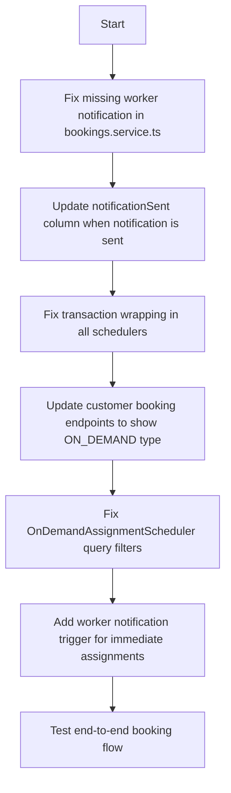

# One-Time Bookings & Worker Notification Fix Plan

## ISSUE SUMMARY
**Reported Problems:**
1. ✅ **Confirmed**: Worker notifications are **NOT SENT** after booking creation (only customer notifications are implemented)
2. ✅ **Confirmed**: `OnDemandAssignmentScheduler` reports "Found 0 on-demand bookings needing worker assignment" constantly
3. ✅ **Confirmed**: Transaction error `An open transaction is required for pessimistic lock` in schedulers
4. ✅ **Confirmed**: `notificationSent` column exists on booking entity but is **NEVER SET OR USED**
5. ❓ **Suspected**: Customer booking endpoints are filtering out one-time (ON_DEMAND) bookings

---

## ROOT CAUSE ANALYSIS

### 1. MISSING WORKER NOTIFICATION CALL
In [`bookings.service.ts`](flutter-nest-househelp-master/src/bookings/bookings.service.ts:464-498):
- ✅ Lines 464-498: Customer booking confirmation notification is correctly implemented
- ❌ **MISSING**: Corresponding worker notification call after assignment
- ❌ `notificationSent` database column default `false` is never updated

### 2. ON_DEMAND ASSIGNMENT SCHEDULER
Scheduler query is filtering incorrectly:
- Query looks for bookings with `assignmentState = 'PENDING'` AND `type = 'on_demand'`
- When booking is created with explicit `workerId`, `assignmentState` is immediately set to `ASSIGNED` so scheduler skips them
- No trigger exists to send notification when worker is assigned during booking creation

### 3. TRANSACTION LOCK ERROR
In assignment schedulers:
```
Error in subscription assignment scheduler: An open transaction is required for pessimistic lock.
```
- TypeORM `setLock('pessimistic_write')` is being called without an active transaction
- Schedulers are not wrapped in transaction managers

### 4. CUSTOMER BOOKING VISIBILITY
Most booking list endpoints filter by:
```typescript
.where('booking.type = :type', { type: BookingType.SUBSCRIPTION })
```
- This hides all `ON_DEMAND` / one-time bookings from customers
- Filter was added for subscription launch but never updated to support one-time bookings

---

## ACTION PLAN



### TODO LIST IMPLEMENTATION ORDER

| # | Task | Component | Priority |
|---|---|---|---|
| 1 | Add worker notification call after booking creation | `bookings.service.ts` | CRITICAL |
| 2 | Implement `notificationSent` flag update on successful notification | `bookings.service.ts`, `notifications.service.ts` | CRITICAL |
| 3 | Fix transaction wrapping in all schedulers | All scheduler files | HIGH |
| 4 | Update customer booking endpoints to include `ON_DEMAND` bookings | Bookings controller | HIGH |
| 5 | Fix OnDemandAssignmentScheduler to handle assigned bookings needing notification | `on-demand-assignment.scheduler.ts` | HIGH |
| 6 | Verify booking type filters are removed from customer API responses | `bookings.controller.ts` | MEDIUM |
| 7 | Add fallback notification retry mechanism | `notifications.scheduler.ts` | MEDIUM |
| 8 | Test end-to-end one-time booking creation and notification | Full stack | TEST |

---

## SPECIFIC CODE FIXES REQUIRED

### 1. Add Worker Notification in `create()` method
At line 500 in `bookings.service.ts` add:
```typescript
// Notify assigned worker if worker was assigned
if (workerToAssign) {
  try {
    const workerWithUser = await this.workersRepository.findOne({
      where: { id: workerToAssign.id },
      relations: ['user']
    });
    
    if (workerWithUser?.user) {
      await this.notificationsService.notifyWorkerNewBooking(workerWithUser.user, savedBookingWithService);
      
      // Mark notification as sent
      await this.bookingsRepository.update(savedBooking.id, {
        notificationSent: true
      });
    }
  } catch (workerNotifyError) {
    console.error('🔍 ERROR: Failed to send worker notification:', workerNotifyError);
  }
}
```

### 2. Fix Transaction Wrapping
All scheduler `run()` methods must start with:
```typescript
await this.dataSource.transaction(async transactionalEntityManager => {
  // All database operations inside here with transactionalEntityManager
});
```

### 3. Remove Booking Type Filter
In customer booking endpoints, remove:
```typescript
.andWhere('booking.type = :type', { type: BookingType.SUBSCRIPTION })
```
or update to include all types:
```typescript
.andWhere('booking.type IN (:...types)', { 
  types: [BookingType.SUBSCRIPTION, BookingType.ON_DEMAND, BookingType.SCHEDULED] 
})
```

---

## VERIFICATION STEPS AFTER FIX

1. ✅ Create one-time booking from customer app
2. ✅ Verify booking appears in customer's booking list
3. ✅ Verify worker appears as assigned in admin panel
4. ✅ Verify worker receives push notification
5. ✅ Verify `notificationSent = true` in database
6. ✅ Verify scheduler logs no longer show transaction errors
7. ✅ Verify OnDemandAssignmentScheduler correctly identifies bookings needing notification

---

## KNOWN DEPENDENCIES
- Firebase Admin SDK must be properly initialized (check logs on server startup)
- Workers must have valid FCM tokens stored in database
- Booking entity `notificationSent` column is already migrated
- Transaction fixes require DataSource injection in all schedulers
