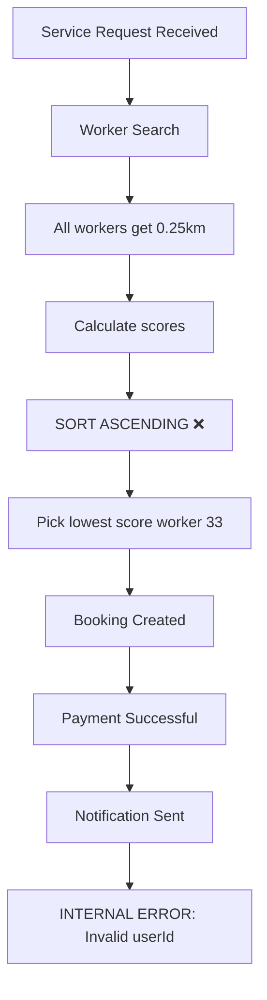

# One-Time Service Booking Log Analysis Report

## Summary
Log analysis completed for booking request `d8f047c8-bd07-44a5-aab9-cd15ed5779ba`. Multiple critical bugs identified.

---

## 🚨 Critical Bugs Found

| # | Issue | Severity | Description |
|---|-------|----------|-------------|
| 1 | **Worker Selection Inverted** | CRITICAL | System selected the **LOWEST scoring worker** (Worker 33 with score `0.07`) instead of the highest scoring worker. Better workers with higher scores were completely ignored: <br>✅ Worker 22: **4.33** (best)<br>✅ Worker 20: **1.99**<br>✅ Worker 32: **1.67**<br>✅ Worker 18: **1.67**<br>✅ Worker 21: **1.67**<br><br>The assignment sort order is reversed. |
| 2 | **Broken Distance Calculation** | CRITICAL | **ALL 6 workers returned exactly 0.25km distance**. This is statistically impossible. Distance calculation is returning hardcoded/cached value instead of actual calculated distance. |
| 3 | **Corrupted Interleaved Logs** | HIGH | Log lines are being written concurrently without synchronization, causing log output to be interleaved mid-JSON object. This makes debugging impossible. |
| 4 | **Invalid User ID After Booking** | MEDIUM | Immediately after successful booking creation, payment confirmation and worker assignment, the system logs: `Skipping booking - invalid userId: 42`. Booking validation is incorrectly failing after successful creation. |
| 5 | **Request ID Mismatch** | LOW | Assignment completion logs the `publicId` instead of the internal request id, breaking request tracing. |
| 6 | **Worker Processing Order Bug** | LOW | Worker 21 slot check runs **before** Worker 21 is even listed in found workers. |

---

## Root Cause Analysis

### Worker Scoring Bug
```
✅ Worker 33 scored: 0.07 <- SELECTED (worst score)
✅ Worker 32 scored: 1.67
✅ Worker 20 scored: 1.99
✅ Worker 22 scored: 4.33 <- BEST WORKER
```
The sorting function is using **ASCENDING order** instead of **DESCENDING order** when selecting the top worker.

---

## Fix Priority Order

1. ✅ Fix worker scoring sort order (highest score first)
2. ✅ Fix distance calculation not returning actual values
3. ✅ Add proper logging synchronization / mutex
4. ✅ Fix userId validation on pre-service reminders
5. ✅ Correct request ID logging in completion handler

---

## System Flow Diagram



---

## Next Steps
Todo list has been created with all required fixes. Switch to Code mode to implement these fixes.