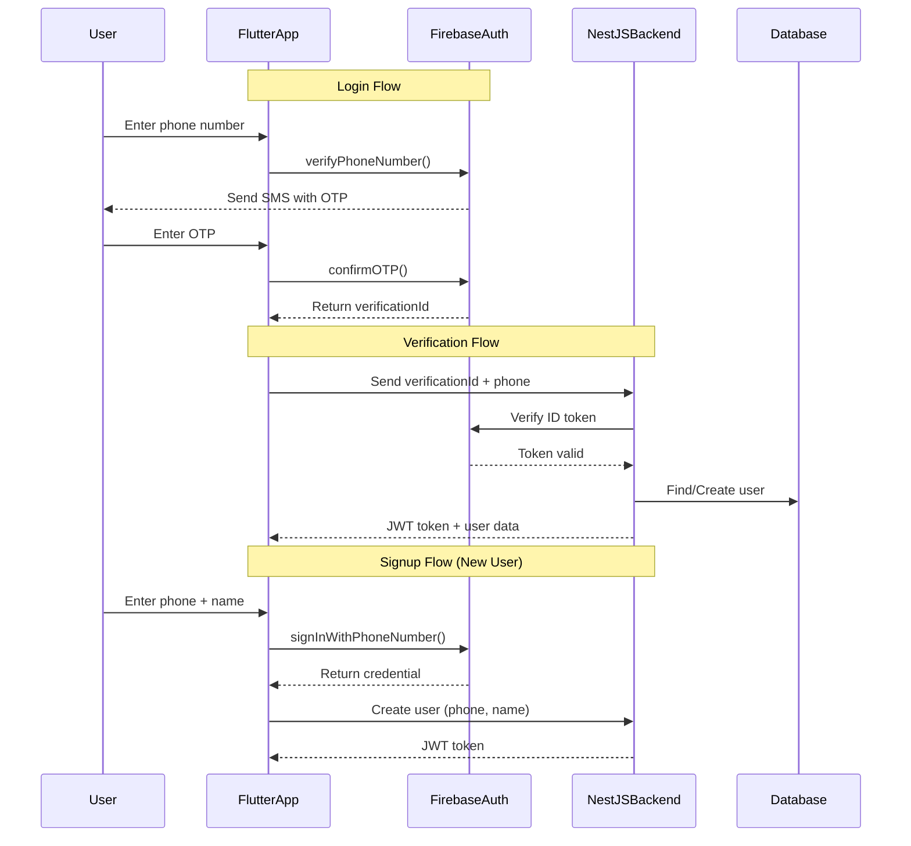

# OTP Login Implementation Plan - Firebase Authentication

## Overview

Implement phone number authentication (OTP) using Firebase Auth while maintaining the existing email/password authentication flow.

## Architecture



## Implementation Steps

### Step 1: Backend - Add Firebase Auth Service

**File:** `flutter-nest-househelp-master/src/auth/firebase-auth.service.ts`

```typescript
import { Injectable, UnauthorizedException } from '@nestjs/common';
import { auth } from 'firebase-admin/auth';
import { UsersService } from '../users/users.service';
import { JwtService } from '@nestjs/jwt';

@Injectable()
export class FirebaseAuthService {
    constructor(
        private usersService: UsersService,
        private jwtService: JwtService,
    ) { }

    async verifyPhoneAndLogin(phone: string, firebaseUid: string) {
        // Verify the Firebase ID token
        try {
            await auth().getUser(firebaseUid);
        } catch (error) {
            throw new UnauthorizedException('Invalid Firebase credentials');
        }

        // Find or create user
        let user = await this.usersService.findOneByPhone(phone);
        
        if (!user) {
            // Create new user with phone-only auth
            user = await this.usersService.create({
                email: `${phone}@firebase.auth`,
                password: firebaseUid, // Use Firebase UID as password
                firstName: 'User',
                lastName: phone,
                phone: phone,
                role: 'user',
            });
        }

        // Generate JWT
        return this.generateJwt(user);
    }

    async verifyIdToken(idToken: string) {
        try {
            const decodedToken = await auth().verifyIdToken(idToken);
            return decodedToken;
        } catch (error) {
            throw new UnauthorizedException('Invalid ID token');
        }
    }

    private generateJwt(user: any) {
        const payload = { email: user.email, sub: user.id, role: user.role };
        return {
            access_token: this.jwtService.sign(payload),
            user: {
                id: user.id,
                email: user.email,
                firstName: user.firstName,
                lastName: user.lastName,
                phone: user.phone,
                role: user.role,
            },
        };
    }
}
```

### Step 2: Backend - Add OTP Endpoints

**File:** `flutter-nest-househelp-master/src/auth/auth.controller.ts` (Add new endpoints)

```typescript
@Post('otp/verify-login')
async verifyOtpLogin(@Body() req: { phone: string; firebaseUid: string }) {
    return this.firebaseAuthService.verifyPhoneAndLogin(req.phone, req.firebaseUid);
}

@Post('otp/verify-token')
async verifyIdToken(@Body() req: { idToken: string }) {
    return this.firebaseAuthService.verifyIdToken(req.idToken);
}
```

### Step 3: Backend - Add Users Service Method

**File:** `flutter-nest-househelp-master/src/users/users.service.ts` (Add method)

```typescript
async findOneByPhone(phone: string): Promise<User | null> {
    return this.userRepository.findOne({ where: { phone } });
}
```

### Step 4: Backend - Auth Module Update

**File:** `flutter-nest-househelp-master/src/auth/auth.module.ts`

```typescript
import { Module } from '@nestjs/common';
import { AuthService } from './auth.service';
import { AuthController } from './auth.controller';
import { JwtModule } from '@nestjs/jwt';
import { PassportModule } from '@nestjs/passport';
import { UsersModule } from '../users/users.module';
import { FirebaseAuthService } from './firebase-auth.service';
import * as admin from 'firebase-admin';

@Module({
    imports: [
        UsersModule,
        PassportModule,
        JwtModule.register({
            secret: process.env.JWT_SECRET || 'your-secret-key',
            signOptions: { expiresIn: '7d' },
        }),
    ],
    controllers: [AuthController],
    providers: [AuthService, FirebaseAuthService],
    exports: [AuthService],
})
export class AuthModule {}
```

### Step 5: Backend - Firebase Admin SDK Setup

**File:** `flutter-nest-househelp-master/src/main.ts` (Add Firebase initialization)

```typescript
import * as admin from 'firebase-admin';

// Initialize Firebase Admin
const serviceAccount = JSON.parse(process.env.FIREBASE_SERVICE_ACCOUNT || '{}');
if (Object.keys(serviceAccount).length > 0) {
    admin.initializeApp({
        credential: admin.credential.cert(serviceAccount),
    });
}
```

### Step 6: Frontend - Add Firebase Auth Dependency

**File:** `frontend-flutter-house-help-master/pubspec.yaml` (Add)

```yaml
dependencies:
  firebase_auth: ^5.3.1
```

### Step 7: Frontend - Create OTP Service

**File:** `frontend-flutter-house-help-master/lib/services/firebase_auth_service.dart`

```dart
import 'package:firebase_auth/firebase_auth.dart';

class FirebaseAuthService {
  static final FirebaseAuth _auth = FirebaseAuth.instance;

  Future<String> verifyPhoneNumber(String phoneNumber) async {
    try {
      await _auth.verifyPhoneNumber(
        phoneNumber: phoneNumber,
        verificationCompleted: (PhoneAuthCredential credential) async {
          await _auth.signInWithCredential(credential);
        },
        verificationFailed: (FirebaseAuthException e) {
          throw e.message ?? 'Verification failed';
        },
        codeSent: (String verificationId, int? resendToken) {
          // Store verificationId for OTP confirmation
        },
        codeAutoRetrievalTimeout: (String verificationId) {},
      );
      return 'Verification code sent';
    } catch (e) {
      throw e.toString();
    }
  }

  Future<UserCredential> signInWithOTP(String verificationId, String otp) async {
    try {
      PhoneAuthCredential credential = PhoneAuthProvider.credential(
        verificationId: verificationId,
        smsCode: otp,
      );
      return await _auth.signInWithCredential(credential);
    } catch (e) {
      throw e.toString();
    }
  }

  Future<String> getIdToken() async {
    final user = _auth.currentUser;
    if (user == null) throw 'User not authenticated';
    return await user.getIdToken();
  }
}
```

### Step 8: Frontend - Create OTP Login Screen

**File:** `frontend-flutter-house-help-master/lib/screens/otp_login_screen.dart`

```dart
import 'package:flutter/material.dart';
import 'package:firebase_auth/firebase_auth.dart';
import '../providers/auth_provider.dart';

class OtpLoginScreen extends StatefulWidget {
  final String phoneNumber;
  
  const OtpLoginScreen({Key? key, required this.phoneNumber}) : super(key: key);
  
  @override
  _OtpLoginScreenState createState() => _OtpLoginScreenState();
}

class _OtpLoginScreenState extends State<OtpLoginScreen> {
  final TextEditingController _otpController = TextEditingController();
  bool _isLoading = false;
  String? _verificationId;

  @override
  void initState() {
    super.initState();
    _sendOTP();
  }

  Future<void> _sendOTP() async {
    setState(() => _isLoading = true);
    try {
      await FirebaseAuth.instance.verifyPhoneNumber(
        phoneNumber: widget.phoneNumber,
        verificationCompleted: (credential) async {
          await FirebaseAuth.instance.signInWithCredential(credential);
          await _verifyWithBackend();
        },
        verificationFailed: (e) {
          setState(() => _isLoading = false);
          ScaffoldMessenger.of(context).showSnackBar(
            SnackBar(content: Text(e.message ?? 'Verification failed')),
          );
        },
        codeSent: (verificationId, _) {
          setState(() {
            _verificationId = verificationId;
            _isLoading = false;
          });
        },
        codeAutoRetrievalTimeout: (_) {},
      );
    } catch (e) {
      setState(() => _isLoading = false);
    }
  }

  Future<void> _verifyOTP() async {
    if (_verificationId == null) return;
    
    setState(() => _isLoading = true);
    try {
      final credential = PhoneAuthProvider.credential(
        verificationId: _verificationId!,
        smsCode: _otpController.text,
      );
      await FirebaseAuth.instance.signInWithCredential(credential);
      await _verifyWithBackend();
    } catch (e) {
      setState(() => _isLoading = false);
      ScaffoldMessenger.of(context).showSnackBar(
        SnackBar(content: Text('Invalid OTP')),
      );
    }
  }

  Future<void> _verifyWithBackend() async {
    final user = FirebaseAuth.instance.currentUser;
    if (user == null) return;

    final success = await Provider.of<AuthProvider>(
      context,
      listen: false,
    ).loginWithFirebase(
      phone: widget.phoneNumber,
      firebaseUid: user.uid,
    );

    if (success && mounted) {
      // Navigate to home
    } else {
      setState(() => _isLoading = false);
    }
  }

  @override
  Widget build(BuildContext context) {
    return Scaffold(
      appBar: AppBar(title: Text('Enter OTP')),
      body: Padding(
        padding: EdgeInsets.all(24),
        child: Column(
          children: [
            Text('OTP sent to ${widget.phoneNumber}'),
            TextField(
              controller: _otpController,
              keyboardType: TextInputType.number,
              maxLength: 6,
              decoration: InputDecoration(labelText: 'OTP'),
            ),
            SizedBox(height: 24),
            ElevatedButton(
              onPressed: _isLoading ? null : _verifyOTP,
              child: _isLoading ? CircularProgressIndicator() : Text('Verify OTP'),
            ),
            TextButton(
              onPressed: _isLoading ? null : _sendOTP,
              child: Text('Resend OTP'),
            ),
          ],
        ),
      ),
    );
  }
}
```

### Step 9: Frontend - Update Auth Provider

**File:** `frontend-flutter-house-help-master/lib/providers/auth_provider.dart` (Add method)

```dart
Future<bool> loginWithFirebase({
  required String phone,
  required String firebaseUid,
}) async {
  _isLoading = true;
  _errorMessage = null;
  notifyListeners();

  try {
    final response = await _apiService.post('auth/otp/verify-login', {
      'phone': phone,
      'firebaseUid': firebaseUid,
    });

    if (response != null) {
      final token = response['access_token'];
      final user = response['user'];

      if (token != null && user != null) {
        _currentUser = User.fromJson(user);

        await _storage.write(key: 'jwt_token', value: token);
        await _storage.write(key: 'user_id', value: user['id'].toString());

        final prefs = await SharedPreferences.getInstance();
        await prefs.setString(_TOKEN_KEY, token);
        await prefs.setString(_USER_ID_KEY, user['id'].toString());
        await prefs.setString(_CACHED_USER_KEY, _currentUser!.toJsonString());

        _cachedToken = token;
        _cachedUserId = user['id'].toString();
        _cachedUser = _currentUser;
        _cacheLoaded = true;
        _isLoading = false;

        notifyListeners();
        return true;
      }
    }
  } catch (e) {
    _errorMessage = e.toString();
    _isLoading = false;
    notifyListeners();
    return false;
  }

  _isLoading = false;
  _errorMessage = 'OTP login failed';
  notifyListeners();
  return false;
}
```

### Step 10: Frontend - Update Login Screen

**File:** `frontend-flutter-house-help-master/lib/screens/login_screen.dart` (Add phone login option)

```dart
// Add phone login button
ElevatedButton.icon(
  onPressed: () => _showPhoneLoginDialog(),
  icon: Icon(Icons.phone),
  label: Text('Login with OTP'),
),

// Show phone input dialog
void _showPhoneLoginDialog() {
  final phoneController = TextEditingController();
  showDialog(
    context: context,
    builder: (context) => AlertDialog(
      title: Text('Login with Phone'),
      content: TextField(
        controller: phoneController,
        keyboardType: TextInputType.phone,
        decoration: InputDecoration(
          labelText: 'Phone Number',
          hintText: '+919876543210',
        ),
      ),
      actions: [
        TextButton(
          onPressed: () {
            Navigator.pop(context);
            Navigator.push(
              context,
              MaterialPageRoute(
                builder: (_) => OtpLoginScreen(phoneNumber: phoneController.text),
              ),
            );
          },
          child: Text('Send OTP'),
        ),
      ],
    ),
  );
}
```

## Environment Variables

### Backend (.env)

```env
FIREBASE_SERVICE_ACCOUNT={"type":"service_account","project_id":"...","private_key_id":"...","private_key":"...","client_email":"...","client_id":"..."}
JWT_SECRET=your-jwt-secret-key
```

### Frontend (firebase_options.dart)

Already configured - ensure phone auth is enabled in Firebase Console.

## Firebase Console Setup

1. Enable Phone Authentication:
   - Go to Firebase Console → Authentication → Sign-in method
   - Enable "Phone" provider
   
2. Add Android/iOS apps:
   - Download google-services.json for Android
   - Download GoogleService-Info.plist for iOS
   - Add to respective platforms

## Testing Checklist

- [ ] Send OTP to phone number
- [ ] Enter correct OTP and login
- [ ] Enter incorrect OTP shows error
- [ ] Resend OTP functionality works
- [ ] New user gets created in database
- [ ] Existing user logs in successfully
- [ ] JWT token is stored and used for API calls
- [ ] Logout clears all auth data

## Rollback Plan

If OTP login has issues:
1. Email/password login remains fully functional
2. Simply disable the OTP login button in the UI
3. Backend endpoints don't affect existing auth flow
