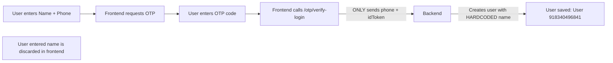
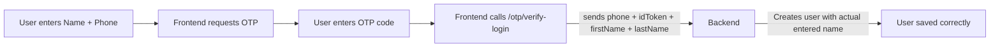

# OTP Signup User Name Fix - Comprehensive Fullstack Solution

## Problem Deep Dive

**Current Flow Bug**:


When a new user signs up:
1.  ✅ Frontend correctly collects first & last name
2.  ❌ Name fields are never transmitted to backend during OTP verification
3.  ❌ Backend creates new users with hardcoded `firstName: 'User'`
4.  ❌ Backend sets `lastName` = raw phone number
5.  ❌ Additional bug: Line 168 incorrectly sets 'Worker' instead of 'User'

---

## Fullstack Solution Plan

### 1. Backend DTO Update
**File**: [`flutter-nest-househelp-master/src/auth/dto/verify-otp-login.dto.ts`](flutter-nest-househelp-master/src/auth/dto/verify-otp-login.dto.ts)
- Add optional `firstName` and `lastName` fields
- Add proper validation (min length, max length, allowed characters)
- Maintain backward compatibility (fields remain optional)

### 2. Auth Controller Update
**File**: [`flutter-nest-househelp-master/src/auth/auth.controller.ts`](flutter-nest-househelp-master/src/auth/auth.controller.ts:166)
- Extract name fields from request body
- Pass name parameters down to `verifyPhoneAndLogin()` method

### 3. Core Auth Service Fix
**File**: [`firebase-auth.service.ts`](flutter-nest-househelp-master/src/auth/firebase-auth.service.ts)
- Extend method signature to accept optional `firstName`, `lastName`
- Update user creation logic:
  ```typescript
  const createUserDto = {
    email: `user_${phone.replace(/[^0-9]/g, '')}@phone.auth`,
    password: securePassword,
    firstName: firstName?.trim() || 'User',
    lastName: lastName?.trim() || phone.replace('+', ''),
    phone: phone,
    role: UserRole.USER,
  };
  ```
- Fix the typo bug: Line 168 should set `'User'` not `'Worker'`

### 4. Name Sanitization
- Trim whitespace from incoming names
- Sanitize special characters
- Validate minimum length (2 chars minimum)
- Add null safety checks

### 5. Frontend Implementation
**File**: `frontend-flutter-house-help-master` signup flow
- Store user entered name in state when entered
- Include `firstName` and `lastName` in the `/otp/verify-login` request body
- Maintain backward compatibility for existing login flow (not required for existing users)

### 6. Backward Compatibility
- All changes are non-breaking
- Existing clients without name fields continue working normally
- Default fallback behavior preserved for legacy calls
- No API version increment required

### 7. Data Migration
Create migration script to fix existing users:
```javascript
// Update all users created with default phone name pattern
UPDATE users
SET firstName = NULL, lastName = NULL, needsProfileCompletion = true
WHERE firstName = 'User' AND lastName ~ '^\\d{10,15}$'
```

---

## Correct Flow After Fix


---

## Edge Cases Handled
✅ Empty name values from frontend (falls back safely)
✅ Whitespace only names
✅ Special characters in names
✅ Existing users logging in (no name overwrites)
✅ Old app versions calling endpoint without name fields
✅ Multiple login attempts with same phone

---

## Verification Checklist
- [ ] New signups show correct user name in dashboard
- [ ] Existing users are not affected
- [ ] User profile completion flow works correctly
- [ ] Backend logs show proper user creation
- [ ] Frontend still works on older app versions
- [ ] No regressions in OTP login flow

This fix addresses the root cause while maintaining full backward compatibility for all existing clients.
