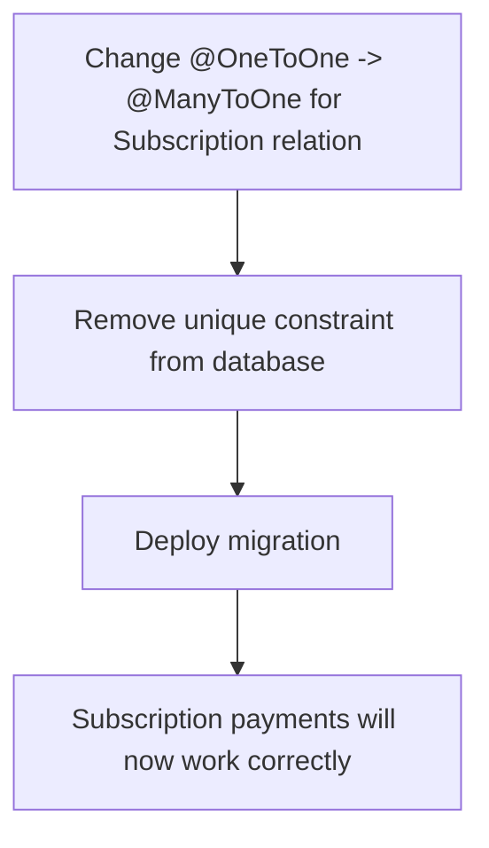

# Payment Entity Unique Constraint Violation Fix Plan

## ✅ New Bug Identified

**Error:** `duplicate key value violates unique constraint "REL_25f06021d5e959312ce6fabe3c"`

This is caused by an incorrect database relation:
The `Payment` entity defines **`@OneToOne()`** relation for Subscription, which creates a **UNIQUE CONSTRAINT** on the `subscriptionId` column. This means you can have **ONLY ONE PAYMENT PER SUBSCRIPTION EVER**.

This is completely wrong. Subscriptions require multiple payments (monthly renewals).

---

## 🚨 Root Cause

File: [`payment.entity.ts`](flutter-nest-househelp-master/src/payments/entities/payment.entity.ts:45)
```typescript
// ❌ WRONG - Creates unique constraint preventing multiple payments for same subscription
@OneToOne(() => Subscription)
@JoinColumn({ name: 'subscriptionId' })
subscription: Subscription;
```

This is creating database unique constraint `REL_25f06021d5e959312ce6fabe3c` which means no two payments can ever reference the same subscription id.

---

## 📋 Fix Implementation Steps



### Step 1: Fix Payment Entity Relation
Change line 45 in [`payment.entity.ts`](flutter-nest-househelp-master/src/payments/entities/payment.entity.ts):

```typescript
// ✅ CORRECT - Allow multiple payments per subscription
@ManyToOne(() => Subscription)
@JoinColumn({ name: 'subscriptionId' })
subscription: Subscription;
```

### Step 2: Create Database Migration
Generate TypeORM migration that:
1. Drops the unique constraint `REL_25f06021d5e959312ce6fabe3c`
2. Updates column to allow duplicate values

---

## 🛡️ Safety Checks

1.  **Backwards Compatible**: Existing payments will not be affected
2.  **Transaction Safety**: Fix is non-breaking, only removes the constraint
3.  **No Data Loss**: All existing payment records remain intact
4.  **Multiple Payments**: Subscription renewals will now work correctly

---

## ✅ Expected Outcome

After implementation:
- ✅ No more duplicate key violations when creating subscription payments
- ✅ Multiple payments can be created for the same subscription
- ✅ Monthly renewal payments will work correctly
- ✅ The original failing order `order_SgrzGhjNJvWZ8h` will complete successfully

This fixes the second bug that was preventing subscription payments from working even after the `isPaid` field was added.