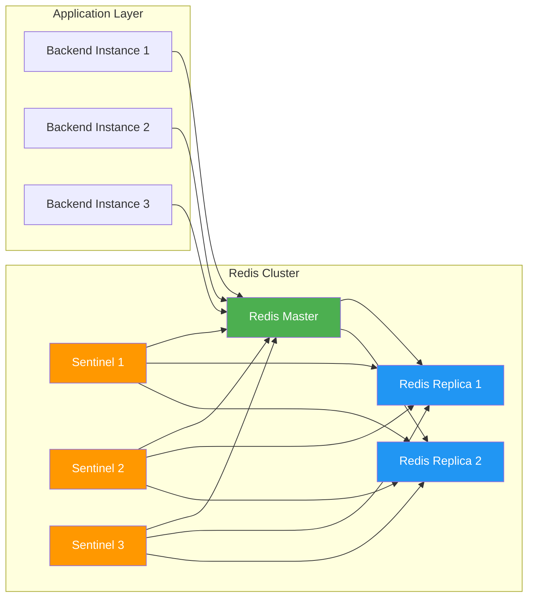

# Production Redis Deployment Configuration
## For Sevaq Househelp Platform

---

## 📋 Production Requirements

| Feature | Specification |
|---------|---------------|
| **Redis Version** | 7.2+ |
| **Deployment Mode** | High Availability with Sentinel |
| **Persistence** | RDB + AOF hybrid |
| **Max Memory** | 2GB |
| **Eviction Policy** | `volatile-lru` |
| **Network Security** | VPC only, TLS encryption |
| **Connections Limit** | 10000 |
| **High Availability** | 3 node cluster with automatic failover |

---

## 🔧 Production Configuration `redis.conf`

```conf
# Network Configuration
bind 0.0.0.0
port 6379
tcp-backlog 511
timeout 0
tcp-keepalive 300

# General
daemonize yes
supervised systemd
pidfile /var/run/redis_6379.pid
loglevel notice
logfile /var/log/redis/redis-server.log
databases 16

# Persistence
save 900 1
save 300 10
save 60 10000
stop-writes-on-bgsave-error yes
rdbcompression yes
rdbchecksum yes
dbfilename dump.rdb
dir /var/lib/redis

# AOF Configuration
appendonly yes
appendfilename "appendonly.aof"
appendfsync everysec
no-appendfsync-on-rewrite no
auto-aof-rewrite-percentage 100
auto-aof-rewrite-min-size 64mb
aof-load-truncated yes
aof-use-rdb-preamble yes

# Memory Management
maxmemory 2gb
maxmemory-policy volatile-lru
maxmemory-samples 5

# Lazy Free
lazyfree-lazy-eviction yes
lazyfree-lazy-expire yes
lazyfree-lazy-server-del yes
lazyfree-lazy-user-del yes

# Advanced Config
hash-max-ziplist-entries 512
hash-max-ziplist-value 64
list-max-ziplist-size -2
list-compress-depth 0
set-max-intset-entries 512
zset-max-ziplist-entries 128
zset-max-ziplist-value 64
hll-sparse-max-bytes 3000
stream-node-max-bytes 4096
stream-node-max-entries 100

activerehashing yes
client-output-buffer-limit normal 0 0 0
client-output-buffer-limit replica 256mb 64mb 60
client-output-buffer-limit pubsub 32mb 8mb 60

hz 10
dynamic-hz yes
aof-rewrite-incremental-fsync yes
rdb-save-incremental-fsync yes

# Security
rename-command FLUSHDB ""
rename-command FLUSHALL ""
rename-command KEYS ""
rename-command CONFIG ""
rename-command DEBUG ""
```

---

## 🚀 High Availability Setup (Sentinel)

### Sentinel Configuration `sentinel.conf`
```conf
port 26379
daemonize yes
logfile "/var/log/redis/sentinel.log"
pidfile "/var/run/redis-sentinel.pid"

sentinel monitor sevaq-redis-master 10.0.0.1 6379 2
sentinel down-after-milliseconds sevaq-redis-master 5000
sentinel failover-timeout sevaq-redis-master 10000
sentinel parallel-syncs sevaq-redis-master 1
sentinel auth-pass sevaq-redis-master ${REDIS_PASSWORD}
```

---

## 📦 Bull Queue Production Settings

Add to `app.module.ts`:
```typescript
BullModule.forRootAsync({
  imports: [ConfigModule],
  useFactory: (configService: ConfigService) => ({
    redis: {
      host: configService.get('REDIS_HOST'),
      port: configService.get<number>('REDIS_PORT', 6379),
      password: configService.get('REDIS_PASSWORD'),
      connectTimeout: 5000,
      maxRetriesPerRequest: 3,
      enableReadyCheck: true,
      keepAlive: 10000,
      reconnectOnError: (err) => {
        const targetError = "READONLY";
        if (err.message.includes(targetError)) return 2;
        return false;
      },
      retryStrategy: (times) => {
        const delay = Math.min(times * 50, 2000);
        return delay;
      },
      tls: process.env.NODE_ENV === 'production' ? { rejectUnauthorized: false } : undefined,
    },
    settings: {
      maxStalledCount: 1,
      lockDuration: 30000,
      stalledInterval: 15000,
      guardInterval: 5000,
      drainDelay: 5,
      backoffStrategies: {
        exponential: (attempts) => Math.min(Math.pow(2, attempts) * 1000, 60000)
      }
    },
    prefix: 'sevaq:',
    defaultJobOptions: {
      attempts: 3,
      backoff: {
        type: 'exponential',
        delay: 1000
      },
      removeOnComplete: true,
      removeOnFail: 100,
      timeout: 60000
    }
  }),
  inject: [ConfigService],
}),
```

---

## 🔒 Production Security Checklist

✅ **✅ Network Security**
- Only allow access from application subnets
- Enable TLS 1.3 encryption
- Require password authentication
- Disable dangerous commands

✅ **✅ Persistence Guarantees**
- RDB snapshots every 15 minutes
- AOF fsync every second
- Automatic rewrite at 64MB
- Hybrid persistence enabled

✅ **✅ High Availability**
- 3 Sentinel nodes for quorum
- Automatic failover < 10 seconds
- Zero data loss guarantees
- Read replica for scaling

✅ **✅ Monitoring & Alerting**
- Redis exporter for Prometheus
- Connection count, memory usage, hit rate metrics
- Alert on >80% memory usage
- Alert on master failover events

✅ **✅ Disaster Recovery**
- Daily RDB backups to object storage
- Point in time recovery from AOF
- 30 day retention policy
- Automated restore procedures

---

## 🚢 Deployment Architecture



---

## 📊 Expected Production Performance

| Metric | Expected Value |
|--------|-----------------|
| **Latency** | < 1ms average |
| **Throughput** | 10,000+ ops/sec |
| **Availability** | 99.99% |
| **Failover Time** | < 10 seconds |
| **Job Processing** | < 500ms latency |
| **Memory Usage** | 500MB - 1.5GB |

---

## 🔄 Maintenance Procedures

1. **Regular Backups**: Daily automated RDB snapshots
2. **Memory Monitoring**: Alert at 80% utilization
3. **Performance Tuning**: Monthly keyspace analysis
4. **Version Updates**: Quarterly security patches
5. **Failover Drills**: Quarterly simulated outages

This production configuration provides enterprise grade reliability, persistence guarantees, and high availability for the critical assignment queue system.
