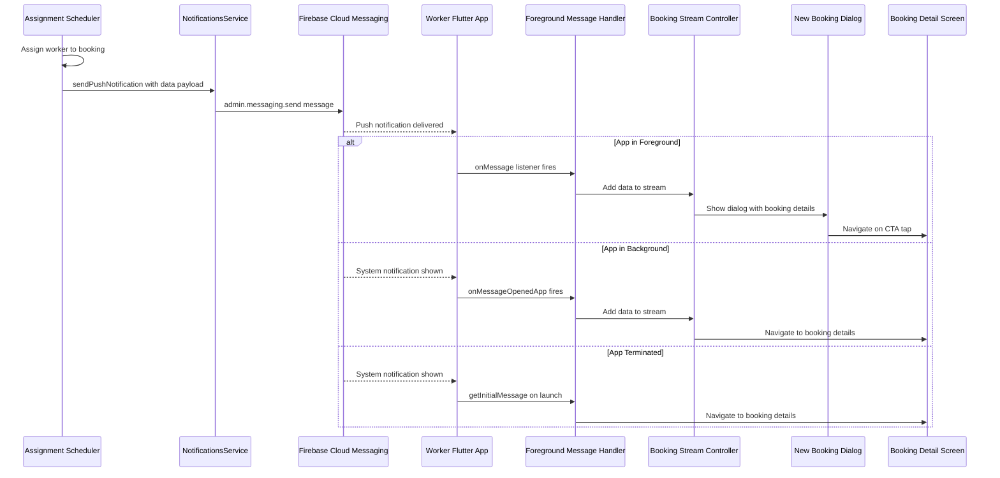

# Real-Time "New Booking" Notification Implementation Plan

## Executive Summary

This plan details the implementation of real-time FCM push notifications when a booking is assigned to a worker. The system already has the infrastructure in place (FCM tokens, notification service, data payload handling) but needs enhancements to ensure reliable delivery and a polished in-app experience.

---

## Current State Analysis

### Backend (NestJS)

**What's Working:**
- [`NotificationsService.sendPushNotification()`](flutter-nest-househelp-master/src/notifications/notifications.service.ts:316) - FCM sending is implemented and functional
- [`NotificationsService.notifyWorkerNewBooking()`](flutter-nest-househelp-master/src/notifications/notifications.service.ts:365) - Worker notification method exists
- [`OnDemandAssignmentScheduler._notifyWorkerOfAssignment()`](flutter-nest-househelp-master/src/subscriptions/on-demand-assignment.scheduler.ts:272) - On-demand bookings already send notifications
- Worker entity has [`fcmToken`](flutter-nest-househelp-master/src/workers/entities/worker.entity.ts:115) field
- Firebase Admin SDK is initialized with service account credentials

**What's Missing:**
- [`SubscriptionAssignmentScheduler`](flutter-nest-househelp-master/src/subscriptions/subscription-assignment.scheduler.ts:32) does NOT send notifications after assigning workers to subscription bookings
- No notification is sent in [`directlyAssignWorker()`](flutter-nest-househelp-master/src/subscriptions/subscription-assignment.scheduler.ts:637) or [`directlyAssignWorkerWithoutBooking()`](flutter-nest-househelp-master/src/subscriptions/subscription-assignment.scheduler.ts:702)

### Worker App (Flutter)

**What's Working:**
- [`NotificationService.initialize()`](worker_app_flutter/lib/services/notification_service.dart:29) - Firebase messaging is initialized
- [`NotificationService._handleForegroundMessage()`](worker_app_flutter/lib/services/notification_service.dart:70) - Foreground messages are received
- [`NotificationService._bookingStreamController`](worker_app_flutter/lib/services/notification_service.dart:18) - Broadcast stream for new booking events exists
- FCM token registration with backend works via [`registerTokenWithBackend()`](worker_app_flutter/lib/services/notification_service.dart:126)

**What's Missing:**
- No listener on `_bookingStreamController` to show an in-app popup
- No foreground notification display (local notification or dialog)
- No navigation to booking details when CTA is tapped
- Background message handler is not configured (needs `firebase_messaging_background_handler.dart`)

---

## Notification Data Payload Structure

### Current Payload (from backend)
```typescript
{
  type: 'new_booking',
  bookingId: booking.id.toString(),
}
```

### Recommended Enhanced Payload
```typescript
{
  type: 'new_booking',
  bookingId: booking.id.toString(),
  bookingPublicId: booking.publicId ?? '',
  serviceName: service?.name ?? 'Service',
  serviceDate: booking.date ?? '',
  startTime: booking.startTime ?? '',
  customerName: user?.firstName ?? 'Customer',
  customerAddress: booking.address ?? '',
  price: booking.price?.toString() ?? '0',
  assignmentType: 'on_demand' | 'subscription',
  timestamp: new Date().toISOString(),
}
```

**Rationale:**
- `bookingId` (internal integer ID) is used for API calls like accept/reject
- `bookingPublicId` (UUID) may be needed for some API endpoints
- `serviceName`, `serviceDate`, `startTime` allow rich notification display without API call
- `customerName` and `customerAddress` provide context in the popup
- `assignmentType` helps the app differentiate between on-demand and subscription bookings
- `timestamp` helps with deduplication and sorting

---

## Architecture Diagram



---

## Step-by-Step Implementation Plan

### Phase 1: Backend Changes

#### Step 1.1: Add Notification to SubscriptionAssignmentScheduler

**File:** [`flutter-nest-househelp-master/src/subscriptions/subscription-assignment.scheduler.ts`](flutter-nest-househelp-master/src/subscriptions/subscription-assignment.scheduler.ts)

**Changes:**

1. Inject `NotificationsService` into the constructor:
```typescript
constructor(
  // ... existing dependencies
  private readonly notificationsService: NotificationsService,
) {}
```

2. Add notification call in [`directlyAssignWorker()`](flutter-nest-househelp-master/src/subscriptions/subscription-assignment.scheduler.ts:637) after booking is saved (after line 685):
```typescript
// Send push notification to worker
await this._notifyWorkerOfAssignment(nearestWorker, booking);
```

3. Add notification call in [`assignWorkerForSubscription()`](flutter-nest-househelp-master/src/subscriptions/subscription-assignment.scheduler.ts:383) after successful assignment (after line 617):
```typescript
if (assignmentResult.success && assignmentResult.worker) {
  await this._notifyWorkerOfAssignment(assignmentResult.worker, booking);
}
```

4. Add the `_notifyWorkerOfAssignment` method (similar to OnDemandAssignmentScheduler):
```typescript
private async _notifyWorkerOfAssignment(worker: Worker, booking: Booking): Promise<void> {
  if (!worker.fcmToken) {
    this.logger.warn(`Worker ${worker.id} has no FCM token, skipping notification`);
    return;
  }

  const serviceName = booking.service?.name || 'Service';
  const bookingDate = booking.date || new Date().toISOString().split('T')[0];

  await this.notificationsService.sendPushNotification(
    worker.fcmToken,
    'नई बुकिंग मिली! 🎉',
    `${serviceName} - ${bookingDate} को। ग्राहक का पता और विवरण देखने के लिए ऐप खोलें।`,
    {
      type: 'new_booking',
      bookingId: booking.id.toString(),
      bookingPublicId: booking.publicId ?? '',
      serviceName,
      serviceDate: bookingDate,
      startTime: booking.startTime ?? '',
      assignmentType: 'subscription',
      timestamp: new Date().toISOString(),
    },
  );
  this.logger.log(`Sent push notification to worker ${worker.id} for booking ${booking.id}`);
}
```

5. Add `NotificationsService` import at the top:
```typescript
import { NotificationsService } from '../notifications/notifications.service';
```

#### Step 1.2: Enhance OnDemandAssignmentScheduler Notification Payload

**File:** [`flutter-nest-househelp-master/src/subscriptions/on-demand-assignment.scheduler.ts`](flutter-nest-househelp-master/src/subscriptions/on-demand-assignment.scheduler.ts)

**Changes:**

Update the payload in [`_notifyWorkerOfAssignment()`](flutter-nest-househelp-master/src/subscriptions/on-demand-assignment.scheduler.ts:272) (lines 289-293):
```typescript
await this.notificationsService.sendPushNotification(
  worker.fcmToken,
  title,
  body,
  {
    type: 'new_booking',
    bookingId: booking.id.toString(),
    bookingPublicId: booking.publicId ?? '',
    serviceName,
    serviceDate: bookingDate,
    startTime: booking.startTime ?? '',
    customerName: booking.user?.firstName ?? 'Customer',
    assignmentType: 'on_demand',
    timestamp: new Date().toISOString(),
  },
);
```

---

### Phase 2: Worker App Changes

#### Step 2.1: Create Background Message Handler

**New File:** `worker_app_flutter/lib/firebase_messaging_background_handler.dart`

```dart
import 'package:firebase_messaging/firebase_messaging.dart';
import 'package:flutter/foundation.dart';

/// Top-level function for handling background FCM messages.
/// This MUST be a top-level function, not a class method.
@pragma('vm:entry-point')
Future<void> _firebaseMessagingBackgroundHandler(RemoteMessage message) async {
  debugPrint('=== Background Message Handler ===');
  debugPrint('Handling a background message: ${message.messageId}');
  debugPrint('Message data: ${message.data}');
  debugPrint('Notification: ${message.notification?.title}');
  
  // Background messages are handled by the system notification
  // No need to show a local notification here since FCM handles it
}

/// Export this function for use in main.dart
Future<void> initializeBackgroundMessageHandler() async {
  FirebaseMessaging.onBackgroundMessage(_firebaseMessagingBackgroundHandler);
  debugPrint('Background message handler registered');
}
```

#### Step 2.2: Create New Booking Dialog Widget

**New File:** `worker_app_flutter/lib/widgets/new_booking_dialog.dart`

```dart
import 'package:flutter/material.dart';

class NewBookingDialogData {
  final String bookingId;
  final String serviceName;
  final String serviceDate;
  final String startTime;
  final String customerName;
  final String? customerAddress;
  final String price;

  NewBookingDialogData({
    required this.bookingId,
    required this.serviceName,
    required this.serviceDate,
    required this.startTime,
    required this.customerName,
    this.customerAddress,
    required this.price,
  });

  factory NewBookingDialogData.fromMap(Map<String, dynamic> data) {
    return NewBookingDialogData(
      bookingId: data['bookingId'] ?? '',
      serviceName: data['serviceName'] ?? 'Service',
      serviceDate: data['serviceDate'] ?? '',
      startTime: data['startTime'] ?? '',
      customerName: data['customerName'] ?? 'Customer',
      customerAddress: data['customerAddress'],
      price: data['price'] ?? '0',
    );
  }
}

class NewBookingDialog extends StatelessWidget {
  final NewBookingDialogData data;
  final VoidCallback onViewDetails;

  const NewBookingDialog({
    super.key,
    required this.data,
    required this.onViewDetails,
  });

  @override
  Widget build(BuildContext context) {
    return Dialog(
      shape: RoundedRectangleBorder(borderRadius: BorderRadius.circular(20)),
      child: Container(
        padding: const EdgeInsets.all(24),
        child: Column(
          mainAxisSize: MainAxisSize.min,
          children: [
            // Success icon
            Container(
              padding: const EdgeInsets.all(16),
              decoration: BoxDecoration(
                color: Colors.green.withValues(alpha: 0.1),
                shape: BoxShape.circle,
              ),
              child: const Icon(
                Icons.check_circle,
                size: 48,
                color: Colors.green,
              ),
            ),
            const SizedBox(height: 16),
            
            // Title
            const Text(
              'नया काम मिला!',
              style: TextStyle(
                fontSize: 22,
                fontWeight: FontWeight.bold,
              ),
            ),
            const SizedBox(height: 8),
            
            // Subtitle
            Text(
              'You have a new booking',
              style: TextStyle(
                fontSize: 16,
                color: Colors.grey[600],
              ),
            ),
            const SizedBox(height: 20),
            
            // Booking details card
            Container(
              width: double.infinity,
              padding: const EdgeInsets.all(16),
              decoration: BoxDecoration(
                color: Colors.grey[50],
                borderRadius: BorderRadius.circular(12),
                border: Border.all(color: Colors.grey[200]!),
              ),
              child: Column(
                crossAxisAlignment: CrossAxisAlignment.start,
                children: [
                  _buildDetailRow(Icons.cleaning_services, data.serviceName),
                  const SizedBox(height: 8),
                  _buildDetailRow(Icons.calendar_today, '${data.serviceDate} at ${data.startTime}'),
                  const SizedBox(height: 8),
                  _buildDetailRow(Icons.person, data.customerName),
                  if (data.customerAddress != null) ...[
                    const SizedBox(height: 8),
                    _buildDetailRow(Icons.location_on, data.customerAddress!),
                  ],
                  const SizedBox(height: 12),
                  Row(
                    mainAxisAlignment: MainAxisAlignment.end,
                    children: [
                      Text(
                        '₹${data.price}',
                        style: const TextStyle(
                          fontSize: 20,
                          fontWeight: FontWeight.bold,
                          color: Colors.green,
                        ),
                      ),
                    ],
                  ),
                ],
              ),
            ),
            const SizedBox(height: 24),
            
            // Action buttons
            Row(
              children: [
                Expanded(
                  child: OutlinedButton(
                    onPressed: () => Navigator.of(context).pop(),
                    style: OutlinedButton.styleFrom(
                      padding: const EdgeInsets.symmetric(vertical: 14),
                      shape: RoundedRectangleBorder(
                        borderRadius: BorderRadius.circular(12),
                      ),
                    ),
                    child: const Text('Later'),
                  ),
                ),
                const SizedBox(width: 12),
                Expanded(
                  child: ElevatedButton(
                    onPressed: () {
                      Navigator.of(context).pop();
                      onViewDetails();
                    },
                    style: ElevatedButton.styleFrom(
                      padding: const EdgeInsets.symmetric(vertical: 14),
                      backgroundColor: Colors.green,
                      foregroundColor: Colors.white,
                      shape: RoundedRectangleBorder(
                        borderRadius: BorderRadius.circular(12),
                      ),
                    ),
                    child: const Text('View Details'),
                  ),
                ),
              ],
            ),
          ],
        ),
      ),
    );
  }

  Widget _buildDetailRow(IconData icon, String text) {
    return Row(
      children: [
        Icon(icon, size: 18, color: Colors.grey[600]),
        const SizedBox(width: 8),
        Expanded(
          child: Text(
            text,
            style: TextStyle(
              fontSize: 14,
              color: Colors.grey[800],
            ),
          ),
        ),
      ],
    );
  }
}
```

#### Step 2.3: Update main.dart to Register Background Handler

**File:** [`worker_app_flutter/lib/main.dart`](worker_app_flutter/lib/main.dart)

**Changes:**

1. Add import:
```dart
import 'firebase_messaging_background_handler.dart';
```

2. Add background handler initialization in `main()` before `_initializeServices()`:
```dart
void main() async {
  WidgetsFlutterBinding.ensureInitialized();

  // Initialize Firebase
  await Firebase.initializeApp(
    options: defaultFirebaseOptions.currentPlatform,
  );

  // Register background message handler (MUST be before runApp)
  await initializeBackgroundMessageHandler();

  // Initialize services
  await _initializeServices();
  
  // ... rest of main()
}
```

#### Step 2.4: Create Notification Listener Widget

**New File:** `worker_app_flutter/lib/widgets/notification_listener_widget.dart`

```dart
import 'package:flutter/material.dart';
import '../services/notification_service.dart';
import '../widgets/new_booking_dialog.dart';
import 'booking_detail_screen.dart';

/// Widget that listens for new booking notifications and shows a dialog.
/// Place this as a child of the main screen's body or as an overlay.
class NotificationListenerWidget extends StatefulWidget {
  final Widget child;

  const NotificationListenerWidget({
    super.key,
    required this.child,
  });

  @override
  State<NotificationListenerWidget> createState() => _NotificationListenerWidgetState();
}

class _NotificationListenerWidgetState extends State<NotificationListenerWidget> {
  late final Stream<Map<String, dynamic>> _bookingStream;

  @override
  void initState() {
    super.initState();
    _bookingStream = NotificationService.onNewBooking;
    _bookingStream.listen(_handleNewBooking);
  }

  void _handleNewBooking(Map<String, dynamic> data) {
    debugPrint('=== New Booking Received ===');
    debugPrint('Data: $data');

    if (!mounted) return;

    final dialogData = NewBookingDialogData.fromMap(data);

    showDialog(
      context: context,
      barrierDismissible: false,
      builder: (context) => NewBookingDialog(
        data: dialogData,
        onViewDetails: () {
          // Navigate to booking details
          Navigator.of(context).push(
            MaterialPageRoute(
              builder: (_) => BookingDetailScreen(
                bookingId: dialogData.bookingId,
              ),
            ),
          );
        },
      ),
    );
  }

  @override
  Widget build(BuildContext context) {
    return widget.child;
  }
}
```

#### Step 2.5: Create Booking Detail Screen (if not exists)

**Check if exists:** `worker_app_flutter/lib/screens/booking_detail_screen.dart`

If it doesn't exist, create it:

**New File:** `worker_app_flutter/lib/screens/booking_detail_screen.dart`

```dart
import 'package:flutter/material.dart';
import 'package:provider/provider.dart';
import '../providers/booking_provider.dart';
import '../models/booking.dart';

class BookingDetailScreen extends StatefulWidget {
  final String bookingId;
  final Booking? booking;

  const BookingDetailScreen({
    super.key,
    this.bookingId = '',
    this.booking,
  });

  @override
  State<BookingDetailScreen> createState() => _BookingDetailScreenState();
}

class _BookingDetailScreenState extends State<BookingDetailScreen> {
  Booking? _booking;
  bool _isLoading = true;

  @override
  void initState() {
    super.initState();
    if (widget.booking != null) {
      _booking = widget.booking;
      _isLoading = false;
    } else {
      _fetchBookingDetails();
    }
  }

  Future<void> _fetchBookingDetails() async {
    final bookingProvider = context.read<BookingProvider>();
    await bookingProvider.fetchBookings();
    
    final booking = bookingProvider.bookings.firstWhere(
      (b) => b.id == widget.bookingId,
      orElse: () => throw Exception('Booking not found'),
    );
    
    if (mounted) {
      setState(() {
        _booking = booking;
        _isLoading = false;
      });
    }
  }

  @override
  Widget build(BuildContext context) {
    if (_isLoading) {
      return const Scaffold(
        body: Center(child: CircularProgressIndicator()),
      );
    }

    if (_booking == null) {
      return Scaffold(
        appBar: AppBar(title: const Text('Booking Details')),
        body: const Center(child: Text('Booking not found')),
      );
    }

    return Scaffold(
      appBar: AppBar(
        title: const Text('Booking Details'),
      ),
      body: SingleChildScrollView(
        padding: const EdgeInsets.all(16),
        child: Column(
          crossAxisAlignment: CrossAxisAlignment.start,
          children: [
            // Service name
            Text(
              _booking!.serviceName,
              style: Theme.of(context).textTheme.headlineSmall?.copyWith(
                fontWeight: FontWeight.bold,
              ),
            ),
            const SizedBox(height: 24),
            
            // Status chip
            _buildStatusChip(_booking!.status),
            const SizedBox(height: 24),
            
            // Details card
            Card(
              child: Padding(
                padding: const EdgeInsets.all(16),
                child: Column(
                  crossAxisAlignment: CrossAxisAlignment.start,
                  children: [
                    _buildDetailRow('Customer', _booking!.customerName),
                    const Divider(),
                    _buildDetailRow('Date', _booking!.scheduledDate),
                    const Divider(),
                    _buildDetailRow('Time', _booking!.startTime),
                    const Divider(),
                    _buildDetailRow('Address', _booking!.customerAddress ?? 'N/A'),
                    const Divider(),
                    _buildDetailRow('Price', '₹${_booking!.price.toStringAsFixed(0)}'),
                  ],
                ),
              ),
            ),
            const SizedBox(height: 24),
            
            // Action buttons based on status
            if (_booking!.isPending) ...[
              Row(
                children: [
                  Expanded(
                    child: OutlinedButton(
                      onPressed: () => _rejectBooking(),
                      style: OutlinedButton.styleFrom(
                        padding: const EdgeInsets.symmetric(vertical: 14),
                        foregroundColor: Colors.red,
                      ),
                      child: const Text('Reject'),
                    ),
                  ),
                  const SizedBox(width: 12),
                  Expanded(
                    child: ElevatedButton(
                      onPressed: () => _acceptBooking(),
                      style: ElevatedButton.styleFrom(
                        padding: const EdgeInsets.symmetric(vertical: 14),
                        backgroundColor: Colors.green,
                        foregroundColor: Colors.white,
                      ),
                      child: const Text('Accept'),
                    ),
                  ),
                ],
              ),
            ] else if (_booking!.isConfirmed || _booking!.isInProgress) ...[
              ElevatedButton(
                onPressed: () => _startBooking(),
                style: ElevatedButton.styleFrom(
                  padding: const EdgeInsets.symmetric(vertical: 14),
                  backgroundColor: Colors.blue,
                  foregroundColor: Colors.white,
                ),
                child: const Text('Start Service'),
              ),
            ],
          ],
        ),
      ),
    );
  }

  Widget _buildDetailRow(String label, String value) {
    return Padding(
      padding: const EdgeInsets.symmetric(vertical: 8),
      child: Row(
        crossAxisAlignment: CrossAxisAlignment.start,
        children: [
          SizedBox(
            width: 100,
            child: Text(
              label,
              style: TextStyle(
                color: Colors.grey[600],
                fontWeight: FontWeight.w500,
              ),
            ),
          ),
          Expanded(
            child: Text(
              value,
              style: const TextStyle(fontWeight: FontWeight.w500),
            ),
          ),
        ],
      ),
    );
  }

  Widget _buildStatusChip(String status) {
    Color color;
    switch (status) {
      case 'PENDING':
        color = Colors.orange;
        break;
      case 'CONFIRMED':
        color = Colors.blue;
        break;
      case 'IN_PROGRESS':
        color = Colors.purple;
        break;
      case 'COMPLETED':
        color = Colors.green;
        break;
      default:
        color = Colors.grey;
    }
    return Container(
      padding: const EdgeInsets.symmetric(horizontal: 16, vertical: 8),
      decoration: BoxDecoration(
        color: color.withValues(alpha: 0.1),
        borderRadius: BorderRadius.circular(20),
        border: Border.all(color: color),
      ),
      child: Text(
        status,
        style: TextStyle(
          color: color,
          fontWeight: FontWeight.bold,
        ),
      ),
    );
  }

  Future<void> _acceptBooking() async {
    final success = await context.read<BookingProvider>().acceptBooking(_booking!.id);
    if (success && mounted) {
      ScaffoldMessenger.of(context).showSnackBar(
        const SnackBar(content: Text('Booking accepted')),
      );
      // Refresh bookings
      context.read<BookingProvider>().fetchBookings();
    }
  }

  Future<void> _rejectBooking() async {
    final success = await context.read<BookingProvider>().rejectBooking(_booking!.id);
    if (success && mounted) {
      ScaffoldMessenger.of(context).showSnackBar(
        const SnackBar(content: Text('Booking rejected')),
      );
      Navigator.of(context).pop();
    }
  }

  Future<void> _startBooking() async {
    final success = await context.read<BookingProvider>().startBooking(_booking!.id);
    if (success && mounted) {
      ScaffoldMessenger.of(context).showSnackBar(
        const SnackBar(content: Text('Service started')),
      );
      context.read<BookingProvider>().fetchBookings();
    }
  }
}
```

#### Step 2.6: Integrate Notification Listener into Main Screen

**File:** [`worker_app_flutter/lib/screens/main_screen.dart`](worker_app_flutter/lib/screens/main_screen.dart)

**Changes:**

1. Add import:
```dart
import '../widgets/notification_listener_widget.dart';
```

2. Wrap the main content with `NotificationListenerWidget`:
```dart
@override
Widget build(BuildContext context) {
  return Consumer<AuthProvider>(
    builder: (context, auth, _) {
      // Check if user is authenticated but has no worker profile
      if (auth.isAuthenticated && auth.worker == null && !auth.isLoading) {
        return _buildNoWorkerProfileScreen();
      }

      return NotificationListenerWidget(
        child: Scaffold(
          body: IndexedStack(index: _currentIndex, children: _screens),
          bottomNavigationBar: BottomNavigationBar(
            currentIndex: _currentIndex,
            onTap: (index) => setState(() => _currentIndex = index),
            items: const [
              BottomNavigationBarItem(icon: Icon(Icons.home), label: 'Home'),
              BottomNavigationBarItem(
                icon: Icon(Icons.calendar_today),
                label: 'Jobs',
              ),
              BottomNavigationBarItem(
                icon: Icon(Icons.account_balance_wallet),
                label: 'Earnings',
              ),
              BottomNavigationBarItem(
                icon: Icon(Icons.person), label: 'Profile'),
            ],
          ),
        ),
      );
    },
  );
}
```

#### Step 2.7: Update BookingProvider to Handle New Booking Detection

**File:** [`worker_app_flutter/lib/providers/booking_provider.dart`](worker_app_flutter/lib/providers/booking_provider.dart)

**Changes:**

Add a method to fetch a specific booking by ID:
```dart
Future<Booking?> fetchBookingById(String bookingId) async {
  await fetchBookings();
  try {
    return _bookings.firstWhere((b) => b.id == bookingId);
  } catch (e) {
    debugPrint('Booking not found with ID: $bookingId');
    return null;
  }
}
```

---

### Phase 3: Android Configuration

#### Step 3.1: Update AndroidManifest.xml for Background Messaging

**File:** `worker_app_flutter/android/app/src/main/AndroidManifest.xml`

Ensure the following is present:
```xml
<application
    ...>
    <!-- Add this for Firebase background messaging -->
    <meta-data
        android:name="com.google.firebase.messaging.default_notification_channel_id"
        android:value="new_booking_channel" />
    <meta-data
        android:name="com.google.firebase.messaging.default_notification_icon"
        android:resource="@mipmap/ic_launcher" />
    <meta-data
        android:name="com.google.firebase.messaging.default_notification_color"
        android:resource="@color/notification_color" />
</application>
```

#### Step 3.2: Create Notification Channel (Android)

**File:** `worker_app_flutter/android/app/src/main/res/values/colors.xml` (create if not exists)
```xml
<?xml version="1.0" encoding="utf-8"?>
<resources>
    <color name="notification_color">#4CAF50</color>
</resources>
```

---

### Phase 4: Testing Plan

#### Step 4.1: Test Scenarios

1. **Foreground Notification (App Open)**
   - Assign a booking to worker 19 via backend
   - Verify dialog appears within 5 seconds
   - Verify dialog shows correct booking details
   - Tap "View Details" and verify navigation to booking detail screen

2. **Background Notification (App Minimized)**
   - Minimize the app
   - Assign a booking to worker 19 via backend
   - Verify system notification appears in notification tray
   - Tap notification and verify app opens to booking detail screen

3. **Terminated Notification (App Closed)**
   - Force close the app
   - Assign a booking to worker 19 via backend
   - Verify system notification appears in notification tray
   - Tap notification and verify app launches to booking detail screen

4. **Multiple Notifications**
   - Assign multiple bookings rapidly
   - Verify each triggers a separate dialog/notification
   - Verify no duplicate dialogs for the same booking

#### Step 4.2: Manual Testing Commands

```bash
# Test on-demand assignment (triggers notification)
cd flutter-nest-househelp-master
node test-booking-with-worker-assignment.js

# Test subscription assignment (after backend changes)
# Via API or scheduler
curl -X POST http://localhost:3000/api/subscriptions/{id}/assign \
  -H "Authorization: Bearer {admin_token}"
```

---

## Files to Create

| File | Purpose |
|------|---------|
| `worker_app_flutter/lib/firebase_messaging_background_handler.dart` | Background message handler |
| `worker_app_flutter/lib/widgets/new_booking_dialog.dart` | Dialog widget for new booking popup |
| `worker_app_flutter/lib/widgets/notification_listener_widget.dart` | Stream listener widget |
| `worker_app_flutter/lib/screens/booking_detail_screen.dart` | Booking detail screen (if not exists) |

## Files to Modify

| File | Changes |
|------|---------|
| `flutter-nest-househelp-master/src/subscriptions/subscription-assignment.scheduler.ts` | Add NotificationsService injection, add notification calls |
| `flutter-nest-househelp-master/src/subscriptions/on-demand-assignment.scheduler.ts` | Enhance notification payload |
| `worker_app_flutter/lib/main.dart` | Add background handler initialization |
| `worker_app_flutter/lib/screens/main_screen.dart` | Wrap with NotificationListenerWidget |
| `worker_app_flutter/lib/providers/booking_provider.dart` | Add fetchBookingById method |
| `worker_app_flutter/android/app/src/main/AndroidManifest.xml` | Add Firebase metadata |

---

## Risk Assessment

| Risk | Impact | Mitigation |
|------|--------|------------|
| FCM token expires/invalid | High | Token refresh handling already exists in NotificationService |
| Notification arrives but booking not in API response | Medium | Add retry logic in booking detail screen |
| Dialog shown when app is in background | Low | Use `mounted` check and `showDialog` only in foreground |
| Multiple dialogs for same booking | Low | Add deduplication using bookingId + timestamp |
| Android notification channel not created | Medium | Create channel in app initialization |

---

## Implementation Order

1. **Backend First** (test independently):
   - Step 1.1: Add notification to SubscriptionAssignmentScheduler
   - Step 1.2: Enhance OnDemandAssignmentScheduler payload

2. **Worker App Core** (build foundation):
   - Step 2.1: Create background message handler
   - Step 2.2: Create new booking dialog widget
   - Step 2.3: Update main.dart

3. **Worker App Integration** (connect everything):
   - Step 2.4: Create notification listener widget
   - Step 2.5: Create booking detail screen (if needed)
   - Step 2.6: Integrate into main screen
   - Step 2.7: Update booking provider

4. **Android Config** (platform-specific):
   - Step 3.1: Update AndroidManifest.xml
   - Step 3.2: Create notification channel

5. **Testing**:
   - Step 4.1: Run all test scenarios
   - Step 4.2: Verify with manual commands
