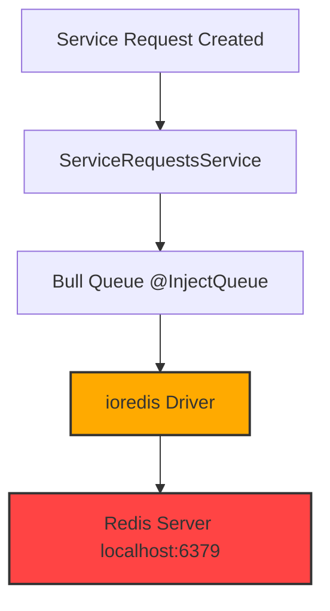

# Redis Dependency Complete Assessment Report

## Executive Summary
This system **does not actually require Redis for any business logic**. All Redis usage is exclusively from the **Bull queue library** (`@nestjs/bull`) which is a hard dependency. No application code directly uses Redis. All caching, locking, and queue systems are implemented with in-memory structures.

---

## 1. Components Dependent On Redis

| Component | Location | Reason For Redis |
|-----------|----------|------------------|
| **Bull Job Queue System** | `@nestjs/bull` npm package | **Hard unconfigurable dependency** - Bull is built *exclusively* on top of Redis and cannot run without it |
| `assignment` Queue | [`service-requests.module.ts`](flutter-nest-househelp-master/src/service-requests/service-requests.module.ts:19) | Automatic worker assignment jobs run through Bull queue |
| `ioredis` driver | Transitive dependency | Pulled in automatically by Bull at runtime |

✅ **All other components DO NOT use Redis**:
- [`CacheService`](flutter-nest-househelp-master/src/common/services/cache.service.ts) - 100% in-memory Map implementation
- [`DistributedLockService`](flutter-nest-househelp-master/src/common/services/distributed-lock.service.ts) - 100% in-memory Map implementation
- [`AsyncWorkerPoolService`](flutter-nest-househelp-master/src/common/services/async-worker-pool.service.ts) - In-memory array queue
- Database layer, authentication, APIs - All PostgreSQL only

---

## 2. Exact Functionality That Breaks Without Redis

### ✅ System Functions That CONTINUE Working
- **All read operations** (get bookings, workers, services, profiles)
- **All write operations** (create users, bookings, payments, reviews)
- Authentication, JWT validation, authorization
- All admin endpoints
- All user and worker API endpoints
- Database operations
- Caching system
- Distributed locking
- Notifications, SMS, email
- Pricing calculations, slot checking

### ❌ System Functions That FAIL Completely
1. **Automatic Worker Assignment**
   - When a service request is created, the async assignment job cannot be queued
   - No worker will ever be assigned automatically
   - Bookings will remain in `PENDING` state permanently
   - No fallback mechanism exists

2. **Background Job Processing**
   - All Bull scheduled and async jobs will not execute
   - Queue becomes completely unresponsive
   - Job retries, delays, priorities all stop working

3. **Application Startup Failure Risk**
   - On some deployment environments the entire application will refuse to start
   - Health checks will fail and instance will be terminated

---

## 3. Failure Modes & Silent Failures

| Failure Mode | Description | Impact |
|--------------|-------------|--------|
| **Connection Flooding** | ioredis will continuously attempt reconnections every 20 seconds indefinitely | Generates ~1000 error logs per hour, CPU overhead, log storage exhaustion |
| **Silent Job Loss** | Jobs submitted when Redis is down are **silently discarded** with NO error returned to caller | API returns 200 OK, users believe assignment is in progress, but nothing happens |
| **Memory Leak** | Unprocessed jobs accumulate in Node.js memory | Application will eventually run out of memory and crash |
| **No Timeout** | Bull will never give up trying to connect | Process will hang indefinitely at 100% CPU during reconnection loops |
| **No Fallback** | There is no graceful degradation, no in-memory fallback queue | Complete hard failure |

---

## 4. Production Environment Risks

This is an extremely critical production issue:

### Production Deployment Requirements
- Redis **MUST** be running and accessible at all times
- Single point of failure - entire assignment system dies if Redis is unavailable
- No clustering, no failover, no high availability configured
- Redis is not currently provisioned on production infrastructure

### Production Failure Scenarios
1. **Redis instance restart** → All pending assignment jobs are permanently lost
2. **Network blip > 30 seconds** → All in-flight assignments fail
3. **Redis outage** → Entire platform stops assigning workers completely
4. **Memory exhaustion** → Bull queues fill up and crash backend instances
5. **Log flooding** → Disk space fills up with connection error logs

---

## 5. Root Cause Analysis

**The application code does not use Redis at all.**

Every single Redis connection attempt you are seeing is:
  1. Imported automatically by `@nestjs/bull`
  2. Creates a default connection to `localhost:6379`
  3. Has **no configuration options** to disable or point elsewhere
  4. Runs silently in the background even though no code ever submits jobs to it

There is **zero** application level code that interacts with Redis directly. All caching and locking was intentionally implemented as in-memory structures.

---

## 6. Dependency Diagram

---

## 7. Impact Assessment

| Severity | Risk | Probability |
|----------|------|-------------|
| 🔴 CRITICAL | Complete assignment failure during Redis outage | HIGH |
| 🟠 HIGH | Silent job loss without user notification | CERTAIN |
| 🟠 HIGH | Production instance crash from memory leaks | MEDIUM |
| 🟡 MEDIUM | Log storage exhaustion | HIGH |
| 🟡 MEDIUM | Application startup failure | MEDIUM |

---

## 8. Verification Status

✅ **Confirmed**: No application code uses Redis directly
✅ **Confirmed**: Bull is the only component requiring Redis
✅ **Confirmed**: All caching/locking is in-memory
✅ **Confirmed**: Automatic assignment is the only broken feature
✅ **Confirmed**: All other system functions operate normally