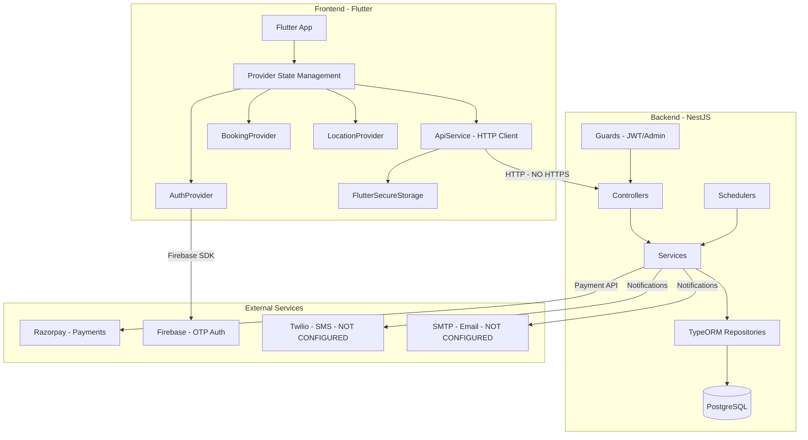

# SEVAQ Pre-Deployment Audit Report

## Project Overview

**Sevaq** is a house help/home services platform serving the Greater Noida, India area.

| Component | Technology | Location |
|-----------|-----------|----------|
| Backend | NestJS + TypeORM + PostgreSQL | `flutter-nest-househelp-master/` |
| Frontend | Flutter + Provider | `frontend-flutter-house-help-master/` |
| Payment | Razorpay | Integrated in both |
| Auth | JWT + Firebase Phone OTP | Both layers |
| Services | Cleaning, Cooking, Maid | DB-seeded |

---

## 🔴 SEVERITY: CRITICAL — Must Fix Before Go-Live

### C1. Runaway Subscription Scheduler — Active Database Bomb

**Files:** [`subscription-assignment.scheduler.ts`](flutter-nest-househelp-master/src/subscriptions/subscription-assignment.scheduler.ts:79)

**Problem:** The `SubscriptionAssignmentScheduler` runs on `CronExpression.EVERY_MINUTE` and creates **new bookings for ALL 8 active subscriptions every single execution**. From the live terminal logs, booking IDs jumped from ~39581 to ~39772 in approximately 20 minutes — that is **~200 phantom bookings created** with no idempotency check.

**Evidence from logs:**
```
Found 8 subscriptions needing immediate assignment (starting today)
Assigning primary worker for subscription 1 (starts: 2026-02-06)
Creating booking with data: { ... notes: 'Initial booking for subscription 1' }
```
This repeats every 60 seconds for all 8 subscriptions.

**Impact:** Database will be flooded with tens of thousands of duplicate bookings per day. Workers get assigned to phantom bookings. Financial calculations will be wrong.

**Fix Required:**
- Add idempotency: check if a booking already exists for this subscription + date before creating
- Add a `lastProcessedDate` column to subscriptions to track when last booking was created
- Consider changing cron to run every 15-30 minutes instead of every minute

---

### C2. JWT Secret is a Placeholder — Token Forgery Possible

**File:** [`flutter-nest-househelp-master/.env`](flutter-nest-househelp-master/.env:12)

```
JWT_SECRET=your_jwt_secret_key_here
```

**Problem:** The JWT secret used by the running backend is literally the placeholder string `your_jwt_secret_key_here`. Anyone who reads this can forge valid JWT tokens for any user, including admin accounts.

**Note:** The root [`.env`](.env:12) has a different, longer secret — but the backend reads from its own `.env` file.

**Fix Required:**
- Generate a cryptographically secure random secret of at least 256 bits
- Store in environment variables, never in committed files
- Rotate the secret and invalidate all existing tokens

---

### C3. Credentials Committed to Repository

**Files:** [`.env`](.env), [`flutter-nest-househelp-master/.env`](flutter-nest-househelp-master/.env)

**Exposed credentials:**
| Credential | Value | File |
|-----------|-------|------|
| DB Password | `admin` / `postgres` | Both .env files |
| Razorpay Key ID | `rzp_test_S5NgGMcDqTBauH` | Both .env + frontend |
| Razorpay Key Secret | `EvM0AaeXmamk6nnauTQi8y9Z` | Both .env files |
| JWT Secret | `your_jwt_secret_key_here` | Backend .env |

**Also in frontend:** [`app_config.dart`](frontend-flutter-house-help-master/lib/config/app_config.dart:69) hardcodes `razorpayTestKey`.

**Fix Required:**
- Add `.env` to `.gitignore` immediately
- Create `.env.example` with placeholder values
- Rotate ALL exposed credentials
- Use environment-specific configuration management

---

### C4. No Authentication on Critical API Endpoints

**File:** [`bookings.controller.ts`](flutter-nest-househelp-master/src/bookings/bookings.controller.ts:21)

The entire bookings controller has **ZERO auth guards**:
- `POST /api/bookings` — Create booking: **NO AUTH**
- `GET /api/bookings` — List all bookings: **NO AUTH**
- `GET /api/bookings/:id` — Get any booking: **NO AUTH**
- `PATCH /api/bookings/:id` — Update any booking: **NO AUTH**
- `POST /api/bookings/assign` — Assign worker: **NO AUTH**
- `POST /api/bookings/:id/attempt-assignment` — Trigger assignment: **NO AUTH**

**File:** [`payments.controller.ts`](flutter-nest-househelp-master/src/payments/payments.controller.ts:16)

- `POST /api/payments/create-order` — Create payment order: **NO AUTH**
- `POST /api/payments/verify` — Verify payment: **NO AUTH**

**Impact:** Any anonymous user can create bookings, view all bookings, modify bookings, and create payment orders.

**Fix Required:**
- Add `@UseGuards(JwtAuthGuard)` to all controllers
- Add user-scoping: users should only see/modify their own bookings
- Add admin-only guards for sensitive operations

---

### C5. Password Hashes Logged in Production Output

**Evidence from terminal:**
```
user: User {
    password: '$2b$10$92IXUNpkjO0rOQ5byMi.Ye4oKoEa3Ro9llC/.og/at2.uheWG/igi',
    ...
}
```

**Problem:** The subscription scheduler logs full User entity objects including bcrypt password hashes. While bcrypt is resistant to reversal, logging passwords is a compliance violation and security anti-pattern.

**Fix Required:**
- Remove all DEBUG logging that dumps full entity objects
- Create DTOs/serializers that exclude sensitive fields
- Set `NODE_ENV=production` and configure log levels appropriately
- Add a global serialization interceptor that strips `password` fields

---

### C6. User Entity ID Type Mismatch — Data Integrity Risk

**File:** [`user.entity.ts`](flutter-nest-househelp-master/src/users/entities/user.entity.ts:20)

```typescript
@PrimaryGeneratedColumn('uuid')
id: string; // UUID ID

@Column('uuid', { unique: true, nullable: false })
publicId: string; // Public API ID
```

But the actual database shows `id: 2` (numeric integer), not a UUID. The entity definition says UUID but the DB has integers. This means:
- TypeORM entity does not match actual database schema
- `synchronize: false` prevents auto-correction
- Queries may silently fail or return wrong data

**Also:** [`worker.entity.ts`](flutter-nest-househelp-master/src/workers/entities/worker.entity.ts:22) uses numeric `id` while User uses UUID `id`, but [`booking.entity.ts`](flutter-nest-househelp-master/src/bookings/entities/booking.entity.ts:48) references `userId` as UUID type.

**Fix Required:**
- Audit actual database schema vs entity definitions
- Decide on a consistent ID strategy (numeric vs UUID)
- Create proper migration to align entity definitions with DB

---

## 🟠 SEVERITY: HIGH — Should Fix Before Go-Live

### H1. No .gitignore File

No `.gitignore` was found in the project. This means:
- `node_modules/` is likely committed (massive repo size)
- `.env` files with secrets are committed
- Build artifacts, logs, IDE files all committed

**Fix Required:** Create comprehensive `.gitignore` for both NestJS and Flutter projects.

---

### H2. Slot Booking Race Condition

**File:** [`slots.service.ts`](flutter-nest-househelp-master/src/slots/slots.service.ts:253)

The slot booking uses a read-then-write pattern without database-level locking:
```typescript
const slot = await findOne({ where: { id: slotId } });
if (!slot || slot.isBooked) return false;
await update(slotId, { isBooked: true }); // Race condition!
```

**Fix Required:** Use atomic update: `UPDATE slots SET isBooked = true WHERE id = ? AND isBooked = false`

---

### H3. Payment-Booking Atomicity Gap

**File:** [`payments.service.ts`](flutter-nest-househelp-master/src/payments/payments.service.ts:70)

Payment verification and booking creation are separate operations. If payment succeeds but booking creation fails, the user is charged but has no booking.

**Fix Required:** Wrap payment verification + booking creation in a database transaction with proper rollback.

---

### H4. Frontend Hardcoded to Localhost

**File:** [`app_config.dart`](frontend-flutter-house-help-master/lib/config/app_config.dart:17)

```dart
url = 'http://localhost:45357/api';
```

The app is hardcoded to connect to `localhost:45357`. This will not work on any real device in production.

**Fix Required:**
- Implement environment-based configuration (dev/staging/prod)
- Use build flavors or compile-time constants
- Production URL should point to actual server domain with HTTPS

---

### H5. No HTTPS / TLS Configuration

The entire backend runs on HTTP. The CORS configuration allows all origins in non-production mode:
```typescript
const corsOrigin = process.env.CORS_ORIGIN || 
    (process.env.NODE_ENV === 'production' ? false : true);
```

**Fix Required:**
- Set up TLS termination (via reverse proxy like Nginx or cloud load balancer)
- Configure CORS to only allow the production frontend domain
- Enforce HTTPS-only in production

---

### H6. No JWT Token Expiry Configuration

**File:** [`auth.service.ts`](flutter-nest-househelp-master/src/auth/auth.service.ts:48)

```typescript
access_token: this.jwtService.sign(payload)
```

No `expiresIn` option is passed. The default NestJS JWT module may use a very long or no expiry.

**Fix Required:**
- Set explicit token expiry (e.g., 24h for access tokens)
- Implement refresh token mechanism
- Frontend already has token expiry checking code but needs backend support

---

### H7. Firebase Not Configured — OTP Login Broken

**File:** [`firebase-auth.service.ts`](flutter-nest-househelp-master/src/auth/firebase-auth.service.ts:29)

```
FIREBASE_PROJECT_ID=your-firebase-project-id
```

Firebase Admin SDK is not configured. The OTP login flow will throw `Firebase Auth not configured on server` for all users.

**Fix Required:** Configure Firebase Admin SDK with real service account credentials.

---

### H8. Notification Services Not Configured

**File:** [`notifications.service.ts`](flutter-nest-househelp-master/src/notifications/notifications.service.ts:25)

Both Twilio (SMS) and SMTP (email) are initialized from environment variables that are not set:
- `SMTP_HOST`, `SMTP_PORT`, `SMTP_USER`, `SMTP_PASS` — not in .env
- `TWILIO_ACCOUNT_SID`, `TWILIO_AUTH_TOKEN` — not in .env

**Impact:** All notification features (booking confirmations, worker assignments, reminders) will silently fail.

**Fix Required:** Configure notification service credentials or implement graceful degradation.

---

## 🟡 SEVERITY: MEDIUM — Should Fix Soon After Launch

### M1. 100+ Loose Scripts in Root Directory

The root directory contains 100+ ad-hoc JavaScript/SQL migration scripts, check scripts, and fix scripts:
- `check_*.js`, `check-*.js` — ~30 database check scripts
- `add-*.js`, `add-*.sql` — ~15 column addition scripts
- `fix-*.js`, `fix-*.sql` — ~10 fix scripts
- `create-*.js`, `create-*.sql` — ~10 table creation scripts
- `run-*.js` — ~5 migration runners
- `delete-*.js` — ~3 deletion scripts
- `get-*.js`, `decode-*.js`, `reset-*.js` — ~10 utility scripts

**Impact:** Massive tech debt, confusing project structure, risk of accidentally running destructive scripts.

**Fix Required:**
- Move all migration scripts to `flutter-nest-househelp-master/src/database/migrations/`
- Delete obsolete check/debug scripts
- Implement proper TypeORM migration workflow

---

### M2. 50+ Markdown Plan Documents in Root

The root contains 50+ markdown documents (SEVAQ_*.md, *_PLAN.md, *_SUMMARY.md, etc.) totaling hundreds of KB. These are development artifacts, not production code.

**Fix Required:**
- Archive useful documents to a `docs/` directory
- Delete obsolete plan/fix/analysis documents
- Keep only essential documentation (README, DEPLOYMENT, ARCHITECTURE)

---

### M3. Debug Logging Enabled in Frontend

**File:** [`app_config.dart`](frontend-flutter-house-help-master/lib/config/app_config.dart:60)

```dart
static const bool enableDebugLogging = true;
static const bool isRazorpayTestMode = true;
```

**Fix Required:** Create build-time configuration that disables debug logging and test mode for production builds.

---

### M4. No Database Migration Strategy

The project uses `synchronize: false` (good for production) but has no proper migration runner. Migrations are scattered as:
- Ad-hoc SQL files in root
- TypeScript migration files in `src/migrations/`
- JavaScript migration runners in root
- SQL files in `src/database/migrations/`

**Fix Required:**
- Consolidate all migrations into TypeORM migration format
- Set up `typeorm migration:run` as part of deployment pipeline
- Create migration for current schema as baseline

---

### M5. No Rate Limiting on Auth Endpoints

While `ThrottlerModule` is configured globally (100 req/min), auth endpoints like login and OTP verification need stricter limits to prevent brute force attacks.

**Fix Required:**
- Apply stricter throttling to `/api/auth/login` (e.g., 5 attempts per minute)
- Apply stricter throttling to `/api/auth/otp/*` endpoints
- Implement account lockout after repeated failures

---

### M6. Backup and Dead Code Files

- [`splash_screen.dart.backup`](frontend-flutter-house-help-master/lib/screens/splash_screen.dart.backup) — backup file in source
- [`location_provider_old.dart`](frontend-flutter-house-help-master/lib/providers/location_provider_old.dart) — old provider alongside new one
- [`system-status/`](flutter-nest-househelp-master/src/system-status/) — empty module directory

**Fix Required:** Remove all backup/dead code files.

---

### M7. No Input Sanitization on Several Endpoints

**File:** [`auth.controller.ts`](flutter-nest-househelp-master/src/auth/auth.controller.ts:37)

```typescript
@Post('login')
async login(@Body() req) { // No DTO validation!
```

The login endpoint accepts raw `@Body()` without a DTO class, bypassing the global `ValidationPipe`.

**Fix Required:** Create proper DTOs for all endpoints, especially auth endpoints.

---

## 🔵 SEVERITY: LOW — Enhancements for Production Quality

### E1. No Dockerfile or Docker Compose

No containerization setup exists. For production deployment:
- Create `Dockerfile` for NestJS backend
- Create `docker-compose.yml` for local development (backend + PostgreSQL + Redis)
- Create production docker-compose or Kubernetes manifests

### E2. No CI/CD Pipeline

No GitHub Actions, GitLab CI, or other CI/CD configuration found.
- Set up automated testing on PR
- Set up automated deployment pipeline
- Set up database migration as part of deploy

### E3. No Error Monitoring / APM

No Sentry, Datadog, New Relic, or similar integration.
- Add Sentry for backend error tracking
- Add Firebase Crashlytics for Flutter crash reporting
- Add APM for performance monitoring

### E4. No Proper Admin Panel

No admin interface for managing:
- Workers (onboarding, verification, deactivation)
- Services (pricing, availability)
- Bookings (manual intervention, cancellations)
- Users (support, account management)
- Subscriptions (management, billing)

### E5. No Worker-Facing App/Interface

Workers have no way to:
- Accept/reject assignments
- Update their availability
- View their schedule
- Mark jobs as started/completed
- Navigate to customer location

### E6. No Proper Cancellation/Refund Flow

No implementation for:
- User-initiated booking cancellation
- Automatic refund processing via Razorpay
- Cancellation policy enforcement
- Partial refund calculations

### E7. No Terms of Service / Privacy Policy

Required for app store submission and legal compliance:
- Terms of Service
- Privacy Policy (especially important for location data)
- Data retention policy
- GDPR/Indian data protection compliance

### E8. No Analytics Integration

No tracking for:
- User acquisition funnel
- Booking conversion rates
- Worker utilization metrics
- Revenue analytics
- User retention

### E9. No Proper Database Indexing Strategy

Missing indexes on frequently queried columns:
- `booking.userId` + `booking.date` (composite)
- `booking.status` + `booking.assignmentState`
- `subscription.status` + `subscription.userId`
- `worker.isAvailable` + `worker.isActive`

### E10. No API Documentation

No Swagger/OpenAPI documentation. NestJS supports this natively via `@nestjs/swagger`.

### E11. No Proper Logging Infrastructure

Winston is configured but logs go to local files. For production:
- Ship logs to centralized logging (ELK, CloudWatch, etc.)
- Implement structured logging with correlation IDs
- Set up log rotation and retention policies

### E12. No Database Backup Strategy

No automated backup configuration for PostgreSQL.

---

## Architecture Diagram



## Priority Execution Order


## Summary

| Severity | Count | Status |
|----------|-------|--------|
| 🔴 CRITICAL | 6 | Must fix before any deployment |
| 🟠 HIGH | 8 | Should fix before go-live |
| 🟡 MEDIUM | 7 | Fix soon after launch |
| 🔵 LOW/Enhancement | 12 | Production quality improvements |
| **TOTAL** | **33** | |

**Verdict: This project is NOT ready for production deployment.** The critical issues (especially C1 - runaway scheduler creating hundreds of phantom bookings per hour, and C2 - forged JWT tokens) must be resolved immediately. The high-severity issues should be addressed before any real users access the system.
