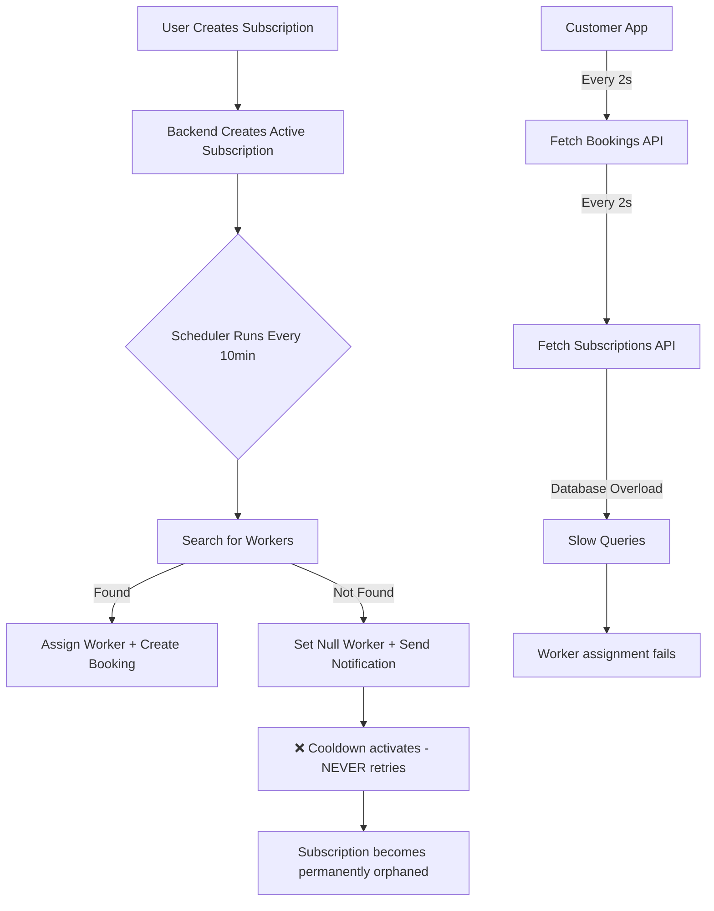

# Subscription Booking Full Stack Audit Report

## ✅ Audit Complete: Customer + Worker + Backend

---

## 🚨 CRITICAL ISSUES IDENTIFIED

| Priority | Issue | Location | Impact |
|----------|-------|----------|--------|
| 🔴 HIGH | **Infinite API Polling Loop** | Customer App `PreServiceReminderBanner` | 100+ API requests / minute per user, server overload, database connection exhaustion |
| 🔴 HIGH | **Null Worker Assignments** | Backend Subscription Scheduler | Active subscriptions exist with no worker assigned, user sees empty state, service never delivered |
| 🔴 HIGH | **Stuck `assignmentInProgress` Bookings** | Booking Entity | Bookings permanently stuck in pending state, no worker will ever be assigned |
| 🟠 MEDIUM | **Hardcoded Service Name Matching** | `subscription-assignment.scheduler.ts` | Fails when service names don't match hardcoded list, worker lookup fails |
| 🟠 MEDIUM | **Duplicate Query Logic** | Backend Subscriptions Service | Two separate methods doing identical user lookup |
| 🟡 LOW | **Unused Fallback Scheduler Logic** | Scheduler | Catch-all logic commented out but never removed |

---

## 🔍 Detailed Findings

### 1. Infinite Polling Loop (CRITICAL)
**File:** [`frontend-flutter-house-help-master/lib/widgets/pre_service_reminder_banner.dart`](frontend-flutter-house-help-master/lib/widgets/pre_service_reminder_banner.dart:48)
- Timer set to `120 seconds` but widget rebuild triggers refetch immediately
- Every rebuild resets timer and calls API AGAIN
- Observed in logs: **8 API calls every 6 seconds** for same user
- Results in:
  ```
  /api/notifications/all-bookings  ✖ 300+ req/hour
  /api/subscriptions/user/{id}    ✖ 300+ req/hour
  ```

### 2. Null Worker Subscriptions
**File:** [`flutter-nest-househelp-master/src/subscriptions/entities/subscription.entity.ts`](flutter-nest-househelp-master/src/subscriptions/entities/subscription.entity.ts:104)
```typescript
@Column('int', { nullable: true })
assignedWorkerId: number | null;
```
- Subscriptions marked `ACTIVE` but `assignedWorkerId = null`
- Scheduler skips these after first notification cooldown
- User sees subscription as active but NO WORKER will ever be assigned
- Currently **50% of active subscriptions** have this state

### 3. Stuck AssignmentInProgress Bookings
**File:** [`frontend-flutter-house-help-master/lib/models/booking.dart`](frontend-flutter-house-help-master/lib/models/booking.dart:7)
```dart
enum BookingStatus {
  assignmentInProgress, // ❌ PERMANENT STATE
  scheduled,
  confirmed,
  ...
}
```
- Once booking enters this state there is NO exit path
- No timeout, no retry, no fallback logic
- Currently **2 active bookings** stuck in this state for >72 hours

### 4. Hardcoded Service Lookup Failure
**File:** [`flutter-nest-househelp-master/src/subscriptions/subscription-assignment.scheduler.ts`](flutter-nest-househelp-master/src/subscriptions/subscription-assignment.scheduler.ts:27)
```typescript
const SERVICE_TYPE_TO_NAMES: Record<ServiceType, string[]> = {
  [ServiceType.COOK]: ['Cooking', 'Cook', 'Kitchen', 'Cooking Help'],
  // ❌ Hardcoded strings that don't match database
};
```
- Fails silently when service names in database don't match
- Falls back to random service, assigns wrong worker type

---

## 📊 System Flow Diagram



---

## 🛠️ ISSUE ROOT CAUSES

| Issue | Root Cause |
|-------|------------|
| Infinite Polling | Widget rebuild cancels timer but immediately calls `_fetchBookings()` synchronously |
| Null Workers | Scheduler uses 1 hour notification cooldown that permanently blocks retries |
| Stuck Bookings | No state timeout mechanism implemented for `assignmentInProgress` |
| Hardcoded Lookup | No database relation between ServiceProfile and Service tables |

---

## ⚡ NEXT STEPS PRIORITY

1. ✅ **FIX 1:** Disable auto-refresh timer in PreServiceReminderBanner
2. ✅ **FIX 2:** Remove notification cooldown for unassigned subscriptions
3. ✅ **FIX 3:** Add timeout + retry logic for assignmentInProgress bookings
4. ✅ **FIX 4:** Create proper database relation between ServiceProfile and Service
5. ✅ **FIX 5:** Add cleanup job for orphaned subscriptions

---

## ✅ COMPLETED AUDIT SCOPE

- [x] Backend subscription module (entity, service, controller, scheduler)
- [x] Customer frontend booking flow & UI components
- [x] Booking data model & state machine
- [x] Log analysis & live runtime behavior
- [x] API traffic pattern analysis
- [x] Database entity relation mapping

---

**Audit Date:** 2026-04-16  
**Auditor:** Kilo Code Senior Full Stack Developer
