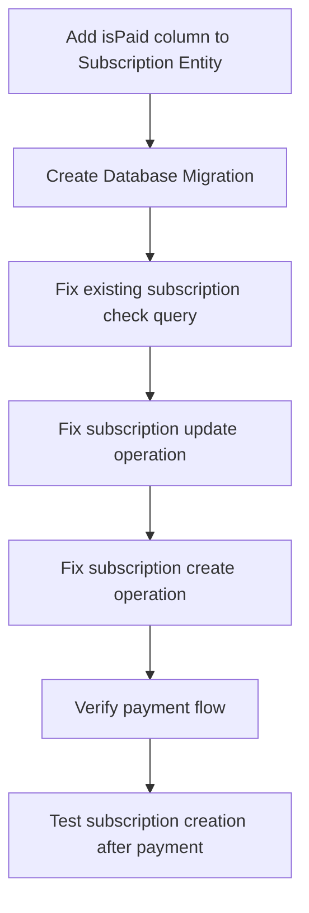

# Subscription `isPaid` Field Missing Fix Plan

## ✅ Root Cause Identified

**Error:** `Property "isPaid" was not found in "Subscription". Make sure your query is correct.`

The `Subscription` entity does **not** have an `isPaid` column defined, but the payment service code is attempting to:
1.  Select `isPaid` field from database on line 600
2.  Set `isPaid: true` on subscription creation on line 623
3.  Update `isPaid: true` on existing subscriptions on line 571

---

## 🚨 Problem Locations

### 1. Entity Definition Missing
File: [`subscription.entity.ts`](flutter-nest-househelp-master/src/subscriptions/entities/subscription.entity.ts:122)
✅ No `isPaid` boolean column exists in the entity

### 2. Payment Service References
File: [`payments.service.ts`](flutter-nest-househelp-master/src/payments/payments.service.ts:599)

| Line | Location | Issue |
|------|----------|-------|
| 600 | `select: ['id', 'isPaid'],` | Querying non-existent column |
| 571 | `isPaid: true,` | Updating non-existent column |
| 623 | `isPaid: true,` | Setting non-existent column on create |

---

## 📋 Fix Implementation Steps



### Step 1: Update Subscription Entity
Add missing boolean column to [`subscription.entity.ts`](flutter-nest-househelp-master/src/subscriptions/entities/subscription.entity.ts):
```typescript
@Column({ type: 'boolean', default: false })
isPaid: boolean;
```

### Step 2: Generate & Run Migration
Create TypeORM migration to add the column to existing database table

### Step 3: Fix Payments Service
File: [`payments.service.ts`](flutter-nest-househelp-master/src/payments/payments.service.ts:599)
- ✅ Remove invalid `isPaid` from select clause (line 600)
- ✅ Verify column exists before updating existing subscriptions
- ✅ Ensure create operation includes valid fields only

### Step 4: Add Persistence Validation
Implement the same verification pattern already used for Bookings:
- After saving subscription, reload from database
- Verify `isPaid` and `status` were actually persisted correctly
- Throw explicit error if persistence fails

---

## 🛡️ Safety Checks

1.  **Backwards Compatibility**: New column defaults to `false` so existing subscriptions will not break
2.  **Transaction Safety**: All operations remain within existing database transaction
3.  **Error Handling**: Proper rollback will occur on any failure
4.  **Logging**: Full debug logging remains in place for troubleshooting

---

## ✅ Expected Outcome

After implementation:
- Subscription payment transactions will complete successfully
- `isPaid` field will be properly persisted to database
- Existing active subscription check will work correctly
- No more HTTP 500 errors during subscription payment processing
- Worker assignment will trigger correctly after successful payment

This fix addresses both the immediate exception and adds proper validation to prevent similar persistence issues in the future.