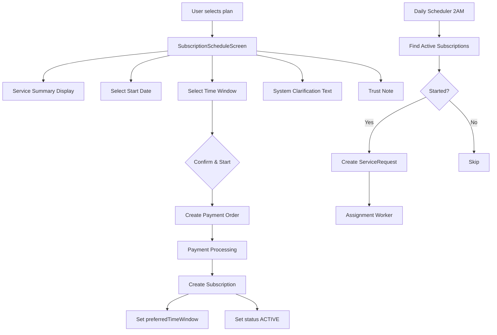

# SubscriptionScheduleScreen Implementation Plan

## Overview

This plan outlines the implementation of the new `SubscriptionScheduleScreen` with the canonical v1 copy and UX rules as specified. The screen is designed to eliminate "weekly/monthly" confusion and reaffirm SEVAQ's automated daily service promise.

## Current State Analysis

### Frontend (Flutter)
- **File**: [`subscription_scheduling_screen.dart`](frontend-flutter-house-help-master/lib/screens/subscription_scheduling_screen.dart:1-839)
- **Current Issues**:
  - Shows frequency selection (weekly/bi-weekly/monthly) - **MUST BE REMOVED**
  - Generic header text
  - Missing service summary section
  - Time window cards lack clarification text
  - Price display shows per-visit pricing concept
  - CTA button text is generic

### Backend (NestJS)
- **Subscription Entity**: [`subscription.entity.ts`](flutter-nest-househelp-master/src/subscriptions/entities/subscription.entity.ts:1-80)
  - Has `frequency` field with DAILY/WEEKDAYS/CUSTOM_DAYS values
  - Uses `timeWindowStart` and `timeWindowEnd` (time type)
  - Should use `preferredTimeWindow` enum (MORNING|AFTERNOON|EVENING)
  
- **ServiceProfile Entity**: [`service-profile.entity.ts`](flutter-nest-househelp-master/src/service-profiles/entities/service-profile.entity.ts:1-59)
  - Missing `visitPattern` field
  - Missing `maxVisitsPerDay` field
  - Missing `defaultTimeWindows` field

- **Scheduler**: [`subscription-scheduler.service.ts`](flutter-nest-househelp-master/src/subscriptions/subscription-scheduler.service.ts:1-132)
  - Currently checks frequency matching
  - Should always generate daily requests for active subscriptions

---

## Implementation Tasks

### Phase 1: Frontend - Screen Copy & UI Updates

#### 1.1 Update Screen Header
**File**: [`subscription_scheduling_screen.dart`](frontend-flutter-house-help-master/lib/screens/subscription_scheduling_screen.dart:371-388)

```dart
Widget _buildHeader(ThemeData theme) {
  return Column(
    crossAxisAlignment: CrossAxisAlignment.start,
    children: [
      Text(
        'Schedule your subscription',
        style: theme.textTheme.headlineSmall?.copyWith(
          fontWeight: FontWeight.bold,
          color: Colors.black87,
        ),
      ),
      const SizedBox(height: 8),
      Text(
        'Choose when your daily service should start.\nSEVAQ will handle all recurring visits.',
        style: theme.textTheme.bodyMedium?.copyWith(color: Colors.black54),
      ),
    ],
  );
}
```

#### 1.2 Remove Frequency Selection Section
**Action**: Remove the entire [`_buildFrequencySelection()`](frontend-flutter-house-help-master/lib/screens/subscription_scheduling_screen.dart:391-440) method and its call.

#### 1.3 Add Service Summary Section (READ-ONLY)
**Action**: Add new method `_buildServiceSummary()` before date selection:

```dart
Widget _buildServiceSummary(ThemeData theme) {
  return Container(
    padding: const EdgeInsets.all(16),
    decoration: BoxDecoration(
      color: Colors.grey[100],
      borderRadius: BorderRadius.circular(12),
      border: Border.all(color: Colors.grey[200]!),
    ),
    child: Column(
      crossAxisAlignment: CrossAxisAlignment.start,
      children: [
        Text(
          'Selected plan',
          style: theme.textTheme.labelMedium?.copyWith(
            color: Colors.black54,
            fontWeight: FontWeight.w500,
          ),
        ),
        const SizedBox(height: 8),
        Text(
          '${widget.serviceProfile.profileName} — ${widget.serviceProfile.serviceType}',
          style: theme.textTheme.titleMedium?.copyWith(
            fontWeight: FontWeight.bold,
          ),
        ),
        const SizedBox(height: 4),
        Text(
          widget.serviceProfile.scopeDefinition,
          style: theme.textTheme.bodyMedium?.copyWith(color: Colors.black54),
        ),
        const SizedBox(height: 12),
        Container(
          padding: const EdgeInsets.symmetric(horizontal: 12, vertical: 8),
          decoration: BoxDecoration(
            color: theme.primaryColor.withOpacity(0.1),
            borderRadius: BorderRadius.circular(8),
          ),
          child: Row(
            mainAxisSize: MainAxisSize.min,
            children: [
              Icon(Icons.calendar_today, size: 16, color: theme.primaryColor),
              const SizedBox(width: 8),
              Text(
                'Visits are scheduled daily as part of this plan.',
                style: theme.textTheme.bodySmall?.copyWith(
                  color: theme.primaryColor,
                  fontWeight: FontWeight.w600,
                ),
              ),
            ],
          ),
        ),
      ],
    ),
  );
}
```

#### 1.4 Update Start Date Section Title
**Action**: Update [`_buildStartDateSelection()`](frontend-flutter-house-help-master/lib/screens/subscription_scheduling_screen.dart:490-574) label to "Service start date"

#### 1.5 Update Time Window Section
**Action**: Update [`_buildTimeWindowSelection()`](frontend-flutter-house-help-master/lib/screens/subscription_scheduling_screen.dart:577-677):
- Change title to "Preferred daily time window"
- Update time window cards with new structure:
  - Morning (8:00 – 11:00) - Default recommended
  - Afternoon (12:00 – 15:00)
  - Evening (16:00 – 19:00)

#### 1.6 Add System Clarification Text
**Action**: Add after time window selection:

```dart
Widget _buildSystemClarification(ThemeData theme) {
  return Container(
    padding: const EdgeInsets.all(16),
    decoration: BoxDecoration(
      color: Colors.blue[50],
      borderRadius: BorderRadius.circular(12),
    ),
    child: Row(
      children: [
        Icon(Icons.info_outline, color: Colors.blue[700], size: 20),
        const SizedBox(width: 12),
        Expanded(
          child: Text(
            'Your assigned professional will visit once every day within this time window. '
            'Exact arrival time may vary slightly.',
            style: theme.textTheme.bodySmall?.copyWith(
              color: Colors.blue[900],
            ),
          ),
        ),
      ],
    ),
  );
}
```

#### 1.7 Replace Price Display with Trust Message
**Action**: Replace [`_buildPriceDisplay()`](frontend-flutter-house-help-master/lib/screens/subscription_scheduling_screen.dart:680-729) with:

```dart
Widget _buildTrustNote(ThemeData theme) {
  return Container(
    padding: const EdgeInsets.all(16),
    decoration: BoxDecoration(
      color: Colors.grey[100],
      borderRadius: BorderRadius.circular(12),
    ),
    child: Column(
      children: [
        Row(
          children: [
            Icon(Icons.verified_user, color: Colors.green[700], size: 24),
            const SizedBox(width: 12),
            Expanded(
              child: Text(
                'Covered by SEVAQ Service Guarantee',
                style: theme.textTheme.titleSmall?.copyWith(
                  fontWeight: FontWeight.bold,
                  color: Colors.black87,
                ),
              ),
            ),
          ],
        ),
        const SizedBox(height: 8),
        Text(
          'Assignment, monitoring, and replacement are handled by SEVAQ.',
          style: theme.textTheme.bodySmall?.copyWith(color: Colors.black54),
        ),
      ],
    ),
  );
}
```

#### 1.8 Update CTA Button
**Action**: Update [`_buildPrimaryCTA()`](frontend-flutter-house-help-master/lib/screens/subscription_scheduling_screen.dart:772-811):
- Change text to "Confirm & start daily service"
- Keep styling consistent with accent color

---

### Phase 2: Backend - Entity Updates

#### 2.1 Update Subscription Entity
**File**: [`subscription.entity.ts`](flutter-nest-househelp-master/src/subscriptions/entities/subscription.entity.ts:1-80)

**Add new enum**:
```typescript
export enum PreferredTimeWindow {
  MORNING = 'MORNING',
  AFTERNOON = 'AFTERNOON',
  EVENING = 'EVENING',
}
```

**Remove**:
- `frequency` field
- `timeWindowStart` (time)
- `timeWindowEnd` (time)
- `customDays` (no longer needed)

**Add**:
```typescript
@Column({
  type: 'varchar',
  enum: PreferredTimeWindow,
})
preferredTimeWindow: PreferredTimeWindow;
```

#### 2.2 Update ServiceProfile Entity
**File**: [`service-profile.entity.ts`](flutter-nest-househelp-master/src/service-profiles/entities/service-profile.entity.ts:1-59)

**Add new fields**:
```typescript
export enum VisitPattern {
  DAILY = 'DAILY',
}

export enum MaxVisitsPerDay {
  ONE = 1,
}

@Column({
  type: 'varchar',
  enum: VisitPattern,
  default: VisitPattern.DAILY,
})
visitPattern: VisitPattern;

@Column({
  type: 'int',
  default: MaxVisitsPerDay.ONE,
})
maxVisitsPerDay: number;

@Column({ type: 'json', nullable: true })
defaultTimeWindows: string[];
```

#### 2.3 Update Subscriptions Service
**File**: [`subscriptions.service.ts`](flutter-nest-househelp-master/src/subscriptions/subscriptions.service.ts:1-120)

**Update `createSubscription` method signature**:
```typescript
async createSubscription(
  userId: number,
  serviceProfileId: number,
  preferredTimeWindow: PreferredTimeWindow,
  startDate: Date,
  location: { lat: number; lng: number },
  monthlyPriceSnapshot: number,
): Promise<Subscription>
```

---

### Phase 3: Backend - Scheduler Updates

#### 3.1 Simplify Scheduler Logic
**File**: [`subscription-scheduler.service.ts`](flutter-nest-househelp-master/src/subscriptions/subscription-scheduler.service.ts:1-132)

**Remove frequency matching logic** - always create daily requests:

```typescript
@Cron('0 2 * * *') // Run at 2 AM daily
async handleDailySubscriptionProcessing() {
  this.logger.log('Starting daily subscription processing');

  try {
    const activeSubscriptions = await this.subscriptionsService.getActiveSubscriptions();
    this.logger.log(`Found ${activeSubscriptions.length} active subscriptions`);

    const today = new Date();
    today.setHours(0, 0, 0, 0);

    for (const subscription of activeSubscriptions) {
      // Check if subscription is still active and has started
      if (
        subscription.status === 'ACTIVE' &&
        (!subscription.endDate || subscription.endDate > today) &&
        subscription.startDate <= today
      ) {
        // Always create service request for daily subscriptions
        await this.createServiceRequest(subscription, today);
      }
    }

    this.logger.log('Daily subscription processing completed');
  } catch (error) {
    this.logger.error('Error processing subscriptions', error);
  }
}
```

**Update time window mapping**:
```typescript
private getTimeWindowString(preferredTimeWindow: string): string {
  switch (preferredTimeWindow) {
    case 'MORNING':
      return '08:00-11:00';
    case 'AFTERNOON':
      return '12:00-15:00';
    case 'EVENING':
      return '16:00-19:00';
    default:
      return '08:00-11:00';
  }
}
```

---

### Phase 4: API Updates

#### 4.1 Update Payment Controller
**File**: [`payments.controller.ts`](flutter-nest-househelp-master/src/payments/payments.controller.ts:1-95)

**Update subscription order creation**:
```typescript
@Post('create-subscription-order')
async createSubscriptionOrder(@Body() body: any) {
  const serviceProfile = await this.serviceProfilesService.findOne(body.serviceProfileId);
  
  return {
    id: razorpayOrder.id,
    amount: serviceProfile.monthlyPrice * 100, // Convert to paise
    currency: 'INR',
    subscription: {
      userId: body.userId,
      serviceProfileId: body.serviceProfileId,
      preferredTimeWindow: body.preferredTimeWindow,
      startDate: body.startDate,
      location: body.location,
      monthlyPriceSnapshot: serviceProfile.monthlyPrice,
    },
  };
}
```

#### 4.2 Update API Service (Flutter)
**File**: [`api_service.dart`](frontend-flutter-house-help-master/lib/services/api_service.dart:442-485)

**Update `createSubscriptionOrder`**:
```dart
Future<dynamic> createSubscriptionOrder({
  required int userId,
  required int serviceProfileId,
  required String preferredTimeWindow, // MORNING | AFTERNOON | EVENING
  required DateTime startDate,
  required double lat,
  required double lng,
}) async {
  return await post('payments/create-subscription-order', {
    'userId': userId,
    'serviceProfileId': serviceProfileId,
    'preferredTimeWindow': preferredTimeWindow,
    'startDate': startDate.toIso8601String(),
    'location': {'lat': lat, 'lng': lng},
  });
}
```

---

### Phase 5: Testing & Validation

#### 5.1 Frontend Testing
- [ ] Screen displays without frequency selector
- [ ] Service summary shows daily visit promise
- [ ] Date chips work correctly
- [ ] Time window selection works
- [ ] System clarification text is visible
- [ ] CTA button text is correct
- [ ] Trust note is displayed

#### 5.2 Backend Testing
- [ ] Subscription creation accepts preferredTimeWindow
- [ ] Daily scheduler creates ServiceRequest for active subscriptions
- [ ] Time windows are correctly mapped
- [ ] Payment flow works with new parameters

---

## Mermaid Diagram: Updated Flow



---

## Files to Modify

| File | Changes |
|------|---------|
| [`subscription_scheduling_screen.dart`](frontend-flutter-house-help-master/lib/screens/subscription_scheduling_screen.dart) | Complete rewrite of UI |
| [`api_service.dart`](frontend-flutter-house-help-master/lib/services/api_service.dart) | Update subscription API methods |
| [`subscription.entity.ts`](flutter-nest-househelp-master/src/subscriptions/entities/subscription.entity.ts) | Remove frequency, add preferredTimeWindow |
| [`service-profile.entity.ts`](flutter-nest-househelp-master/src/service-profiles/entities/service-profile.entity.ts) | Add visitPattern, maxVisitsPerDay |
| [`subscriptions.service.ts`](flutter-nest-househelp-master/src/subscriptions/subscriptions.service.ts) | Update createSubscription |
| [`subscription-scheduler.service.ts`](flutter-nest-househelp-master/src/subscriptions/subscription-scheduler.service.ts) | Simplify to daily only |
| [`payments.controller.ts`](flutter-nest-househelp-master/src/payments/payments.controller.ts) | Update endpoints |
| [`payments.service.ts`](flutter-nest-househelp-master/src/payments/payments.service.ts) | Update subscription creation |

---

## Summary

This implementation plan addresses all requirements from the canonical v1 specification:

1. ✅ **Removes frequency confusion** - No weekly/monthly selectors
2. ✅ **Establishes daily promise** - Clear "daily" messaging throughout
3. ✅ **Simplifies user choices** - Only start date and time window
4. ✅ **System-controlled operations** - SEVAQ manages visits
5. ✅ **Backend alignment** - Simplified scheduler, correct entities
6. ✅ **Trust elements** - Service guarantee note included
