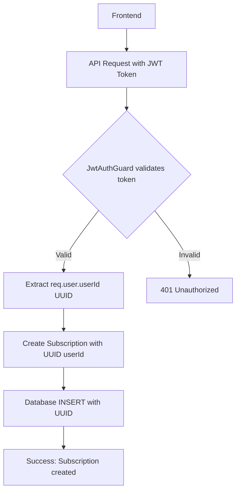

# Subscription Payment Fix Plan: Use Authenticated User from JWT

## Error Summary
```
Error 500: Subscription payment processing failed: invalid input syntax for type uuid: "18"
```

## Root Cause Analysis

### The Problem
The `subscriptions` table's `userId` column expects a UUID, but an integer `18` is being passed instead.

### Why This Happens
The payments controller endpoints are **NOT protected by JwtAuthGuard**:
- [`flutter-nest-househelp-master/src/payments/payments.controller.ts`](flutter-nest-househelp-master/src/payments/payments.controller.ts:103) - `confirm-subscription` has NO auth guard
- [`flutter-nest-househelp-master/src/payments/payments.controller.ts`](flutter-nest-househelp-master/src/payments/payments.controller.ts:19) - `create-subscription-order` has NO auth guard

This means the endpoints rely on `body.userId` which can be:
- A numeric ID from frontend fallback logic
- Tampered with by clients
- Missing or invalid

### JWT Strategy Returns UUID
From [`flutter-nest-househelp-master/src/auth/jwt.strategy.ts`](flutter-nest-househelp-master/src/auth/jwt.strategy.ts:33):
```typescript
async validate(payload: JwtPayload): Promise<{ userId: string; email: string; role: string }> {
  // Returns userId as STRING (UUID format)
  return { userId: userId, email: payload.email, role: payload.role };
}
```

## Solution: Use Authenticated User from JWT

### Approach
1. Add `@UseGuards(JwtAuthGuard)` to both payment endpoints
2. Extract userId from `req.user.userId` (authenticated from JWT)
3. Use this UUID instead of `body.userId`
4. Keep body fields for other data (serviceProfileId, startDate, etc.)

### Files to Modify

#### 1. `flutter-nest-househelp-master/src/payments/payments.controller.ts`

**`create-subscription-order` endpoint:**
```typescript
@Post('create-subscription-order')
@UseGuards(JwtAuthGuard)
async createSubscriptionOrder(@Body() body: any, @Req() req: any) {
  // Use authenticated user's publicId (UUID) from JWT
  const userId = req.user.userId;
  
  // ... existing validation ...
  
  return {
    ...order,
    subscription: {
      userId: userId, // Now guaranteed to be UUID from JWT
      serviceProfileId: body.serviceProfileId,
      preferredTimeWindow: body.preferredTimeWindow,
      startDate: body.startDate,
      location: body.location,
      monthlyPriceSnapshot: amount,
    },
  };
}
```

**`confirm-subscription` endpoint:**
```typescript
@Post('confirm-subscription')
@UseGuards(JwtAuthGuard)
async confirmSubscription(@Body() body: any, @Req() req: any) {
  const isValid = await this.paymentsService.verifyPayment(
    body.razorpayOrderId,
    body.razorpayPaymentId,
    body.signature,
  );
  if (!isValid) {
    throw new BadRequestException('Invalid payment signature');
  }

  // Get subscription data - use authenticated userId from JWT
  const userId = req.user.userId; // UUID from token
  
  const subscriptionData = {
    userId: userId, // Use authenticated user's UUID
    serviceProfileId: body.serviceProfileId,
    preferredTimeWindow: body.preferredTimeWindow,
    startDate: body.startDate,
    location: body.location,
    monthlyPriceSnapshot: body.monthlyPriceSnapshot,
  };

  // ... rest of implementation
}
```

### Benefits of This Approach
1. **Security**: Users can only create subscriptions for themselves
2. **Consistency**: UserId is always a valid UUID from the JWT token
3. **No frontend changes needed**: Frontend still sends Bearer token
4. **Tamper-proof**: Client cannot forge userId

### Frontend Considerations
The frontend already sends the JWT token in the Authorization header. The fix is entirely backend-side.

**Current flow:**
```
Frontend → API call with Bearer token + body.userId (potentially wrong)
```

**Fixed flow:**
```
Frontend → API call with Bearer token
Backend → Extract userId from JWT (guaranteed UUID)
```

## Mermaid Diagram: Fixed Flow



## Verification Steps

1. Test subscription creation with valid JWT token
2. Verify the subscription is created with UUID userId
3. Check database: `SELECT publicId, userId FROM subscriptions;`
4. Try to create subscription without token - should return 401
5. Try to forge userId in body - should use JWT userId instead

## Files to Modify

1. `flutter-nest-househelp-master/src/payments/payments.controller.ts`
   - Add `@UseGuards(JwtAuthGuard)` to both endpoints
   - Add `@Req() req` parameter
   - Replace `body.userId` with `req.user.userId`
