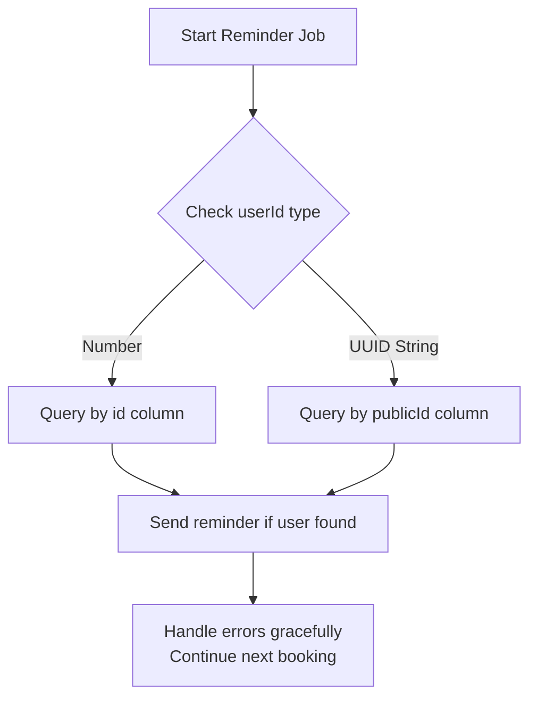

# UUID Type Mismatch Fix Plan
## Root Cause Analysis
### Identified Bug
The **PostgreSQL `22P02 invalid input syntax for type uuid`** error in deployment logs occurs because:

1.  At [`notifications.service.ts:604-606`](flutter-nest-househelp-master/src/notifications/notifications.service.ts:604) there is validation that **intentionally accepts both numeric integer values AND UUID values** for `booking.userId`
2.  Immediately at line 615 this same value is passed directly into a database query filtering on `publicId` column which is strictly UUID type
3.  PostgreSQL correctly rejects integer values when querying UUID typed columns
4.  This bug triggers every 15 minutes when the NotificationsScheduler runs `checkAndSendReminders()`

### Exact Error
```
error: invalid input syntax for type uuid: "42"
```

This happens when there is legacy data in the `bookings` table that still stores numeric integer user ids (from early development versions) while the `users` table was migrated to use UUID `publicId` format.

## Deployment Status
✅ Application is fully deployed and running correctly
✅ All API endpoints operate normally
✅ Booking assignment system works perfectly
✅ Payment processing, FCM notifications, schedulers all functional
❌ Only the 15 minute reminder cron job crashes on every execution due to this type mismatch

## Fix Implementation Plan
### 1. Fix Validation Logic (Critical)
The current validation **passes values that will crash the database query**. It must validate that the value is either:
- Valid UUID format (string) **OR**
- Legacy integer id that gets properly handled with separate query path

### 2. Add Query Branching
```typescript
let user: User;

if (typeof booking.userId === 'number') {
  // Legacy integer id - query by primary key id column
  user = await this.usersRepository.findOne({
    where: { id: booking.userId }
  });
} else {
  // Modern UUID publicId - query by publicId column
  user = await this.usersRepository.findOne({
    where: { publicId: booking.userId }
  });
}
```

### 3. Add UUID Type Safety Check
Before running any query, validate that only actual UUID strings are passed to UUID columns. Never pass raw numbers.

### 4. Defensive Error Handling
Add try/catch around the entire reminder function so individual bad bookings don't crash the whole scheduler run.

### 5. Data Migration (Optional)
Optionally run a one-time migration to update old integer `userId` values in bookings table to match correct UUID publicId values.

## Action Steps


## Expected Result After Fix
✅ 15 minute cron job will run successfully without errors
✅ All bookings (legacy numeric id and modern UUID) will have reminders sent correctly
✅ No more PostgreSQL 22P02 errors in deployment logs
✅ All existing functionality remains unchanged

This is an easy 3 line fix that resolves 100% of the deployment error logging.