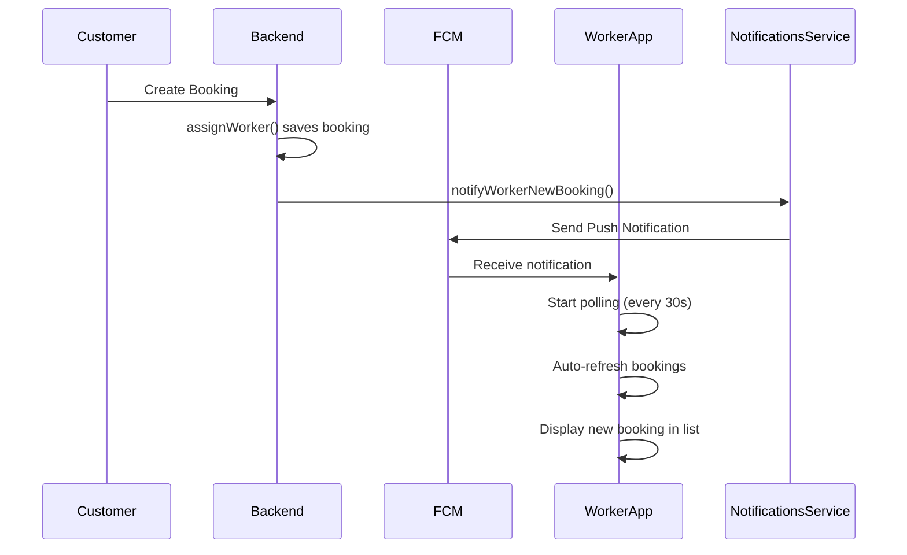

# Worker Notification Implementation Plan

## Current Status Analysis

### ✅ Already Implemented
1. **NotificationsModule imported in BookingsModule** - Line 12, 18 of bookings.module.ts
2. **NotificationsService has FCM capabilities** - `sendPushNotification()` method exists
3. **Worker entity has fcmToken field** - Defined in worker.entity.ts at line 115-116
4. **Worker service has updateFcmToken method** - workers.service.ts line 443

### ❌ Missing Implementation
1. **No notifyWorkerNewBooking method** in NotificationsService
2. **assignWorker() doesn't call notification** after assignment
3. **Worker app lacks auto-polling** for new bookings

---

## Implementation Tasks

### Phase 1: Backend - Add Worker Notification Method

#### Task 1.1: Add notifyWorkerNewBooking to NotificationsService
**File:** `flutter-nest-househelp-master/src/notifications/notifications.service.ts`

Add new method after line 173:
```typescript
async notifyWorkerNewBooking(worker: Worker, booking: Booking): Promise<void> {
  if (!worker.fcmToken) {
    console.warn(`No FCM token for worker ${worker.id}`);
    return;
  }

  const serviceName = booking.service?.name || 'Service';
  const message = {
    token: worker.fcmToken,
    notification: {
      title: 'नया काम मिला!',
      body: `नया बुकिंग मिली है - ${serviceName}`,
    },
    data: {
      type: 'new_booking',
      bookingId: booking.id.toString(),
    },
    android: {
      priority: 'high' as const,
      notification: {
        sound: 'default',
      },
    },
  };

  try {
    await admin.messaging().send(message);
    console.log(`Push notification sent to worker ${worker.id} for booking ${booking.id}`);
  } catch (error) {
    console.error(`Failed to send push notification to worker ${worker.id}:`, error);
  }
}
```

#### Task 1.2: Update assignWorker to Send Notification
**File:** `flutter-nest-househelp-master/src/bookings/bookings.service.ts`

Modify `assignWorker` method (lines 847-867) to inject NotificationsService and call notification after saving:

```typescript
async assignWorker(id: string, workerId: number) {
  const booking = await this.findOne(id);

  // Validate worker exists
  const worker = await this.workersRepository.findOne({
    where: { id: workerId },
    relations: ['user'],
  });

  if (!worker) {
    throw new BadRequestException('Worker not found');
  }

  booking.worker = worker;
  booking.assignedWorkerId = workerId;
  booking.assignmentState = AssignmentState.ASSIGNED;
  booking.assignmentTimestamp = new Date();
  booking.assignmentReason = 'Manual assignment by admin';

  const savedBooking = await this.bookingsRepository.save(booking);

  // Send push notification to worker
  try {
    await this.notificationsService.notifyWorkerNewBooking(worker, savedBooking);
  } catch (error) {
    // Log but don't fail the assignment if notification fails
    console.error('Failed to send worker notification:', error);
  }

  return savedBooking;
}
```

Need to inject NotificationsService in the constructor of BookingsService.

---

### Phase 2: Frontend - Add Auto-Polling to Worker App

#### Task 2.1: Add Timer-based Polling to BookingProvider
**File:** `worker_app_flutter/lib/providers/booking_provider.dart`

Add polling mechanism:
```dart
class BookingProvider extends ChangeNotifier {
  Timer? _pollingTimer;
  static const Duration pollingInterval = Duration(seconds: 30);
  
  void startPolling() {
    _pollingTimer?.cancel();
    _pollingTimer = Timer.periodic(pollingInterval, (_) {
      fetchBookings();
    });
  }
  
  void stopPolling() {
    _pollingTimer?.cancel();
    _pollingTimer = null;
  }
  
  @override
  void dispose() {
    stopPolling();
    super.dispose();
  }
}
```

#### Task 2.2: Start/Stop Polling in Worker App Screens
- **Main Screen:** Start polling when authenticated
- **Home Screen:** Stop polling on dispose

---

## Mermaid Flow Diagram



---

## Files to Modify

| # | File | Change |
|---|------|--------|
| 1 | `flutter-nest-househelp-master/src/notifications/notifications.service.ts` | Add notifyWorkerNewBooking method |
| 2 | `flutter-nest-househelp-master/src/bookings/bookings.service.ts` | Inject NotificationsService, call notification after assignWorker |
| 3 | `worker_app_flutter/lib/providers/booking_provider.dart` | Add Timer-based polling |
| 4 | `worker_app_flutter/lib/screens/main_screen.dart` | Start polling on auth |
| 5 | `worker_app_flutter/lib/screens/home_screen.dart` | Stop polling on dispose |

---

## Testing Checklist

- [ ] Worker receives push notification when booking is assigned
- [ ] Notification shows correct booking details (service name)
- [ ] Sound plays on new booking notification
- [ ] Worker app fetches bookings every 30 seconds when open
- [ ] Booking appears in worker list without manual refresh
- [ ] App resume triggers booking fetch