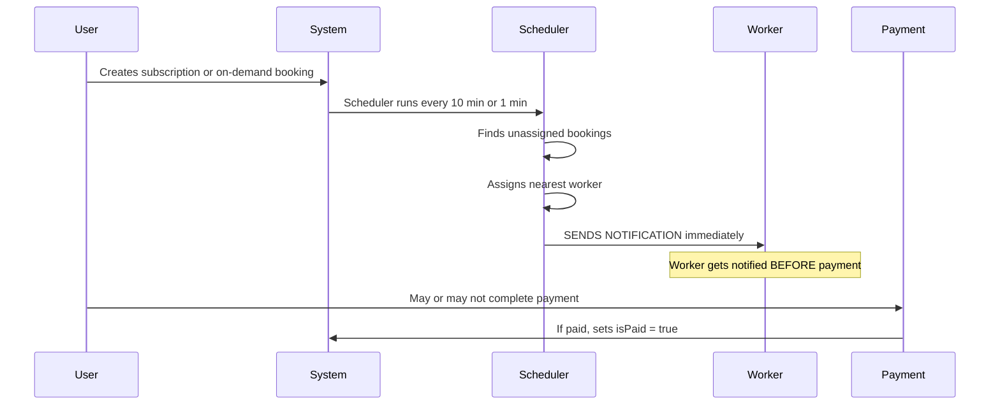
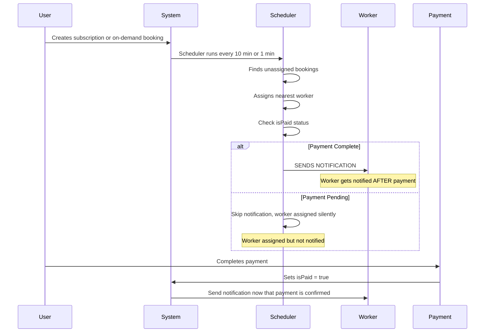

# Worker Notification Timing Fix

## Problem Statement

Workers are receiving FCM push notifications **immediately when assigned** to bookings, but this happens **BEFORE the user has completed payment**. This creates a poor experience where:

1. Workers get notified about a booking that may never be confirmed (if user doesn't pay)
2. Workers may try to contact customers for bookings that aren't actually confirmed
3. The system creates false expectations for workers about their upcoming work

## Root Cause Analysis

### Current Flow (Broken)



### Affected Files

1. **subscription-assignment.scheduler.ts** - Lines 626-628, 566-568, 703-704
   - `_notifyWorkerOfAssignment()` is called immediately after worker assignment
   - No check for subscription payment status

2. **on-demand-assignment.scheduler.ts** - Lines 253-254
   - `_notifyWorkerOfAssignment()` is called immediately after worker assignment  
   - No check for booking payment status

### Key Fields

- **Booking.isPaid** - Boolean field indicating if payment is complete
- **Subscription.isPaid** - Boolean field indicating if subscription payment is complete
- **Booking.status** - Can be `requested`, `confirmed`, `completed`, `cancelled`

## Solution Design

### New Flow (Fixed)



### Implementation Details

#### Option A: Check Payment Before Notification (Recommended)

Modify the `_notifyWorkerOfAssignment` methods in both schedulers to check payment status before sending notifications.

**Pros:**
- Simple change, minimal code modification
- Clear and explicit logic
- Easy to test and verify

**Cons:**
- Workers may be assigned but not notified until payment
- Need to handle the case where payment happens later

#### Option B: Defer Notification Until Payment Webhook

Send notifications from the payment webhook handler instead of the assignment scheduler.

**Pros:**
- Guaranteed to only notify after payment
- Single source of truth for payment-triggered notifications

**Cons:**
- More complex change
- Need to modify payment webhook handler
- May miss edge cases where payment status changes

**Recommendation: Option A** - It's simpler and more maintainable.

## Implementation Plan

### Step 1: Modify subscription-assignment.scheduler.ts

**File:** `flutter-nest-househelp-master/src/subscriptions/subscription-assignment.scheduler.ts`

**Changes:**

1. Modify `_notifyWorkerOfAssignment` method (lines 831-860) to check booking payment status:

```typescript
private async _notifyWorkerOfAssignment(worker: Worker, booking: Booking): Promise<void> {
  // Check if payment is complete before notifying worker
  if (!booking.isPaid) {
    this.logger.log(`Skipping notification for booking ${booking.id} - payment not complete`);
    return;
  }
  
  if (!worker.fcmToken) {
    this.logger.warn(`Worker ${worker.id} has no FCM token, skipping notification`);
    return;
  }
  // ... rest of method unchanged
}
```

2. Add a new method to send deferred notifications after payment:

```typescript
async notifyWorkerOfPaidBooking(bookingId: string): Promise<void> {
  const booking = await this.bookingRepository.findOne({
    where: { id: bookingId },
    relations: ['worker', 'service'],
  });
  
  if (!booking || !booking.worker || !booking.isPaid) {
    return;
  }
  
  await this._notifyWorkerOfAssignment(booking.worker, booking);
}
```

### Step 2: Modify on-demand-assignment.scheduler.ts

**File:** `flutter-nest-househelp-master/src/subscriptions/on-demand-assignment.scheduler.ts`

**Changes:**

1. Modify `_notifyWorkerOfAssignment` method (lines 272-301) to check booking payment status:

```typescript
private async _notifyWorkerOfAssignment(worker: Worker, booking: Booking): Promise<void> {
  // Check if payment is complete before notifying worker
  if (!booking.isPaid) {
    this.logger.log(`Skipping notification for on-demand booking ${booking.id} - payment not complete`);
    return;
  }
  
  if (!worker.fcmToken) {
    this.logger.warn(`Worker ${worker.id} has no FCM token, skipping notification`);
    return;
  }
  // ... rest of method unchanged
}
```

### Step 3: Add Notification Trigger in Payment Webhook

**File:** `flutter-nest-househelp-master/src/payments/payments.service.ts`

**Changes:**

After payment is confirmed and `isPaid` is set to true, trigger worker notification:

```typescript
// In the webhook handler, after setting isPaid = true:
if (booking.workerId || booking.assignedWorkerId) {
  // Trigger notification to assigned worker
  this.notificationsService.sendPushNotification(/* ... */);
}
```

### Step 4: Add isPaid Column to Booking Entity (if missing)

**File:** `flutter-nest-househelp-master/src/bookings/entities/booking.entity.ts`

The `isPaid` column already exists based on the migration file, but we need to verify it's properly defined in the entity:

```typescript
@Column({ default: false })
isPaid: boolean;
```

## Testing Plan

1. **Test Subscription Flow:**
   - Create a new subscription
   - Verify worker is assigned but NOT notified
   - Complete payment
   - Verify worker IS notified after payment

2. **Test On-Demand Flow:**
   - Create a new on-demand booking
   - Verify worker is assigned but NOT notified
   - Complete payment
   - Verify worker IS notified after payment

3. **Test Edge Cases:**
   - What happens if payment fails after assignment?
   - What happens if user cancels before payment?
   - What happens if worker is reassigned after payment?

## Files to Modify

1. `flutter-nest-househelp-master/src/subscriptions/subscription-assignment.scheduler.ts`
2. `flutter-nest-househelp-master/src/subscriptions/on-demand-assignment.scheduler.ts`
3. `flutter-nest-househelp-master/src/payments/payments.service.ts`
4. `flutter-nest-househelp-master/src/bookings/entities/booking.entity.ts` (verify isPaid column)

## Risk Assessment

| Risk | Impact | Mitigation |
|------|--------|------------|
| Workers miss bookings | High | Add fallback notification polling |
| Payment webhook fails | Medium | Add retry logic and logging |
| Existing bookings not notified | Low | Run migration script for pending bookings |
