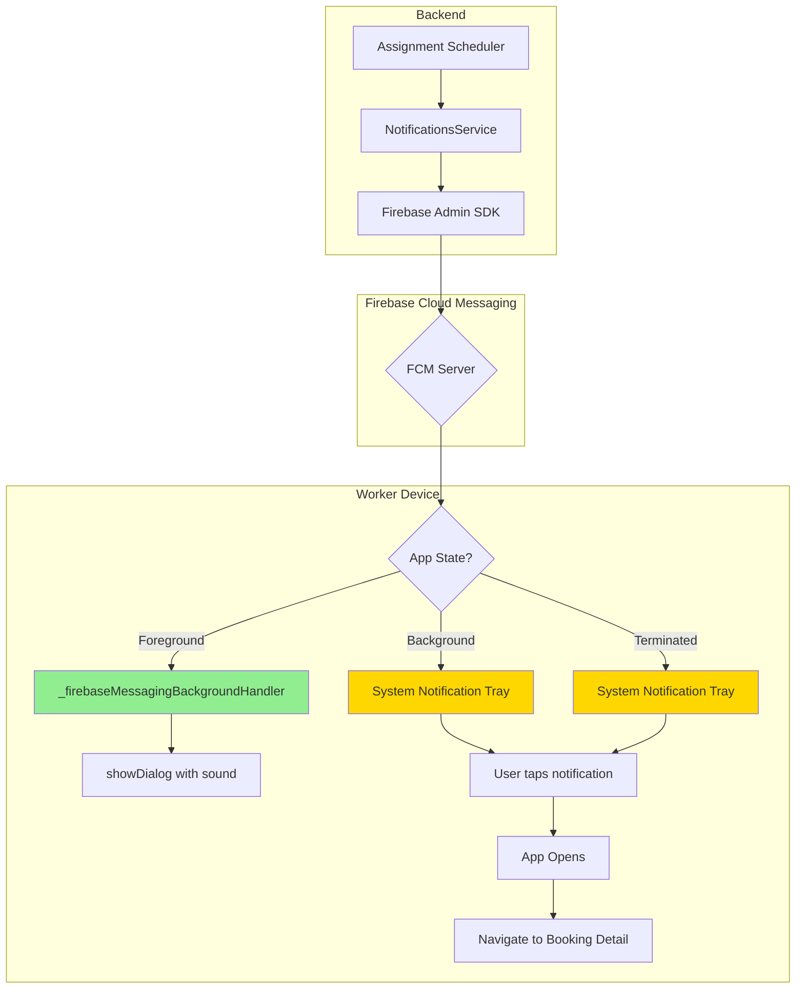

# Worker Real-Time Booking Notification Implementation Plan

## Executive Summary

This plan details the complete implementation of real-time FCM push notifications for the worker app, ensuring workers receive booking alerts with sound **even when the app is in background or terminated**. This is critical for the on-demand service model where time is the most crucial factor.

---

## Problem Statement

Workers need to receive immediate alerts when a booking is assigned to them, regardless of app state:
- **Foreground**: Show in-app dialog with sound
- **Background**: Show system notification with sound
- **Terminated**: Show system notification with sound, launch app when tapped

---

## Current State Analysis

### What's Working

1. **Backend FCM Infrastructure**:
   - [`NotificationsService.sendPushNotification()`](flutter-nest-househelp-master/src/notifications/notifications.service.ts:316) - FCM sending is functional
   - [`OnDemandAssignmentScheduler._notifyWorkerOfAssignment()`](flutter-nest-househelp-master/src/subscriptions/on-demand-assignment.scheduler.ts:272) - On-demand bookings send notifications
   - Worker entity has [`fcmToken`](flutter-nest-househelp-master/src/workers/entities/worker.entity.ts:115) field
   - Firebase Admin SDK is initialized

2. **Worker App FCM Setup**:
   - [`NotificationService.initialize()`](worker_app_flutter/lib/services/notification_service.dart:45) - Firebase messaging initialized
   - [`NotificationService._handleForegroundMessage()`](worker_app_flutter/lib/services/notification_service.dart:210) - Foreground messages received
   - [`NotificationService._bookingStreamController`](worker_app_flutter/lib/services/notification_service.dart:27) - Broadcast stream exists
   - FCM token registration with backend works
   - Full-screen notification channel created (`full_screen_booking_channel`)

### Critical Issues Blocking Background/Terminated Notifications

1. **ERROR in logs**: `FirebaseMessagingService` from the **frontend app** (not worker app) is being invoked in background, causing native code access error:
   ```
   ERROR: To access 'file:///c:/Users/user/Desktop/newsevaq/frontend-flutter-house-help-master/lib/services/firebase_messaging_service.dart::FirebaseMessagingService' from native code, it must be annotated.
   ```

2. **Missing background handler**: The worker app does NOT have a `firebase_messaging_background_handler.dart` file with the required top-level function annotated with `@pragma('vm:entry-point')`

3. **Missing main.dart initialization**: Background handler is not registered in `main()` before `runApp()`

4. **SubscriptionAssignmentScheduler missing notifications**: Subscription bookings don't trigger notifications after assignment

---

## Architecture: How FCM Background Messages Work in Flutter



### Key Concept: Background Handler MUST Be a Top-Level Function

For FCM background messages to work in Flutter:
1. The handler function MUST be a **top-level function** (not a class method)
2. It MUST be annotated with `@pragma('vm:entry-point')`
3. It MUST be registered in `main()` **before** `runApp()`

---

## Step-by-Step Implementation Plan

### Phase 1: Fix Critical Background Message Handler

#### Step 1.1: Create Background Message Handler File

**New File:** `worker_app_flutter/lib/firebase_messaging_background_handler.dart`

```dart
import 'package:firebase_messaging/firebase_messaging.dart';
import 'package:flutter/foundation.dart';

/// Top-level function for handling background FCM messages.
/// This MUST be a top-level function, not a class method.
/// This MUST be annotated with @pragma('vm:entry-point')
@pragma('vm:entry-point')
Future<void> firebaseMessagingBackgroundHandler(RemoteMessage message) async {
  debugPrint('=== Background Message Handler ===');
  debugPrint('Handling a background message: ${message.messageId}');
  debugPrint('Message data: ${message.data}');
  debugPrint('Notification: ${message.notification?.title}');
  
  // Background messages are handled by the system notification
  // FCM automatically shows the notification in the system tray
  // No need to show a local notification here
}

/// Call this in main() before runApp()
Future<void> initializeBackgroundMessageHandler() async {
  FirebaseMessaging.onBackgroundMessage(firebaseMessagingBackgroundHandler);
  debugPrint('Background message handler registered');
}
```

#### Step 1.2: Update main.dart

**File:** `worker_app_flutter/lib/main.dart`

Add at the top:
```dart
import 'firebase_messaging_background_handler.dart';
```

In `main()`, add before `runApp()`:
```dart
void main() async {
  WidgetsFlutterBinding.ensureInitialized();
  
  // Initialize Firebase
  await Firebase.initializeApp(
    options: DefaultFirebaseOptions.currentPlatform,
  );
  
  // CRITICAL: Register background handler BEFORE runApp()
  await initializeBackgroundMessageHandler();
  
  // Initialize services
  await _initializeServices();
  
  runApp(const WorkerApp());
}
```

---

### Phase 2: Enhance Backend Notification Payload

#### Step 2.1: Update OnDemandAssignmentScheduler Payload

**File:** `flutter-nest-househelp-master/src/subscriptions/on-demand-assignment.scheduler.ts`

Update the payload in `_notifyWorkerOfAssignment()` to include:
```typescript
{
  type: 'new_booking',
  bookingId: booking.id.toString(),
  bookingPublicId: booking.publicId ?? '',
  serviceName: booking.service?.name ?? 'Service',
  serviceDate: booking.date ?? '',
  startTime: booking.startTime ?? '',
  customerName: booking.user?.firstName ?? 'Customer',
  customerAddress: booking.user?.address ?? '',
  customerPhone: booking.user?.phone ?? '',
  price: booking.amount?.toString() ?? '0',
  assignmentType: 'on_demand',
  timestamp: new Date().toISOString(),
}
```

#### Step 2.2: Add Notifications to SubscriptionAssignmentScheduler

**File:** `flutter-nest-househelp-master/src/subscriptions/subscription-assignment.scheduler.ts`

1. Inject `NotificationsService` in constructor
2. Add `_notifyWorkerOfAssignment()` method
3. Call it after successful assignment in:
   - `directlyAssignWorker()`
   - `directlyAssignWorkerWithoutBooking()`
   - `assignWorkerForSubscription()`

---

### Phase 3: Create In-App Dialog and Listener

#### Step 3.1: Create New Booking Dialog Widget

**New File:** `worker_app_flutter/lib/widgets/new_booking_dialog.dart`

A dialog that shows:
- Success icon with green color
- Hindi title: "नया काम मिला!"
- English subtitle: "You have a new booking"
- Booking details card (service, date, time, customer, price)
- "Later" and "View Details" buttons

#### Step 3.2: Create Notification Listener Widget

**New File:** `worker_app_flutter/lib/widgets/notification_listener_widget.dart`

A stateful widget that:
- Listens to `NotificationService.onNewBooking` stream
- Shows `NewBookingDialog` when a new booking arrives
- Plays a sound when dialog appears
- Navigates to booking detail on "View Details" tap

#### Step 3.3: Integrate into Main Screen

**File:** `worker_app_flutter/lib/screens/main_screen.dart`

Wrap the Scaffold with `NotificationListenerWidget`:
```dart
return NotificationListenerWidget(
  child: Scaffold(
    // ... existing content
  ),
);
```

---

### Phase 4: Android Configuration

#### Step 4.1: Add Custom Alert Sound

1. Create directory: `worker_app_flutter/android/app/src/main/res/raw/`
2. Add sound file: `booking_alert.mp3` (a distinctive alert sound)
3. Reference in notification channel:
   ```dart
   sound: RawResourceAndroidNotificationSound('booking_alert'),
   ```

#### Step 4.2: Update AndroidManifest.xml

**File:** `worker_app_flutter/android/app/src/main/AndroidManifest.xml`

Add inside `<application>`:
```xml
<meta-data
    android:name="com.google.firebase.messaging.default_notification_channel_id"
    android:value="new_booking_channel" />
<meta-data
    android:name="com.google.firebase.messaging.default_notification_icon"
    android:resource="@mipmap/ic_launcher" />
<meta-data
    android:name="com.google.firebase.messaging.default_notification_color"
    android:resource="@color/notification_color" />
```

#### Step 4.3: Create colors.xml

**File:** `worker_app_flutter/android/app/src/main/res/values/colors.xml`

```xml
<?xml version="1.0" encoding="utf-8"?>
<resources>
    <color name="notification_color">#4CAF50</color>
</resources>
```

---

### Phase 5: Create Booking Detail Screen

**New File:** `worker_app_flutter/lib/screens/booking_detail_screen.dart`

A screen that:
- Fetches booking details by ID
- Shows service name, customer info, date, time, address, price
- Has Accept/Reject buttons for pending bookings
- Has "Start Service" button for confirmed bookings

---

## Files to Create

| File | Purpose |
|------|---------|
| `worker_app_flutter/lib/firebase_messaging_background_handler.dart` | Background message handler with @pragma annotation |
| `worker_app_flutter/lib/widgets/new_booking_dialog.dart` | Dialog widget for new booking popup |
| `worker_app_flutter/lib/widgets/notification_listener_widget.dart` | Stream listener widget |
| `worker_app_flutter/lib/screens/booking_detail_screen.dart` | Booking detail screen |
| `worker_app_flutter/android/app/src/main/res/raw/booking_alert.mp3` | Custom alert sound |
| `worker_app_flutter/android/app/src/main/res/values/colors.xml` | Notification color |

## Files to Modify

| File | Changes |
|------|---------|
| `worker_app_flutter/lib/main.dart` | Add background handler initialization |
| `worker_app_flutter/lib/screens/main_screen.dart` | Wrap with NotificationListenerWidget |
| `worker_app_flutter/lib/services/notification_service.dart` | Enhance payload handling, add sound playback |
| `flutter-nest-househelp-master/src/subscriptions/on-demand-assignment.scheduler.ts` | Enhance notification payload |
| `flutter-nest-househelp-master/src/subscriptions/subscription-assignment.scheduler.ts` | Add notification sending |
| `worker_app_flutter/android/app/src/main/AndroidManifest.xml` | Add Firebase metadata |

---

## Notification Flow by App State

### Foreground (App Open)
```
FCM Message → _handleForegroundMessage → _bookingStreamController → 
NotificationListenerWidget → showDialog() with sound → User sees dialog
```

### Background (App Minimized)
```
FCM Message → System shows notification in tray with sound → 
User taps notification → onMessageOpenedApp → Navigate to booking detail
```

### Terminated (App Closed)
```
FCM Message → System shows notification in tray with sound → 
User taps notification → App launches → getInitialMessage() → 
Navigate to booking detail
```

---

## Testing Plan

### Test 1: Foreground Notification
1. Open worker app
2. Assign booking via backend
3. Verify dialog appears within 5 seconds with sound
4. Verify dialog shows correct booking details
5. Tap "View Details" → navigate to booking detail

### Test 2: Background Notification
1. Minimize worker app (home button)
2. Assign booking via backend
3. Verify system notification appears in tray with sound
4. Tap notification → app opens to booking detail

### Test 3: Terminated Notification
1. Force close worker app
2. Assign booking via backend
3. Verify system notification appears in tray with sound
4. Tap notification → app launches to booking detail

### Test 4: Multiple Rapid Notifications
1. Assign 3 bookings rapidly
2. Verify 3 separate dialogs/notifications appear
3. Verify no duplicates

---

## Risk Assessment

| Risk | Impact | Mitigation |
|------|--------|------------|
| FCM token expires/invalid | High | Token refresh handling exists in NotificationService |
| Background handler not registered | Critical | Add @pragma('vm:entry-point') and register in main() |
| Notification arrives but booking not in API | Medium | Add retry logic in booking detail screen |
| Dialog shown when app is in background | Low | Use `mounted` check and showDialog only in foreground |
| Multiple dialogs for same booking | Low | Add deduplication using bookingId + timestamp |
| Android notification channel not created | Medium | Create channel in app initialization |

---

## Implementation Order

1. **Phase 1** (Critical - fixes background/terminated notifications):
   - Step 1.1: Create firebase_messaging_background_handler.dart
   - Step 1.2: Update main.dart

2. **Phase 2** (Backend - enhances notification data):
   - Step 2.1: Update OnDemandAssignmentScheduler payload
   - Step 2.2: Add notifications to SubscriptionAssignmentScheduler

3. **Phase 3** (Worker App UI - in-app experience):
   - Step 3.1: Create new_booking_dialog.dart
   - Step 3.2: Create notification_listener_widget.dart
   - Step 3.3: Integrate into main_screen.dart

4. **Phase 4** (Android Config - platform-specific):
   - Step 4.1: Add custom alert sound
   - Step 4.2: Update AndroidManifest.xml
   - Step 4.3: Create colors.xml

5. **Phase 5** (Booking Detail Screen):
   - Create booking_detail_screen.dart

6. **Testing**:
   - Run all test scenarios
