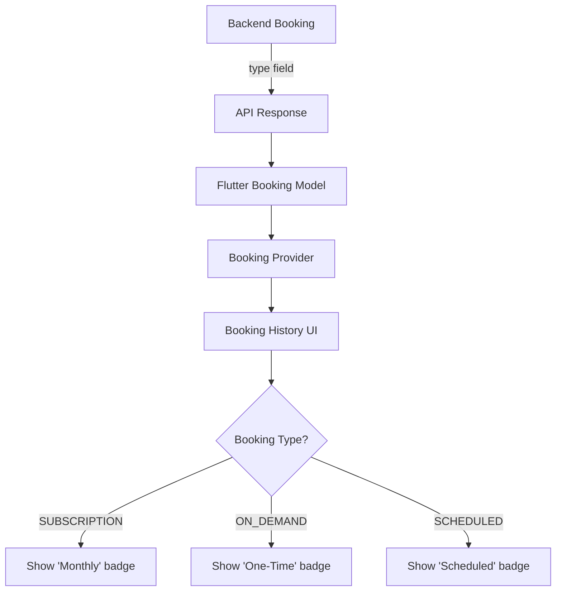

# Booking Type Distinction Plan

## Problem Statement
Users cannot distinguish between one-time and monthly subscription bookings in their booking history. The backend already has the `BookingType` enum (ON_DEMAND, SCHEDULED, SUBSCRIPTION), but the frontend model doesn't parse or display this field.

## Current State Analysis

### Backend (NestJS)
- **Booking Entity** [`flutter-nest-househelp-master/src/bookings/entities/booking.entity.ts`](flutter-nest-househelp-master/src/bookings/entities/booking.entity.ts:19)
  - Has `BookingType` enum: `ON_DEMAND`, `SCHEDULED`, `SUBSCRIPTION`
  - Field: `type: BookingType` (line 108-109)

### Frontend (Flutter)
- **Booking Model** [`frontend-flutter-house-help-master/lib/models/booking.dart`](frontend-flutter-house-help-master/lib/models/booking.dart:15)
  - Missing `bookingType` field
  - Only parses: id, publicId, user, worker, service, startTime, endTime, status, isPaid, amount

## Solution Architecture



## Implementation Steps

### Step 1: Update Flutter Booking Model
**File:** [`frontend-flutter-house-help-master/lib/models/booking.dart`](frontend-flutter-house-help-master/lib/models/booking.dart)

**Changes:**
1. Add `BookingType` enum
2. Add `bookingType` field to `Booking` class
3. Update `fromJson` factory to parse `type` field
4. Add helper method `isSubscription()` and `isOneTime()`

```dart
enum BookingType {
  onDemand,
  scheduled,
  subscription,
}

class Booking {
  // ... existing fields ...
  final BookingType? bookingType;
  
  // Add helper methods
  bool get isSubscription => bookingType == BookingType.subscription;
  bool get isOneTime => bookingType == BookingType.onDemand;
  bool get isScheduled => bookingType == BookingType.scheduled;
}
```

### Step 2: Update Booking Provider
**File:** [`frontend-flutter-house-help-master/lib/providers/booking_provider.dart`](frontend-flutter-house-help-master/lib/providers/booking_provider.dart)

**Changes:**
1. Add filtering methods for different booking types
2. Add getter for subscription bookings
3. Add getter for one-time bookings

```dart
class BookingProvider with ChangeNotifier {
  List<Booking> get subscriptionBookings =>
      _bookings.where((b) => b.isSubscription).toList();
      
  List<Booking> get oneTimeBookings =>
      _bookings.where((b) => b.isOneTime).toList();
}
```

### Step 3: Update Booking History UI
**File:** To be determined (likely in profile or main screen)

**Changes:**
1. Add visual badge for booking type
2. Use color coding:
   - Purple: Subscription (Monthly)
   - Green: One-Time
   - Blue: Scheduled
3. Add text label showing booking type

```dart
Widget _buildBookingTypeBadge(Booking booking) {
  if (booking.isSubscription) {
    return Container(
      padding: EdgeInsets.symmetric(horizontal: 8, vertical: 4),
      decoration: BoxDecoration(
        color: Colors.purple[100],
        borderRadius: BorderRadius.circular(8),
      ),
      child: Text(
        'Monthly Subscription',
        style: TextStyle(
          color: Colors.purple[700],
          fontSize: 12,
          fontWeight: FontWeight.w600,
        ),
      ),
    );
  } else if (booking.isOneTime) {
    return Container(
      padding: EdgeInsets.symmetric(horizontal: 8, vertical: 4),
      decoration: BoxDecoration(
        color: Colors.green[100],
        borderRadius: BorderRadius.circular(8),
      ),
      child: Text(
        'One-Time Service',
        style: TextStyle(
          color: Colors.green[700],
          fontSize: 12,
          fontWeight: FontWeight.w600,
        ),
      ),
    );
  }
  return SizedBox.shrink();
}
```

### Step 4: Update Subscription Model (Optional)
**File:** [`frontend-flutter-house-help-master/lib/models/subscription.dart`](frontend-flutter-house-help-master/lib/models/subscription.dart) (create if doesn't exist)

**Changes:**
1. Create Subscription model to show subscription details
2. Add link between subscriptions and bookings

## Visual Design

### Booking History Card
```
┌─────────────────────────────────────┐
│ [Badge: Monthly Subscription]       │
│ ┌─────────┐                         │
│ │ Service │  📅 Date: Feb 15, 2026  │
│ │ Name    │  ⏰ Time: 9:00 AM       │
│ └─────────┘  👤 Worker: John        │
│ 💰 ₹800/month                       │
└─────────────────────────────────────┘
```

### One-Time Booking Card
```
┌─────────────────────────────────────┐
│ [Badge: One-Time Service]           │
│ ┌─────────┐                         │
│ │ Service │  📅 Date: Feb 20, 2026  │
│ │ Name    │  ⏰ Time: 2:00 PM       │
│ └─────────┘  👤 Worker: Jane        │
│ 💰 ₹500                           │
└─────────────────────────────────────┘
```

## Testing Checklist
- [ ] Verify booking type is correctly parsed from API response
- [ ] Check that subscription bookings show "Monthly Subscription" badge
- [ ] Check that one-time bookings show "One-Time Service" badge
- [ ] Verify color coding is accessible and clear
- [ ] Test filtering by booking type in booking provider

## Estimated Effort
- Model update: 15 minutes
- Provider update: 10 minutes
- UI update: 30 minutes
- Testing: 15 minutes

**Total: ~1.5 hours**

## Files to Modify
1. `frontend-flutter-house-help-master/lib/models/booking.dart`
2. `frontend-flutter-house-help-master/lib/providers/booking_provider.dart`
3. `frontend-flutter-house-help-master/lib/screens/booking_history_screen.dart` (or equivalent)
4. Any widget that displays booking cards

## Success Criteria
- Users can clearly see if a booking is one-time or subscription
- Visual distinction is accessible and clear
- Booking type is stored and retrievable in the frontend
