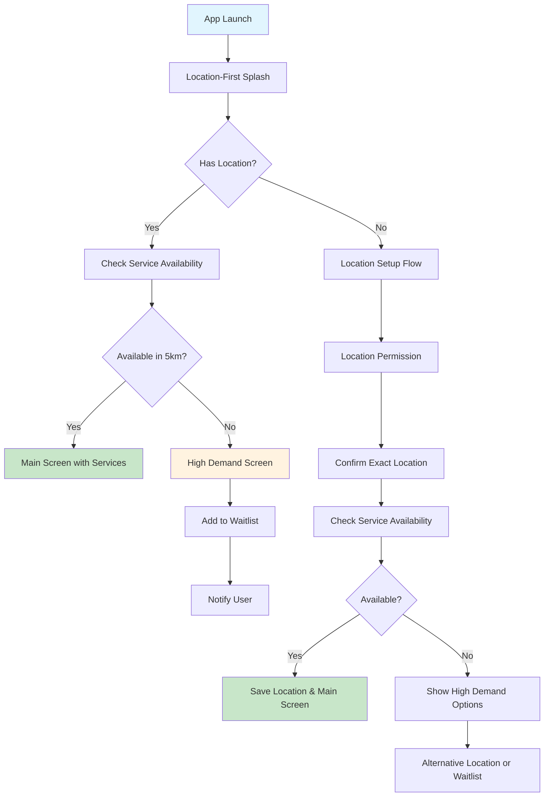
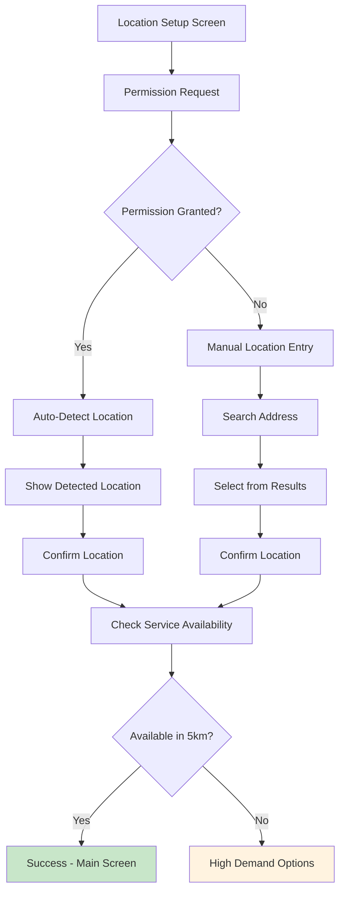

# Sevaq Location-First User Flow Implementation Plan

## Overview

Implement a location-first user flow for Sevaq inspired by Zepto's dark store mapping logic. The system will prioritize location verification before service discovery, ensuring optimal service availability and user experience.

## Key Requirements

- **Location-first approach**: Mandatory location confirmation before accessing services
- **5km radius worker availability checking**: Real-time provider density validation
- **High demand fallback**: Waitlist functionality when no providers available
- **Hybrid micro-zone mapping**: 500m-2km zones with both static and dynamic elements
- **Instant feedback**: Real-time service availability status
- **Consistent UI/UX**: Seamless integration with existing design patterns

## System Architecture

### 1. Backend API Design

#### New Endpoints for Location-Based Services

```typescript
// Location availability checking
GET /api/locations/availability?lat={lat}&lng={lng}&radius=5

// Service availability by location
GET /api/services/available?lat={lat}&lng={lng}&radius=5

// Worker availability by location
GET /api/workers/available?lat={lat}&lng={lng}&radius=5

// Micro-zone information
GET /api/zones/nearby?lat={lat}&lng={lng}

// Waitlist management
POST /api/waitlist
GET /api/waitlist/status/{userId}
DELETE /api/waitlist/{waitlistId}
```

#### Enhanced Existing Endpoints

```typescript
// Filter services by location
GET /api/services?lat={lat}&lng={lng}&radius=5

// Filter workers by location
GET /api/workers?lat={lat}&lng={lng}&radius=5

// Filter bookings by location
GET /api/bookings?lat={lat}&lng={lng}&radius=5
```

### 2. Database Schema Extensions

#### New Entities

```typescript
// Micro-zone entity for area management
@Entity()
export class MicroZone {
    @PrimaryGeneratedColumn('uuid')
    id: string;

    @Column()
    name: string;

    @Column({ type: 'decimal', precision: 10, scale: 7 })
    centerLat: number;

    @Column({ type: 'decimal', precision: 10, scale: 7 })
    centerLng: number;

    @Column({ type: 'decimal', precision: 5, scale: 2 })
    radiusKm: number; // 0.5 to 2km

    @Column({ type: 'enum', enum: ['static', 'dynamic', 'hybrid'] })
    zoneType: string;

    @Column({ default: true })
    isActive: boolean;

    @Column({ type: 'json', nullable: true })
    boundaries: GeoJSON.Polygon; // For complex zone shapes

    @CreateDateColumn()
    createdAt: Date;
}

// Service area entity for coverage management
@Entity()
export class ServiceArea {
    @PrimaryGeneratedColumn('uuid')
    id: string;

    @Column()
    name: string;

    @Column({ type: 'decimal', precision: 10, scale: 7 })
    minLat: number;

    @Column({ type: 'decimal', precision: 10, scale: 7 })
    maxLat: number;

    @Column({ type: 'decimal', precision: 10, scale: 7 })
    minLng: number;

    @Column({ type: 'decimal', precision: 10, scale: 7 })
    maxLng: number;

    @Column({ default: true })
    isActive: boolean;

    @Column({ type: 'json', nullable: true })
    coverageMap: GeoJSON.MultiPolygon;

    @CreateDateColumn()
    createdAt: Date;
}

// Waitlist entity for high demand management
@Entity()
export class Waitlist {
    @PrimaryGeneratedColumn('uuid')
    id: string;

    @Column()
    userId: string;

    @Column()
    serviceId: string;

    @Column({ type: 'decimal', precision: 10, scale: 7 })
    latitude: number;

    @Column({ type: 'decimal', precision: 10, scale: 7 })
    longitude: number;

    @Column({ type: 'timestamp' })
    requestedAt: Date;

    @Column({ type: 'enum', enum: ['pending', 'notified', 'cancelled'] })
    status: string;

    @Column({ nullable: true })
    notifiedAt: Date;

    @Column({ nullable: true })
    estimatedWaitTime: number; // in minutes
}
```

#### Enhanced Existing Entities

```typescript
// Enhanced User entity with location preferences
@Entity()
export class User {
    // ... existing fields
    
    @Column({ type: 'decimal', precision: 10, scale: 7, nullable: true })
    preferredLat: number;

    @Column({ type: 'decimal', precision: 10, scale: 7, nullable: true })
    preferredLng: number;

    @Column({ nullable: true })
    preferredZoneId: string;

    @Column({ default: false })
    hasCompletedLocationSetup: boolean;

    @Column({ type: 'json', nullable: true })
    locationHistory: Array<{
        lat: number;
        lng: number;
        timestamp: Date;
        accuracy: number;
    }>;
}

// Enhanced Worker entity with service radius
@Entity()
export class Worker {
    // ... existing fields
    
    @Column({ type: 'decimal', precision: 5, scale: 2, default: 5 })
    serviceRadiusKm: number; // Default 5km

    @Column({ type: 'decimal', precision: 10, scale: 7, nullable: true })
    currentLat: number;

    @Column({ type: 'decimal', precision: 10, scale: 7, nullable: true })
    currentLng: number;

    @Column({ type: 'timestamp', nullable: true })
    lastLocationUpdate: Date;

    @Column({ type: 'json', nullable: true })
    availabilitySchedule: Array<{
        day: number; // 0-6 (Sunday-Saturday)
        startTime: string; // "09:00"
        endTime: string; // "18:00"
    }>;

    @Column({ default: true })
    isActive: boolean;
}
```

### 3. Geo-Fencing Implementation

#### Location Service with Micro-Zone Mapping

```typescript
@Injectable()
export class LocationService {
    private readonly EARTH_RADIUS_KM = 6371;
    private readonly DEFAULT_RADIUS_KM = 5;

    // Calculate distance between two coordinates using Haversine formula
    calculateDistance(lat1: number, lng1: number, lat2: number, lng2: number): number {
        const dLat = this.deg2rad(lat2 - lat1);
        const dLng = this.deg2rad(lng2 - lng1);
        const a = 
            Math.sin(dLat / 2) * Math.sin(dLat / 2) +
            Math.cos(this.deg2rad(lat1)) * Math.cos(this.deg2rad(lat2)) * 
            Math.sin(dLng / 2) * Math.sin(dLng / 2);
        const c = 2 * Math.atan2(Math.sqrt(a), Math.sqrt(1 - a));
        return this.EARTH_RADIUS_KM * c;
    }

    deg2rad(deg: number): number {
        return deg * (Math.PI / 180);
    }

    // Find nearby micro-zones
    async findNearbyZones(lat: number, lng: number, maxRadiusKm: number = 2): Promise<MicroZone[]> {
        const zones = await this.microZoneRepository.find({
            where: { isActive: true },
        });

        return zones.filter(zone => {
            const distance = this.calculateDistance(lat, lng, zone.centerLat, zone.centerLng);
            return distance <= (zone.radiusKm + maxRadiusKm);
        });
    }

    // Check service availability in area
    async checkServiceAvailability(lat: number, lng: number, radiusKm: number = 5): Promise<{
        isAvailable: boolean;
        workerCount: number;
        estimatedWaitTime: number;
        nearbyZones: MicroZone[];
        highDemand: boolean;
    }> {
        const nearbyWorkers = await this.findAvailableWorkers(lat, lng, radiusKm);
        const nearbyZones = await this.findNearbyZones(lat, lng);
        
        const workerCount = nearbyWorkers.length;
        const highDemand = workerCount === 0;
        
        // Calculate estimated wait time based on worker density
        let estimatedWaitTime = 0;
        if (workerCount > 0) {
            estimatedWaitTime = Math.max(15, Math.floor(60 / workerCount)); // 15-60 minutes
        } else {
            estimatedWaitTime = 120; // 2 hours waitlist
        }

        return {
            isAvailable: workerCount > 0,
            workerCount,
            estimatedWaitTime,
            nearbyZones,
            highDemand,
        };
    }

    // Find available workers in radius
    async findAvailableWorkers(lat: number, lng: number, radiusKm: number): Promise<Worker[]> {
        const workers = await this.workerRepository.find({
            where: { isActive: true },
            relations: ['user'],
        });

        return workers.filter(worker => {
            if (!worker.currentLat || !worker.currentLng) return false;
            
            const distance = this.calculateDistance(lat, lng, worker.currentLat!, worker.currentLng!);
            return distance <= Math.min(radiusKm, worker.serviceRadiusKm);
        });
    }
}
```

### 4. Frontend Architecture

#### Enhanced Location Provider

```dart
class LocationProvider with ChangeNotifier {
    // ... existing fields
    
    LocationAvailability? _availabilityStatus;
    List<MicroZone> _nearbyZones = [];
    bool _isCheckingAvailability = false;
    bool _hasHighDemand = false;
    
    LocationAvailability? get availabilityStatus => _availabilityStatus;
    List<MicroZone> get nearbyZones => _nearbyZones;
    bool get isCheckingAvailability => _isCheckingAvailability;
    bool get hasHighDemand => _hasHighDemand;

    // Check service availability for current location
    Future<void> checkServiceAvailability() async {
        if (_currentLocationData == null) return;
        
        _isCheckingAvailability = true;
        notifyListeners();
        
        try {
            final response = await ApiService.checkServiceAvailability(
                _currentLocationData!.latitude!,
                _currentLocationData!.longitude!,
                5.0,
            );
            
            _availabilityStatus = LocationAvailability.fromJson(response.data);
            _nearbyZones = (response.data['nearbyZones'] as List)
                .map((zone) => MicroZone.fromJson(zone))
                .toList();
            _hasHighDemand = response.data['highDemand'] ?? false;
            
            // Auto-add to waitlist if high demand
            if (_hasHighDemand && _currentLocationData != null) {
                await addToWaitlist();
            }
            
        } catch (e) {
            print('Failed to check availability: $e');
        } finally {
            _isCheckingAvailability = false;
            notifyListeners();
        }
    }
    
    // Add user to waitlist
    Future<void> addToWaitlist() async {
        if (_currentLocationData == null || _availabilityStatus == null) return;
        
        try {
            await ApiService.addToWaitlist(
                _currentLocationData!.latitude!,
                _currentLocationData!.longitude!,
                _availabilityStatus!.estimatedWaitTime,
            );
        } catch (e) {
            print('Failed to add to waitlist: $e');
        }
    }
}
```

#### Location-First Splash Screen

```dart
class LocationFirstSplashScreen extends StatefulWidget {
    @override
    _LocationFirstSplashScreenState createState() => _LocationFirstSplashScreenState();
}

class _LocationFirstSplashScreenState extends State<LocationFirstSplashScreen> with TickerProviderStateMixin {
    late AnimationController _animationController;
    late Animation<double> _logoAnimation;
    late Animation<double> _textAnimation;
    late Animation<Color?> _bgColorAnimation;
    
    @override
    void initState() {
        super.initState();
        _initializeAnimations();
        _checkExistingLocation();
    }
    
    void _initializeAnimations() {
        _animationController = AnimationController(
            duration: const Duration(seconds: 2),
            vsync: this,
        );
        
        _logoAnimation = Tween<double>(begin: 0, end: 1).animate(
            CurvedAnimation(parent: _animationController, curve: Curves.easeOutBack),
        );
        
        _textAnimation = Tween<double>(begin: 30, end: 0).animate(
            CurvedAnimation(parent: _animationController, curve: Curves.easeOut),
        );
        
        _bgColorAnimation = ColorTween(
            begin: Colors.white,
            end: Theme.of(context).scaffoldBackgroundColor,
        ).animate(_animationController);
        
        _animationController.forward();
    }
    
    void _checkExistingLocation() async {
        final locationProvider = Provider.of<LocationProvider>(context, listen: false);
        
        // Check if user has already set location
        if (locationProvider.currentLocationData != null) {
            // Check service availability
            await locationProvider.checkServiceAvailability();
            
            if (locationProvider.availabilityStatus?.isAvailable == true) {
                // Navigate to main screen
                Future.delayed(const Duration(seconds: 2), () {
                    Navigator.pushReplacement(
                        context,
                        MaterialPageRoute(builder: (_) => MainScreen()),
                    );
                });
            } else {
                // Show high demand screen
                Future.delayed(const Duration(seconds: 2), () {
                    Navigator.pushReplacement(
                        context,
                        MaterialPageRoute(builder: (_) => HighDemandScreen()),
                    );
                });
            }
        } else {
            // Show location setup after splash
            Future.delayed(const Duration(seconds: 2), () {
                Navigator.pushReplacement(
                    context,
                    MaterialPageRoute(builder: (_) => LocationSetupScreen()),
                );
            });
        }
    }
    
    @override
    Widget build(BuildContext context) {
        return Scaffold(
            backgroundColor: _bgColorAnimation.value,
            body: Center(
                child: Column(
                    mainAxisAlignment: MainAxisAlignment.center,
                    children: [
                        AnimatedBuilder(
                            animation: _logoAnimation,
                            builder: (context, child) {
                                return Transform.scale(
                                    scale: _logoAnimation.value,
                                    child: child,
                                );
                            },
                            child: Icon(
                                Icons.home_repair_service,
                                size: 80,
                                color: Theme.of(context).primaryColor,
                            ),
                        ),
                        const SizedBox(height: 20),
                        AnimatedBuilder(
                            animation: _textAnimation,
                            builder: (context, child) {
                                return Transform.translate(
                                    offset: Offset(0, _textAnimation.value),
                                    child: Opacity(
                                        opacity: _textAnimation.value > 10 ? 1.0 : 0.0,
                                        child: child,
                                    ),
                                );
                            },
                            child: Text(
                                'Sevaq',
                                style: Theme.of(context).textTheme.displayLarge?.copyWith(
                                    fontWeight: FontWeight.bold,
                                    color: Theme.of(context).primaryColor,
                                ),
                            ),
                        ),
                        const SizedBox(height: 10),
                        Text(
                            'Your trusted home services partner',
                            style: Theme.of(context).textTheme.bodyMedium?.copyWith(
                                color: Theme.of(context).colorScheme.onSurfaceVariant,
                            ),
                        ),
                        const SizedBox(height: 40),
                        AnimatedBuilder(
                            animation: _animationController,
                            builder: (context, child) {
                                return Opacity(
                                    opacity: _animationController.value,
                                    child: child,
                                );
                            },
                            child: const CircularProgressIndicator(),
                        ),
                    ],
                ),
            ),
        );
    }
}
```

#### High Demand Screen with Waitlist

```dart
class HighDemandScreen extends StatelessWidget {
    @override
    Widget build(BuildContext context) {
        final locationProvider = Provider.of<LocationProvider>(context);
        final availability = locationProvider.availabilityStatus;
        
        return Scaffold(
            appBar: AppBar(
                backgroundColor: Colors.transparent,
                elevation: 0,
                leading: IconButton(
                    icon: Icon(Icons.arrow_back),
                    onPressed: () => Navigator.pop(context),
                ),
            ),
            body: Padding(
                padding: const EdgeInsets.all(24),
                child: Column(
                    crossAxisAlignment: CrossAxisAlignment.center,
                    children: [
                        const Icon(
                            Icons.hourglass_empty,
                            size: 80,
                            color: Colors.orange,
                        ),
                        const SizedBox(height: 20),
                        Text(
                            'High Demand Area',
                            style: Theme.of(context).textTheme.headlineMedium?.copyWith(
                                fontWeight: FontWeight.bold,
                            ),
                        ),
                        const SizedBox(height: 16),
                        Text(
                            'We\'re experiencing high demand in your area. Don\'t worry, we\'ll notify you as soon as service becomes available.',
                            style: Theme.of(context).textTheme.bodyLarge,
                            textAlign: TextAlign.center,
                        ),
                        const SizedBox(height: 32),
                        
                        // Waitlist status
                        Card(
                            child: Padding(
                                padding: const EdgeInsets.all(16),
                                child: Row(
                                    children: [
                                        Icon(Icons.list, color: Theme.of(context).primaryColor),
                                        const SizedBox(width: 16),
                                        Expanded(
                                            child: Column(
                                                crossAxisAlignment: CrossAxisAlignment.start,
                                                children: [
                                                    Text(
                                                        'You\'re on the waitlist',
                                                        style: Theme.of(context).textTheme.bodyLarge?.copyWith(
                                                            fontWeight: FontWeight.bold,
                                                        ),
                                                    ),
                                                    Text(
                                                        'Estimated wait time: ${availability?.estimatedWaitTime ?? 120} minutes',
                                                        style: Theme.of(context).textTheme.bodyMedium,
                                                    ),
                                                ],
                                            ),
                                        ),
                                    ],
                                ),
                            ),
                        ),
                        
                        const SizedBox(height: 24),
                        
                        // Action buttons
                        ElevatedButton(
                            onPressed: () {
                                // Try different location
                                Navigator.push(
                                    context,
                                    MaterialPageRoute(builder: (_) => LocationSetupScreen()),
                                );
                            },
                            style: ElevatedButton.styleFrom(
                                padding: const EdgeInsets.symmetric(horizontal: 32, vertical: 16),
                            ),
                            child: const Text('Try Different Location'),
                        ),
                        
                        const SizedBox(height: 16),
                        
                        TextButton(
                            onPressed: () {
                                // Continue browsing
                                Navigator.pushReplacement(
                                    context,
                                    MaterialPageRoute(builder: (_) => MainScreen()),
                                );
                            },
                            child: Text('Continue Browsing (Limited Services)'),
                        ),
                    ],
                ),
            ),
        );
    }
}
```

### 5. User Flow Implementation

#### Complete User Journey



#### Location Setup Flow



### 6. Performance Optimization

#### Database Indexing Strategy

```sql
-- Spatial indexes for location queries
CREATE INDEX idx_users_location ON users USING GIST (ST_PointFromText('POINT(' || longitude || ' ' || latitude || ')', 4326));

CREATE INDEX idx_workers_location ON workers USING GIST (ST_PointFromText('POINT(' || current_lng || ' ' || current_lat || ')', 4326));

CREATE INDEX idx_micro_zones_center ON micro_zones USING GIST (ST_PointFromText('POINT(' || center_lng || ' ' || center_lat || ')', 4326));

-- Composite indexes for availability queries
CREATE INDEX idx_workers_active_service_radius ON workers(is_active, service_radius_km);
CREATE INDEX idx_users_location_setup ON users(has_completed_location_setup, preferred_lat, preferred_lng);
```

#### Caching Strategy

```typescript
@Injectable()
export class LocationCacheService {
    private readonly CACHE_TTL = 5 * 60; // 5 minutes
    
    async getCachedAvailability(lat: number, lng: number): Promise<LocationAvailability | null> {
        const key = `availability:${lat}:${lng}`;
        return await this.redis.get(key);
    }
    
    async setCachedAvailability(lat: number, lng: number, data: LocationAvailability): Promise<void> {
        const key = `availability:${lat}:${lng}`;
        await this.redis.setex(key, this.CACHE_TTL, JSON.stringify(data));
    }
    
    async invalidateAvailabilityCache(lat: number, lng: number): Promise<void> {
        const key = `availability:${lat}:${lng}`;
        await this.redis.del(key);
    }
}
```

### 7. Error Handling & Edge Cases

#### Location Failure Scenarios

```dart
class LocationErrorHandler {
    static void handleLocationError(BuildContext context, LocationError error) {
        switch (error) {
            case LocationError.permissionDenied:
                _showPermissionDeniedDialog(context);
                break;
            case LocationError.serviceDisabled:
                _showServiceDisabledDialog(context);
                break;
            case LocationError.timeout:
                _showTimeoutDialog(context);
                break;
            case LocationError.unknown:
                _showGenericErrorDialog(context);
                break;
        }
    }
    
    static void _showPermissionDeniedDialog(BuildContext context) {
        showDialog(
            context: context,
            builder: (context) => AlertDialog(
                title: Text('Location Permission Required'),
                content: Text('Sevaq needs location access to show available services in your area.'),
                actions: [
                    TextButton(
                        onPressed: () => openAppSettings(),
                        child: Text('Go to Settings'),
                    ),
                    TextButton(
                        onPressed: () => Navigator.pop(context),
                        child: Text('Cancel'),
                    ),
                ],
            ),
        );
    }
}
```

### 8. Testing Strategy

#### Unit Tests

```typescript
describe('LocationService', () => {
    let locationService: LocationService;
    
    beforeEach(async () => {
        const module = await Test.createTestingModule({
            providers: [LocationService, MicroZoneRepository, WorkerRepository],
        }).compile();
        
        locationService = module.get<LocationService>(LocationService);
    });
    
    describe('checkServiceAvailability', () => {
        it('should return availability status for valid location', async () => {
            const result = await locationService.checkServiceAvailability(28.6139, 77.2090, 5);
            
            expect(result).toHaveProperty('isAvailable');
            expect(result).toHaveProperty('workerCount');
            expect(result).toHaveProperty('estimatedWaitTime');
            expect(result).toHaveProperty('nearbyZones');
            expect(result).toHaveProperty('highDemand');
        });
        
        it('should handle high demand scenarios', async () => {
            // Mock no workers available
            jest.spyOn(locationService, 'findAvailableWorkers').mockResolvedValue([]);
            
            const result = await locationService.checkServiceAvailability(28.6139, 77.2090, 5);
            
            expect(result.isAvailable).toBe(false);
            expect(result.highDemand).toBe(true);
            expect(result.estimatedWaitTime).toBe(120);
        });
    });
});
```

#### Integration Tests

```dart
void main() {
    group('Location-First Flow', () {
        testWidgets('should show splash then location setup for new users', (WidgetTester tester) async {
            // Mock no existing location
            when(() => locationProvider.currentLocationData).thenReturn(null);
            
            await tester.pumpWidget(SevaqApp());
            
            // Should show splash screen
            expect(find.text('Sevaq'), findsOneWidget);
            await tester.pumpAndSettle();
            
            // Should navigate to location setup
            expect(find.text('Select Location'), findsOneWidget);
        });
        
        testWidgets('should show high demand screen when no workers available', (WidgetTester tester) async {
            // Mock location with no nearby workers
            when(() => locationProvider.availabilityStatus).thenReturn(
                LocationAvailability(isAvailable: false, highDemand: true, estimatedWaitTime: 120)
            );
            
            await tester.pumpWidget(SevaqApp());
            await tester.pumpAndSettle();
            
            expect(find.text('High Demand Area'), findsOneWidget);
            expect(find.text('You\'re on the waitlist'), findsOneWidget);
        });
    });
}
```

## Implementation Timeline

### Phase 1: Backend Infrastructure (Week 1-2)
- [ ] Database schema extensions (MicroZone, ServiceArea, Waitlist)
- [ ] Location service with geo-fencing logic
- [ ] API endpoints for location-based availability
- [ ] Enhanced worker and user entities

### Phase 2: Frontend Core (Week 2-3)
- [ ] Location provider enhancements
- [ ] Location-first splash screen
- [ ] Location setup flow
- [ ] High demand screen with waitlist

### Phase 3: Integration & Polish (Week 3-4)
- [ ] Service and worker filtering by location
- [ ] Real-time location updates
- [ ] Performance optimization
- [ ] Error handling and edge cases
- [ ] Testing and QA

### Phase 4: Deployment & Monitoring (Week 4)
- [ ] Production deployment
- [ ] Monitoring and analytics
- [ ] User feedback collection
- [ ] Iterative improvements

## Success Metrics

### User Experience Metrics
- **Location Setup Completion Rate**: Target >95%
- **Service Discovery Time**: Target <3 seconds
- **High Demand Conversion**: Target >60% waitlist signups
- **User Satisfaction**: Target >4.5/5 rating

### Business Metrics
- **Service Coverage**: Target 80% of target areas
- **Worker Utilization**: Target >85% efficiency
- **Waitlist Conversion**: Target >40% to active users
- **Reduced Support Tickets**: Target 50% reduction in location-related issues

## Risk Mitigation

### Technical Risks
- **Location Accuracy**: Implement fallback mechanisms and user confirmation
- **Performance**: Use caching and spatial indexing for fast queries
- **Scalability**: Design for horizontal scaling of location services

### Business Risks
- **User Adoption**: Clear communication about location benefits
- **Worker Availability**: Dynamic zone adjustment based on demand
- **Competition**: Unique value proposition through superior location experience

This comprehensive plan provides a solid foundation for implementing the location-first user flow with Zepto-style dark store mapping logic, ensuring optimal service availability and user experience.