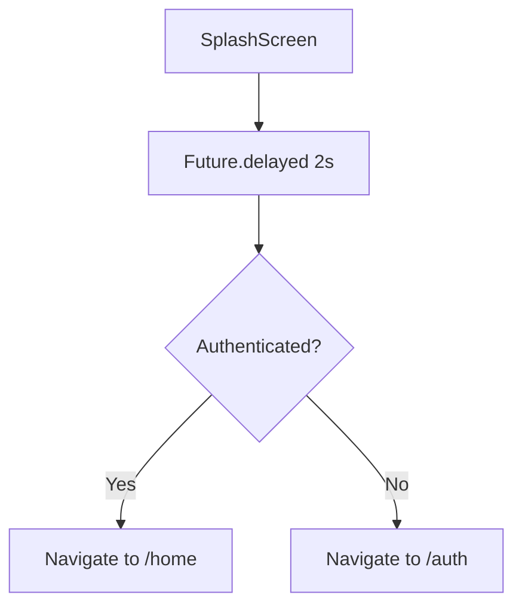
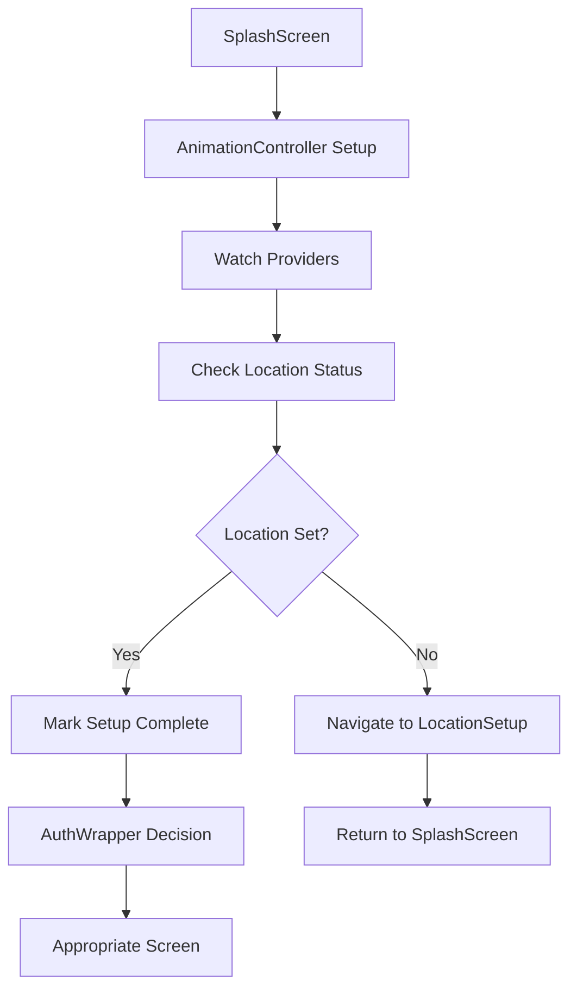

# Splash Screen Transformation Technical Specification

## Overview

This document provides a comprehensive technical specification for transforming the current simple [`splash_screen.dart`](frontend-flutter-house-help-master/lib/screens/splash_screen.dart:1) into a sophisticated animated splash screen that matches the [`LocationFirstSplashScreen`](frontend-flutter-house-help-master/lib/screens/location_first_splash_screen.dart:15) design exactly.

## 1. Technical Architecture

### 1.1 Current State Analysis
- **Current**: Simple static splash screen with basic animations
- **Target**: Complex animated splash screen with sophisticated visual effects
- **Architecture**: Replace direct navigation with provider-based state management

### 1.2 Key Architectural Changes

| Component | Current Implementation | Target Implementation |
|-----------|----------------------|---------------------|
| **Animation System** | No AnimationController | Complex AnimationController with multiple tweens |
| **Visual Design** | Static gradients | Dynamic gradients with blur effects and shadows |
| **State Management** | Direct navigation | Provider-based with AuthWrapper pattern |
| **Loading Indicators** | Basic CircularProgressIndicator | Enhanced container with backdrop effects |
| **Trust Elements** | None | Animated trust badges with icons |

### 1.3 System Flow

```
Current Flow:
SplashScreen → Direct Navigation → AuthWrapper/MainScreen

Target Flow:
SplashScreen → Provider State Management → AuthWrapper Decision → Appropriate Screen
```

## 2. Code Structure

### 2.1 File Modifications Required

#### Primary File: `frontend-flutter-house-help-master/lib/screens/splash_screen.dart`

**Current Structure:**
- 116 lines
- Simple StatefulWidget
- Basic initState with Future.delayed
- Static UI elements

**Target Structure:**
- ~400+ lines
- Complex StatefulWidget with TickerProviderStateMixin
- Multiple animation controllers and tweens
- Sophisticated visual effects

### 2.2 New Components to Add

1. **Animation Controllers**: Multiple controllers for different elements
2. **Tween Animations**: Position, scale, opacity, and color animations
3. **Visual Effects**: BackdropFilter, gradients, shadows
4. **Trust Badges**: Animated informational elements
5. **Enhanced Loading**: Container-based loading with visual effects

## 3. Animation System

### 3.1 AnimationController Configuration

```dart
// Primary animation controller
late AnimationController _animationController;

// Individual element animations
late Animation<double> _logoAnimation;      // Scale animation
late Animation<double> _textAnimation;      // Position animation  
late Animation<double> _fadeAnimation;      // Opacity animation
Animation<Color?>? _bgColorAnimation;       // Background color animation
```

### 3.2 Tween Specifications

#### Logo Animation
- **Type**: Scale animation
- **Duration**: 2 seconds
- **Curve**: `Curves.easeOutBack`
- **Range**: 0.0 → 1.0
- **Purpose**: Bouncy entrance effect

#### Text Animation  
- **Type**: Position animation
- **Duration**: 2 seconds
- **Curve**: `Curves.easeOut`
- **Range**: 30px → 0px (upward movement)
- **Purpose**: Smooth text reveal

#### Fade Animation
- **Type**: Opacity animation
- **Duration**: 2 seconds  
- **Curve**: `Curves.easeInOut`
- **Range**: 0.0 → 1.0
- **Purpose**: Overall fade-in effect

#### Background Color Animation
- **Type**: Color transition
- **Duration**: 2 seconds
- **Curve**: Linear
- **Range**: Theme-dependent gradient colors
- **Purpose**: Dynamic background effects

### 3.3 Animation Controller Lifecycle

```dart
@override
void initState() {
  super.initState();
  
  // Initialize controller
  _animationController = AnimationController(
    duration: const Duration(seconds: 2),
    vsync: this,
  );
  
  // Create tweens
  _logoAnimation = Tween<double>(begin: 0, end: 1).animate(
    CurvedAnimation(parent: _animationController, curve: Curves.easeOutBack),
  );
  
  // Start animations
  _animationController.forward();
  
  // Initialize theme-dependent animations
  WidgetsBinding.instance.addPostFrameCallback((_) {
    _initializeThemeDependentAnimations(theme);
  });
}

@override
void dispose() {
  _animationController.dispose();
  super.dispose();
}
```

## 4. Visual Design

### 4.1 Background System

#### Gradient Implementation
```dart
Container(
  decoration: BoxDecoration(
    gradient: LinearGradient(
      colors: [
        theme.primaryColor.withAlpha((0.1 * 255).round()),
        theme.colorScheme.surface.withAlpha((0.95 * 255).round()),
        theme.colorScheme.surface,
      ],
      begin: Alignment.topCenter,
      end: Alignment.bottomCenter,
    ),
  ),
)
```

#### Dynamic Background Color
- **Source**: Theme-dependent color transitions
- **Animation**: Smooth color interpolation
- **Fallback**: Theme scaffoldBackgroundColor

### 4.2 Logo Design

#### Enhanced Logo Container
```dart
ClipRRect(
  borderRadius: BorderRadius.circular(24),
  child: BackdropFilter(
    filter: ImageFilter.blur(sigmaX: 10, sigmaY: 10),
    child: Container(
      width: 120,
      height: 120,
      decoration: BoxDecoration(
        gradient: LinearGradient(
          colors: [
            theme.primaryColor,
            theme.primaryColor.withOpacity(0.8),
          ],
          begin: Alignment.topLeft,
          end: Alignment.bottomRight,
        ),
        borderRadius: BorderRadius.circular(24),
        boxShadow: [
          BoxShadow(
            color: theme.colorScheme.shadow.withAlpha((0.2 * 255).round()),
            blurRadius: 20,
            offset: Offset(0, 10),
          ),
        ],
      ),
      child: Icon(
        Icons.home_repair_service,
        size: 64,
        color: theme.colorScheme.onPrimary,
      ),
    ),
  ),
)
```

#### Key Visual Elements:
- **BackdropFilter**: Gaussian blur effect (sigma: 10)
- **Gradient**: Diagonal primary color gradient
- **Border Radius**: 24px rounded corners
- **Shadow**: Soft drop shadow with blur
- **Icon**: Large 64px service icon

### 4.3 Typography System

#### Main Title
```dart
Text(
  'Sevaq',
  style: theme.textTheme.displayLarge?.copyWith(
    fontWeight: FontWeight.bold,
    color: theme.primaryColor,
    shadows: [
      Shadow(
        color: theme.colorScheme.shadow.withAlpha((0.3 * 255).round()),
        blurRadius: 10,
        offset: Offset(0, 4),
      ),
    ],
  ),
)
```

#### Subtitle
```dart
Text(
  'Your trusted home services partner',
  style: theme.textTheme.bodyLarge?.copyWith(
    color: theme.colorScheme.onSurfaceVariant,
  ),
  textAlign: TextAlign.center,
)
```

### 4.4 Loading Indicator Enhancement

#### Container-Based Loading
```dart
Container(
  padding: const EdgeInsets.all(16),
  decoration: BoxDecoration(
    color: theme.colorScheme.surface.withAlpha((0.8 * 255).round()),
    borderRadius: BorderRadius.circular(16),
    boxShadow: [
      BoxShadow(
        color: theme.colorScheme.shadow.withAlpha((0.1 * 255).round()),
        blurRadius: 8,
        offset: Offset(0, 4),
      ),
    ],
  ),
  child: Row(
    mainAxisSize: MainAxisSize.min,
    children: [
      CircularProgressIndicator(
        color: theme.primaryColor,
        strokeWidth: 2,
      ),
      const SizedBox(width: 16),
      Text(
        'Setting up your experience...',
        style: theme.textTheme.bodyMedium?.copyWith(
          color: theme.colorScheme.onSurfaceVariant,
        ),
      ),
    ],
  ),
)
```

## 5. State Management

### 5.1 Provider Integration

#### Required Providers
```dart
// Current providers to maintain
final authProvider = Provider.of<AuthProvider>(context, listen: false);
final locationProvider = Provider.of<LocationProvider>(context, listen: false);
final themeProvider = Provider.of<ThemeProvider>(context);

// New provider to add
final locationProvider = Provider.of<LocationProvider>(context, listen: false);
```

### 5.2 AuthWrapper Pattern Implementation

#### Navigation Logic
```dart
// Replace direct navigation with provider-based decisions
Future<void> _checkAuthStatus() async {
  // Simulate splash screen duration
  await Future.delayed(const Duration(seconds: 2));

  // Check authentication and location status
  if (authProvider.isAuthenticated) {
    // Navigate to main app via AuthWrapper
    Navigator.pushReplacementNamed(context, '/auth');
  } else {
    // Navigate to auth wrapper
    Navigator.pushReplacementNamed(context, '/auth');
  }
}
```

#### Provider State Watching
```dart
@override
Widget build(BuildContext context) {
  // Watch providers for state changes
  final locationProvider = context.watch<LocationProvider>();
  final currentLocation = locationProvider.currentLocationData;
  final hasCompletedSetup = locationProvider.hasCompletedLocationSetup;

  // Check location on every build
  _checkExistingLocation();

  return Scaffold(/* ... */);
}
```

### 5.3 LocationProvider Integration

#### Location Setup Check
```dart
void _checkExistingLocation() async {
  final locationProvider = Provider.of<LocationProvider>(context, listen: false);
  
  if (locationProvider.currentLocationData != null) {
    // Mark location setup complete
    locationProvider.markLocationSetupComplete();
    
    // Check service availability
    await locationProvider.checkServiceAvailability(
      locationProvider.currentLocationData!.latitude ?? 0.0,
      locationProvider.currentLocationData!.longitude ?? 0.0,
    );
  }
}
```

## 6. Navigation Logic

### 6.1 Current Navigation Flow



### 6.2 Target Navigation Flow



### 6.3 Navigation Implementation

#### Replace Direct Navigation
```dart
// OLD: Direct navigation
if (authProvider.isAuthenticated) {
  Navigator.pushReplacementNamed(context, '/home');
} else {
  Navigator.pushReplacementNamed(context, '/auth');
}

// NEW: Provider-based navigation
if (authProvider.isAuthenticated) {
  // Let AuthWrapper handle the decision
  Navigator.pushReplacementNamed(context, '/auth');
} else {
  Navigator.pushReplacementNamed(context, '/auth');
}
```

#### Location Setup Navigation
```dart
Future.delayed(const Duration(seconds: 2), () {
  if (mounted) {
    Navigator.push(
      context,
      MaterialPageRoute(builder: (_) => LocationSetupScreen()),
    );
  }
});
```

## 7. Performance Considerations

### 7.1 Animation Optimization

#### Controller Management
- **Dispose properly**: Always dispose AnimationController in dispose()
- **Vsync binding**: Use TickerProviderStateMixin for proper lifecycle
- **Memory management**: Null out animations in dispose

#### Theme Performance
- **Debounce theme changes**: Prevent rapid re-initialization
- **Cache theme values**: Store computed theme values
- **Lazy initialization**: Initialize theme-dependent animations only once

### 7.2 Provider Performance

#### Efficient Provider Usage
- **Selective listening**: Use `listen: false` for write-only operations
- **Context watching**: Use `context.watch<Provider>()` for read-only
- **Avoid rebuilds**: Minimize state changes during animations

#### Location Provider Optimization
- **Cache location data**: Use static cache for fast access
- **Async handling**: Properly handle async location loading
- **Error handling**: Graceful fallbacks for location failures

### 7.3 Visual Performance

#### Render Optimization
- **BackdropFilter**: Use judiciously (performance intensive)
- **Shadow rendering**: Optimize shadow blur radius
- **Gradient rendering**: Cache gradient computations

#### Animation Performance
- **Tween optimization**: Use simple tween ranges
- **Curve selection**: Prefer simple curves over complex ones
- **Frame rate**: Target 60fps animations

## 8. Testing Strategy

### 8.1 Unit Testing

#### Animation Testing
```dart
test('Logo animation completes in 2 seconds', () {
  final controller = AnimationController(
    duration: const Duration(seconds: 2),
    vsync: TestVSync(),
  );
  
  final logoAnimation = Tween<double>(begin: 0, end: 1).animate(
    CurvedAnimation(parent: controller, curve: Curves.easeOutBack),
  );
  
  controller.forward();
  expect(logoAnimation.value, 1.0);
});
```

#### Provider Testing
```dart
test('LocationProvider integration works correctly', () {
  final locationProvider = LocationProvider();
  
  // Test location setup completion
  locationProvider.markLocationSetupComplete();
  expect(locationProvider.hasCompletedLocationSetup, true);
  
  // Test location setting
  final testLocation = Location(
    address: 'Test Address',
    latitude: 28.6139,
    longitude: 77.2090,
  );
  
  locationProvider.setManualLocation(testLocation);
  expect(locationProvider.currentLocationData, testLocation);
});
```

### 8.2 Widget Testing

#### Splash Screen Widget Tests
```dart
testWidgets('Splash screen shows animated logo', (WidgetTester tester) async {
  await tester.pumpWidget(
    MaterialApp(
      home: SplashScreen(),
      theme: ThemeData.light(),
    ),
  );
  
  // Verify logo is present
  expect(find.byType(Icon), findsOneWidget);
  
  // Verify animations are running
  await tester.pump(const Duration(seconds: 1));
  expect(find.text('Sevaq'), findsOneWidget);
});
```

#### Provider Integration Tests
```dart
testWidgets('Splash screen integrates with AuthWrapper', (WidgetTester tester) async {
  await tester.pumpWidget(
    MultiProvider(
      providers: [
        ChangeNotifierProvider(create: (_) => AuthProvider()),
        ChangeNotifierProvider(create: (_) => LocationProvider()),
      ],
      child: MaterialApp(
        home: AuthWrapper(),
        routes: {
          '/auth': (context) => AuthWrapper(),
          '/home': (context) => MainNavigation(),
        },
      ),
    ),
  );
  
  // Verify AuthWrapper shows appropriate screen
  expect(find.byType(SplashScreen), findsOneWidget);
});
```

### 8.3 Integration Testing

#### End-to-End Navigation Flow
```dart
test('Complete splash to main navigation flow', () async {
  // Test the complete flow from splash to main app
  final app = MaterialApp(
    home: SplashScreen(),
    routes: {
      '/auth': (context) => AuthWrapper(),
      '/home': (context) => MainNavigation(),
    },
  );
  
  // Verify splash shows
  expect(find.byType(SplashScreen), findsOneWidget);
  
  // Wait for animations
  await tester.pumpAndSettle(const Duration(seconds: 3));
  
  // Verify navigation to appropriate screen
  expect(find.byType(AuthWrapper), findsOneWidget);
});
```

### 8.4 Performance Testing

#### Animation Performance
- **Frame rate testing**: Ensure 60fps animations
- **Memory usage**: Monitor animation controller memory
- **CPU usage**: Profile animation performance

#### Provider Performance
- **Rebuild frequency**: Monitor unnecessary rebuilds
- **State update performance**: Test provider state changes
- **Memory leaks**: Check for provider-related memory leaks

## 9. Implementation Checklist

### 9.1 Core Implementation
- [ ] Replace StatefulWidget with TickerProviderStateMixin
- [ ] Add AnimationController and tweens
- [ ] Implement sophisticated visual effects
- [ ] Add trust badges and enhanced loading
- [ ] Integrate with AuthWrapper pattern

### 9.2 Animation System
- [ ] Logo scale animation with Curves.easeOutBack
- [ ] Text position animation with Curves.easeOut
- [ ] Overall fade animation with Curves.easeInOut
- [ ] Background color animation
- [ ] Proper animation lifecycle management

### 9.3 Visual Design
- [ ] Gradient background with transparency
- [ ] BackdropFilter blur effects
- [ ] Enhanced logo with shadows and gradients
- [ ] Typography with text shadows
- [ ] Container-based loading indicator

### 9.4 State Management
- [ ] Provider integration for auth and location
- [ ] AuthWrapper pattern implementation
- [ ] LocationProvider state watching
- [ ] Proper navigation logic

### 9.5 Testing
- [ ] Unit tests for animations
- [ ] Widget tests for UI components
- [ ] Integration tests for navigation flow
- [ ] Performance tests for animations

## 10. Migration Strategy

### 10.1 Phase 1: Foundation
1. Add AnimationController and basic tweens
2. Implement theme-dependent animations
3. Add proper disposal and lifecycle management

### 10.2 Phase 2: Visual Enhancement
1. Replace static UI with animated components
2. Add backdrop effects and gradients
3. Implement trust badges and enhanced loading

### 10.3 Phase 3: State Management
1. Integrate with AuthWrapper pattern
2. Implement provider-based navigation
3. Add location provider integration

### 10.4 Phase 4: Testing & Optimization
1. Add comprehensive test coverage
2. Performance optimization
3. Bug fixes and refinements

## Conclusion

This technical specification provides a detailed roadmap for transforming the current simple splash screen into a sophisticated animated experience that matches the [`LocationFirstSplashScreen`](frontend-flutter-house-help-master/lib/screens/location_first_splash_screen.dart:15) design. The implementation focuses on:

- **Complex animation systems** with multiple controllers and tweens
- **Sophisticated visual effects** including gradients, blur, and shadows
- **Provider-based state management** using the AuthWrapper pattern
- **Enhanced user experience** with trust badges and improved loading indicators
- **Comprehensive testing strategy** ensuring reliability and performance

The transformation maintains the existing functionality while significantly enhancing the visual appeal and user experience of the splash screen.