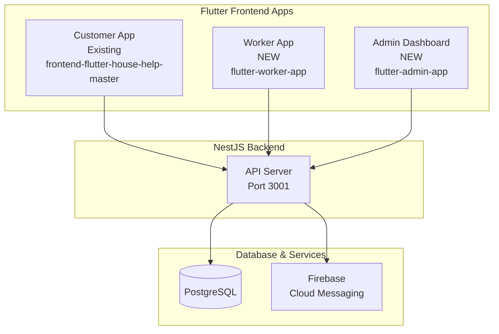
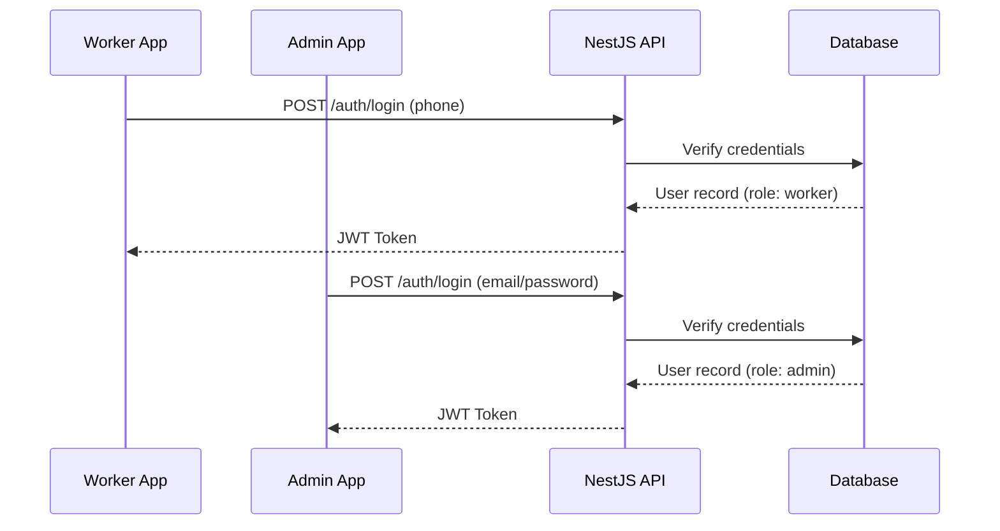

# Worker App & Admin Dashboard Implementation Plan

## Project Context

This is a **multi-app Flutter ecosystem** where:
- **Customer App** - Existing app at `frontend-flutter-house-help-master`
- **Worker App** - NEW Flutter app for service providers (workers)
- **Admin Dashboard** - NEW Flutter app for platform administrators

All three Flutter apps integrate with the same NestJS backend (`flutter-nest-househelp-master`).

---

## Architecture Overview

This is a **multi-app ecosystem** with three Flutter apps sharing the same backend:



### Shared Components

All three Flutter apps can share:
- **API Service** - Base HTTP client with JWT handling
- **Theme** - Design system tokens
- **Models** - Data structures
- **Widgets** - Reusable UI components
- **Utils** - Helper functions

---

# Part 1: Worker App

## 1.1 Core Features

### Authentication
- Phone number + OTP login (reuse existing auth service)
- JWT token-based session management
- Role-based access (worker role)
- Profile completion flow

### Job Management
- View assigned bookings/jobs
- Accept/reject job assignments
- View job details (customer info, address, service type, timing)
- Update job status: Assigned → In Progress → Completed
- Job history

### Schedule Management
- Weekly/monthly calendar view
- View upcoming jobs
- Block unavailable dates
- Set preferred working hours

### Availability Management
- Toggle available/unavailable status
- Set service area coverage
- Manage working zones

### Earnings & Wallet
- View earnings summary
- Transaction history
- Pending payments
- Earnings breakdown by service

### Profile & Settings
- Personal information management
- Service skills/categories
- Profile photo
- Notification preferences
- Change password

### Customer Communication
- View customer contact (phone)
- In-app messaging (future phase)
- Job-related notifications

## 1.2 Required Screens

| Screen | Purpose |
|--------|---------|
| Splash Screen | App loading, initial routing |
| Login Screen | Phone OTP authentication |
| Profile Completion | Initial setup for new workers |
| Home/Dashboard | Overview, today's jobs, quick stats |
| My Jobs | List of assigned jobs (upcoming/active/completed) |
| Job Details | Full job information with customer details |
| Calendar | Monthly/weekly schedule view |
| Availability | Set/update availability |
| Earnings | View earnings and transactions |
| Profile | Edit personal information |
| Settings | App preferences |

## 1.3 Required Backend API Endpoints

### New Endpoints (Worker-specific)

| Endpoint | Method | Description |
|----------|--------|-------------|
| `/workers/me` | GET | Get current worker profile |
| `/workers/me/bookings` | GET | Get assigned bookings for worker |
| `/workers/me/availability` | GET/POST | Get/set availability |
| `/workers/me/earnings` | GET | Get earnings summary |
| `/workers/me/schedule` | GET/POST | Get/set work schedule |
| `/bookings/:id/accept` | POST | Accept a job |
| `/bookings/:id/reject` | POST | Reject a job |
| `/bookings/:id/start` | POST | Mark job as in progress |
| `/bookings/:id/complete` | POST | Mark job as completed |
| `/bookings/:id/cancel` | POST | Cancel job with reason |

### Existing Endpoints to Reuse
- `POST /auth/login` - Authentication
- `POST /auth/register` - Registration
- `GET /services` - List services
- `GET /bookings/:id` - Get booking details (extended with worker info)
- `GET /notifications` - Job notifications

## 1.4 Data Models

### Worker Profile (New)
```typescript
interface WorkerProfile {
  id: string;
  userId: string;
  bio: string;
  services: Service[];
  rating: number;
  reviewCount: number;
  isAvailable: boolean;
  currentLat: number;
  currentLng: number;
  serviceAreas: string[];
  workingHours: WorkingHours[];
  earnings: EarningsSummary;
}
```

### Worker Booking (Extended)
```typescript
interface WorkerBooking {
  id: string;
  customerName: string;
  customerPhone: string;
  address: string;
  serviceName: string;
  scheduledDate: string;
  scheduledTime: string;
  amount: number;
  status: 'assigned' | 'in_progress' | 'completed' | 'cancelled';
  customerRating?: number;
}
```

---

# Part 2: Admin Dashboard

## 2.1 Core Features

### Authentication
- Email/password login (admin role)
- JWT token-based session
- AdminGuard protection

### Dashboard Home
- Key metrics overview
- Total bookings (today/week/month)
- Active workers count
- Revenue summary
- Pending assignments

### Worker Management
- List all workers
- Add new worker
- Edit worker details
- Deactivate/reactivate worker
- View worker performance
- Assign services to worker
- View worker earnings

### Booking Management
- View all bookings (filterable by status/date/service)
- View booking details
- Manual booking creation
- Reassign booking to different worker
- Cancel booking
- View booking history

### User Management
- List all customers
- View user details
- Deactivate/reactivate user
- View user's booking history

### Service Management
- List all services
- Add/edit service
- Set pricing
- Manage service categories

### Analytics & Reports
- Revenue reports (daily/weekly/monthly)
- Booking trends
- Worker performance metrics
- Customer demographics
- Service popularity

### Location Management
- Manage cities
- Manage service areas
- Manage micro-zones

### Notifications
- Send push notifications
- Broadcast messages

## 2.2 Required Screens

| Screen | Purpose |
|--------|---------|
| Login | Admin authentication |
| Dashboard | Overview and key metrics |
| Workers List | Manage all workers |
| Worker Details | Edit worker info & performance |
| Bookings List | View/manage all bookings |
| Booking Details | Full booking info & actions |
| Users List | Manage customers |
| Services List | Manage services |
| Analytics | Charts and reports |
| Locations | Manage cities/areas |
| Settings | Admin profile & app settings |

## 2.3 Required Backend API Endpoints

### New Admin-specific Endpoints

| Endpoint | Method | Description |
|----------|--------|-------------|
| `GET /admin/dashboard/stats` | GET | Dashboard statistics |
| `GET /admin/workers` | GET | List all workers (admin) |
| `POST /admin/workers` | POST | Create worker |
| `PATCH /admin/workers/:id` | PATCH | Update worker |
| `DELETE /admin/workers/:id` | DELETE | Deactivate worker |
| `GET /admin/bookings` | GET | List all bookings (admin) |
| `POST /admin/bookings` | POST | Create booking |
| `PATCH /admin/bookings/:id/assign` | PATCH | Reassign worker |
| `GET /admin/users` | GET | List all users (admin) |
| `PATCH /admin/users/:id` | PATCH | Update user |
| `GET /admin/analytics/revenue` | GET | Revenue data |
| `GET /admin/analytics/bookings` | GET | Booking trends |
| `POST /admin/notifications/send` | POST | Send notification |

### Existing Endpoints to Reuse
- `GET /users` (AdminGuard) - User listing
- `GET /users/:id` (AdminGuard) - User details
- `PATCH /users/:id` (AdminGuard) - Update user
- `GET /bookings` (AdminGuard) - All bookings
- `GET /workers` - Worker list
- `GET /services` - Service list
- `GET /locations/*` - Location data

---

# Part 3: Shared Components & Architecture

## 3.1 Shared Dependencies

Both apps will use these common packages:
- `http` - API communication
- `provider` - State management (existing pattern)
- `shared_preferences` - Local storage
- `intl` - Date/time formatting
- `flutter_local_notifications` - Push notifications
- `google_maps_flutter` - Location display (worker app)

## 3.2 Shared API Service

Create a shared API service pattern:
```
lib/
├── services/
│   ├── api_service.dart      # Base API client
│   ├── auth_service.dart     # Authentication
│   ├── worker_api.dart       # Worker-specific endpoints
│   └── admin_api.dart        # Admin-specific endpoints
├── models/
│   ├── worker.dart
│   ├── booking.dart
│   └── user.dart
└── providers/
    ├── auth_provider.dart     # Existing - extend for roles
    ├── worker_provider.dart  # Worker-specific state
    └── admin_provider.dart   # Admin-specific state
```

## 3.3 Authentication Flow



## 3.4 Role-based Route Protection

```dart
// Example guard pattern
class RoleGuard extends ChangeNotifier {
  String? userRole;
  
  bool get isWorker => userRole == 'worker';
  bool get isAdmin => userRole == 'admin';
  
  void checkAccess() {
    if (userRole != requiredRole) {
      // Redirect to appropriate screen
    }
  }
}
```

---

# Part 4: Implementation Priority

## Phase 1: Backend API Extensions
1. Add worker-specific endpoints
2. Add admin-specific endpoints
3. Update JWT strategy to include role claims
4. Add AdminGuard to appropriate routes

## Phase 2: Worker App (MVP)
1. Setup Flutter project structure
2. Implement authentication flow
3. Build job list & details screens
4. Build availability management
5. Build earnings view
6. Integrate with backend

## Phase 3: Admin Dashboard (MVP)
1. Setup Flutter project structure
2. Implement admin authentication
3. Build worker management
4. Build booking management
5. Build dashboard with stats
6. Build analytics views

## Phase 4: Enhancements
1. Push notifications integration
2. Real-time updates (WebSocket)
3. In-app messaging
4. Offline support

---

# Part 5: Technical Considerations

## 5.1 Security
- JWT tokens with role claims
- Secure storage for tokens
- API request validation
- Role-based route guards
- FCM token management

## 5.2 Performance
- Pagination for lists
- Lazy loading
- Image caching
- Optimistic UI updates

## 5.3 Error Handling
- Network error states
- Token refresh flow
- Retry logic
- User-friendly error messages

---

# Summary

This plan provides a comprehensive blueprint for building a **multi-app Flutter ecosystem**:

### App Comparison

| App | Users | Purpose | Location |
|-----|-------|---------|----------|
| **Customer App** | Customers | Book house help services | `frontend-flutter-house-help-master` (existing) |
| **Worker App** | Workers | Accept jobs, manage schedules, view earnings | NEW project |
| **Admin Dashboard** | Admins | Manage workers, bookings, analytics | NEW project |

### Shared Backend

All three Flutter apps integrate with the **same NestJS backend** (`flutter-nest-househelp-master`):
- Reuse existing JWT authentication with role-based access (User/Worker/Admin roles)
- Reuse existing entities (User, Worker, Booking, Service, Slot, etc.)
- Add new role-specific API endpoints for workers and admins
- Use existing AdminGuard for admin-protected routes

### Implementation Priority

1. **Phase 1**: Backend API Extensions (worker & admin endpoints)
2. **Phase 2**: Worker App (MVP - job management, availability, earnings)
3. **Phase 3**: Admin Dashboard (MVP - worker management, bookings, analytics)
4. **Phase 4**: Enhancements (notifications, real-time updates)