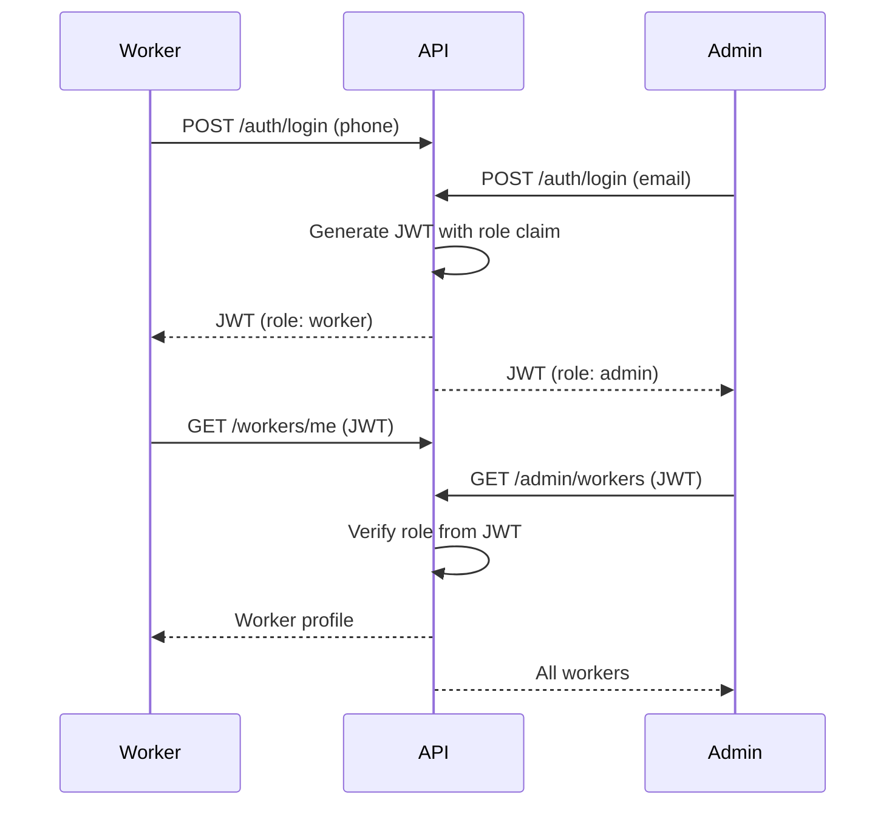

# Sevaq - Hybrid Implementation Plan (Industry Best Practice)

## Architecture Overview

This is the **industry-standard approach** used by companies like Uber, Swiggy, Zomato:

```
newsevaq/
├── flutter-nest-househelp-master/     # NestJS Backend (existing)
├── frontend-flutter-house-help-master/ # Customer App (existing)
├── flutter-worker-app/                  # NEW - Flutter Worker App
└── admin-web/                           # NEW - React Web Admin Dashboard
```

---

## Part 1: Flutter Worker App

### 1.1 Project Setup

**Location:** `newsevaq/flutter-worker-app/`

**Dependencies (pubspec.yaml):**
```yaml
dependencies:
  flutter:
    sdk: flutter
  provider: ^6.0.0
  http: ^1.0.0
  shared_preferences: ^2.0.0
  intl: ^0.18.0
  flutter_local_notifications: ^14.0.0
  google_maps_flutter: ^2.0.0
```

### 1.2 App Structure

```
lib/
├── main.dart
├── app.dart
├── config/
│   └── app_config.dart          # API URL configuration
├── services/
│   ├── api_service.dart         # HTTP client with JWT
│   └── worker_api.dart          # Worker-specific endpoints
├── models/
│   ├── worker.dart
│   ├── booking.dart
│   └── earnings.dart
├── providers/
│   ├── auth_provider.dart
│   ├── job_provider.dart
│   └── earnings_provider.dart
├── screens/
│   ├── splash_screen.dart
│   ├── login_screen.dart
│   ├── home_screen.dart         # Dashboard with today's jobs
│   ├── my_jobs_screen.dart      # Job list
│   ├── job_details_screen.dart
│   ├── calendar_screen.dart
│   ├── availability_screen.dart
│   ├── earnings_screen.dart
│   └── profile_screen.dart
└── widgets/
    ├── job_card.dart
    └── stat_card.dart
```

### 1.3 Worker App Screens

| Screen | Description |
|--------|-------------|
| Splash | App initialization |
| Login | Phone OTP authentication |
| Home | Dashboard - today's jobs, quick stats, earnings preview |
| My Jobs | Tabs: Upcoming, Active, Completed |
| Job Details | Customer info, address, service details, actions |
| Calendar | Monthly view with scheduled jobs |
| Availability | Toggle availability, set working hours |
| Earnings | Summary, transaction history |
| Profile | Personal info, skills, settings |

### 1.4 Required API Endpoints

| Endpoint | Method | Description |
|----------|--------|-------------|
| `/auth/login` | POST | Phone OTP login |
| `/workers/me` | GET | Get worker profile |
| `/workers/me/bookings` | GET | Get assigned bookings |
| `/workers/me/availability` | GET/POST | Get/set availability |
| `/workers/me/earnings` | GET | Get earnings summary |
| `/bookings/:id/accept` | POST | Accept job |
| `/bookings/:id/reject` | POST | Reject job |
| `/bookings/:id/start` | POST | Start job |
| `/bookings/:id/complete` | POST | Complete job |
| `/notifications/worker` | GET | Job notifications |

---

## Part 2: React Admin Web Dashboard

### 2.1 Project Setup

**Location:** `newsevaq/admin-web/`

**Tech Stack:**
- React 18 with TypeScript
- Vite (build tool)
- React Router (navigation)
- Axios (HTTP client)
- Tailwind CSS (styling)
- Recharts (charts/analytics)

**Initialize:**
```bash
npm create vite@latest admin-web -- --template react-ts
cd admin-web
npm install axios react-router-dom recharts tailwindcss postcss autoprefixer
npx tailwindcss init -p
```

### 2.2 Admin Dashboard Structure

```
admin-web/
├── src/
│   ├── main.tsx
│   ├── App.tsx
│   ├── api/
│   │   └── api.ts              # Axios instance with JWT
│   ├── components/
│   │   ├── Layout.tsx          # Sidebar + Header
│   │   ├── Sidebar.tsx
│   │   ├── DataTable.tsx
│   │   └── StatsCard.tsx
│   ├── pages/
│   │   ├── Login.tsx
│   │   ├── Dashboard.tsx       # Overview stats
│   │   ├── Workers.tsx         # Worker management
│   │   ├── WorkerDetail.tsx
│   │   ├── Bookings.tsx        # All bookings
│   │   ├── BookingDetail.tsx
│   │   ├── Users.tsx           # Customer management
│   │   ├── Services.tsx        # Service management
│   │   ├── Analytics.tsx       # Charts & reports
│   │   └── Locations.tsx       # City/area management
│   ├── types/
│   │   └── index.ts
│   └── App.css
├── index.html
├── package.json
└── vite.config.ts
```

### 2.3 Admin Dashboard Pages

| Page | Description |
|------|-------------|
| Login | Email/password admin login |
| Dashboard | Key metrics - total bookings, revenue, workers, users |
| Workers | List, add, edit, deactivate workers |
| Worker Detail | View/edit worker details, performance |
| Bookings | Filterable list of all bookings |
| Booking Detail | Full booking info, reassign worker |
| Users | Customer list, details, deactivate |
| Services | CRUD for services and pricing |
| Analytics | Charts - revenue trends, booking trends |
| Locations | Manage cities, service areas |

### 2.4 Required API Endpoints

| Endpoint | Method | Description |
|----------|--------|-------------|
| `/auth/login` | POST | Admin login |
| `/admin/dashboard/stats` | GET | Dashboard statistics |
| `/admin/workers` | GET/POST | List/create workers |
| `/admin/workers/:id` | GET/PATCH/DELETE | Worker CRUD |
| `/admin/bookings` | GET | List all bookings |
| `/admin/bookings/:id` | GET/PATCH | Booking detail/reassign |
| `/admin/users` | GET | List users |
| `/admin/users/:id` | PATCH | Update user |
| `/admin/services` | GET/POST/PATCH | Service management |
| `/admin/analytics/revenue` | GET | Revenue data |
| `/admin/analytics/bookings` | GET | Booking trends |

---

## Part 3: Backend API Extensions

### 3.1 Worker-specific Endpoints

Add to `flutter-nest-househelp-master/src/workers/`:

```typescript
// workers.controller.ts - Add these endpoints
@Get('me')
@UseGuards(JwtAuthGuard)
getMyProfile(@Request() req) { ... }

@Get('me/bookings')
@UseGuards(JwtAuthGuard)
getMyBookings(@Request() req, @Query() pagination: PaginationDto) { ... }

@Get('me/availability')
@UseGuards(JwtAuthGuard)
getMyAvailability(@Request() req) { ... }

@Post('me/availability')
@UseGuards(JwtAuthGuard)
updateMyAvailability(@Request() req, @Body() availability) { ... }

@Get('me/earnings')
@UseGuards(JwtAuthGuard)
getMyEarnings(@Request() req) { ... }

@Post('bookings/:id/accept')
@UseGuards(JwtAuthGuard)
acceptBooking(@Request() req, @Param('id') id: string) { ... }

@Post('bookings/:id/start')
@UseGuards(JwtAuthGuard)
startBooking(@Request() req, @Param('id') id: string) { ... }

@Post('bookings/:id/complete')
@UseGuards(JwtAuthGuard)
completeBooking(@Request() req, @Param('id') id: string) { ... }
```

### 3.2 Admin-specific Endpoints

Create new module `flutter-nest-househelp-master/src/admin/`:

```typescript
// admin.controller.ts
@Get('dashboard/stats')
@UseGuards(AdminGuard)
getDashboardStats() { ... }

@Get('workers')
@UseGuards(AdminGuard)
getAllWorkers(@Query() pagination: PaginationDto) { ... }

@Post('workers')
@UseGuards(AdminGuard)
createWorker(@Body() workerData: CreateWorkerDto) { ... }

@Patch('workers/:id')
@UseGuards(AdminGuard)
updateWorker(@Param('id') id: string, @Body() data) { ... }

@Delete('workers/:id')
@UseGuards(AdminGuard)
deactivateWorker(@Param('id') id: string) { ... }

@Get('bookings')
@UseGuards(AdminGuard)
getAllBookings(@Query() filters: BookingFilters) { ... }

@Patch('bookings/:id/assign')
@UseGuards(AdminGuard)
reassignBooking(@Param('id') id: string, @Body('workerId') workerId: string) { ... }

@Get('analytics/revenue')
@UseGuards(AdminGuard)
getRevenueData(@Query('period') period: string) { ... }
```

---

## Part 4: Implementation Order

### Phase 1: Backend (Week 1-2)
1. Add worker-specific endpoints
2. Create admin module with endpoints
3. Update JWT strategy for role claims
4. Add AdminGuard for admin routes

### Phase 2: Worker App (Week 2-4)
1. Setup Flutter project
2. Implement authentication
3. Build job list & details screens
4. Build availability management
5. Build earnings view
6. Build calendar & schedule
7. Integrate with backend

### Phase 3: Admin Web (Week 3-5)
1. Setup React project with Vite
2. Build login and layout
3. Implement dashboard with stats
4. Build worker management
5. Build booking management
6. Build analytics charts
7. Deploy (Vercel/Netlify)

---

## Part 5: Shared Components

### JWT Authentication Flow


### Role-based Access
- **Worker role** → Worker endpoints, worker-specific data
- **Admin role** → Admin endpoints, all data
- **User role** → Customer app endpoints, own bookings

---

## Summary

This implementation plan follows **industry best practices**:

| Component | Tech | Why |
|-----------|------|-----|
| Worker App | Flutter | Mobile-first for field staff |
| Admin Dashboard | React Web | Desktop admin work |
| Backend | NestJS | Reuse existing API |

The architecture is scalable, maintainable, and matches how real on-demand service platforms are built.